# 使用canvas画布可以做的一些有意思的事情

## 介绍

Canvas API 提供了一个通过 JavaScript 和 HTML 的`<canvas>`元素来绘制图形的方式。它可以用于动画、游戏画面、数据可视化、图片编辑以及实时视频处理等方面。

Canvas API 主要聚焦于 2D 图形。而同样使用`<canvas>`元素的 WebGL API 则用于绘制硬件加速的 2D 和 3D 图形。

canvas出来也有些年头了，对于前端开发来说是一个非常有用的工具，在大多小程序内也是可以使用，在[原生app内](https://developer.android.com/reference/android/graphics/Canvas)也是有类似的canvas画布，操作接口差别并不大。

canvas性能相对于网页会高一些，以前就有见过有人研究网站全部使用canvas来绘制的。但是这肯定不属于canvas的强项，canvas能做的有意思的事情有很多。

[mdn的canvas文档](https://developer.mozilla.org/zh-CN/docs/Web/API/Canvas_API)。

### 日常开发中的一些使用场景

1. 绘制一些图表，图标等；
2. 对网页进行图片转换；
3. 对图片进行合并、裁剪等；
4. 对于图片进行像素级的处理；
   1. 如对比图片、图片反色、图片马赛克等；
5. 开发一些小游戏；
6. 开发一些3d的功能；
7. 绘制一些图形；
   1. 如画板工具等；
   2. 绘制函数图像；
   3. 绘制分形图；

## 基本图形的绘制

[示例代码:https://github.com/qiuwww/blog/blob/master/0.2.HTML/canvas/%E7%BB%98%E5%88%B6%E5%9F%BA%E6%9C%AC%E5%9B%BE%E5%BD%A2](https://github.com/qiuwww/blog/blob/master/0.2.HTML/canvas/%E7%BB%98%E5%88%B6%E5%9F%BA%E6%9C%AC%E5%9B%BE%E5%BD%A2)；

一些基本图形绘制实例：

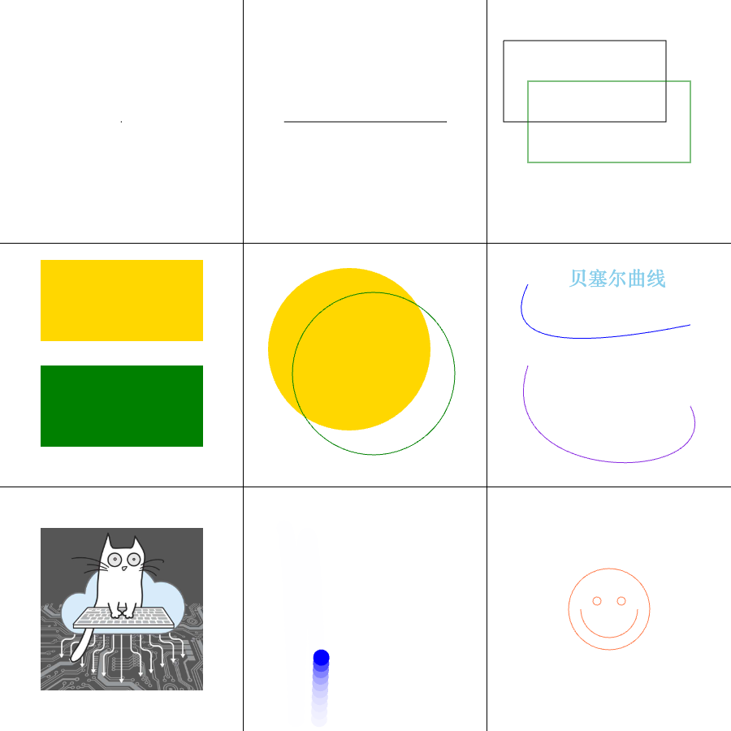

### 获取ctx操作对象

1. [获取ctx操作对象，渲染上下文](https://developer.mozilla.org/zh-CN/docs/Web/API/HTMLCanvasElement/getContext)，`const ctx = document.getElementById('canvas').getContext('2d');`，获取当前的绘制上下文，渲染上下文（The rendering context）；
   1. "2d"表示建立一个 `CanvasRenderingContext2D` 二维渲染上下文，其他可选的参数，如：
      1. "webgl"：用来创建一个三维渲染上下文；
      2. "webgl2"；
      3. "bitmaprenderer"：建一个只提供将 canvas 内容替换为指定ImageBitmap功能的上下文；

```js
// 兼容形式获取ctx
var canvas = document.getElementById("canvas");

if (canvas.getContext) {
  var ctx = canvas.getContext("2d");
  // drawing code here
} else {
  // canvas-unsupported code here
}
```

ctx对象属性:

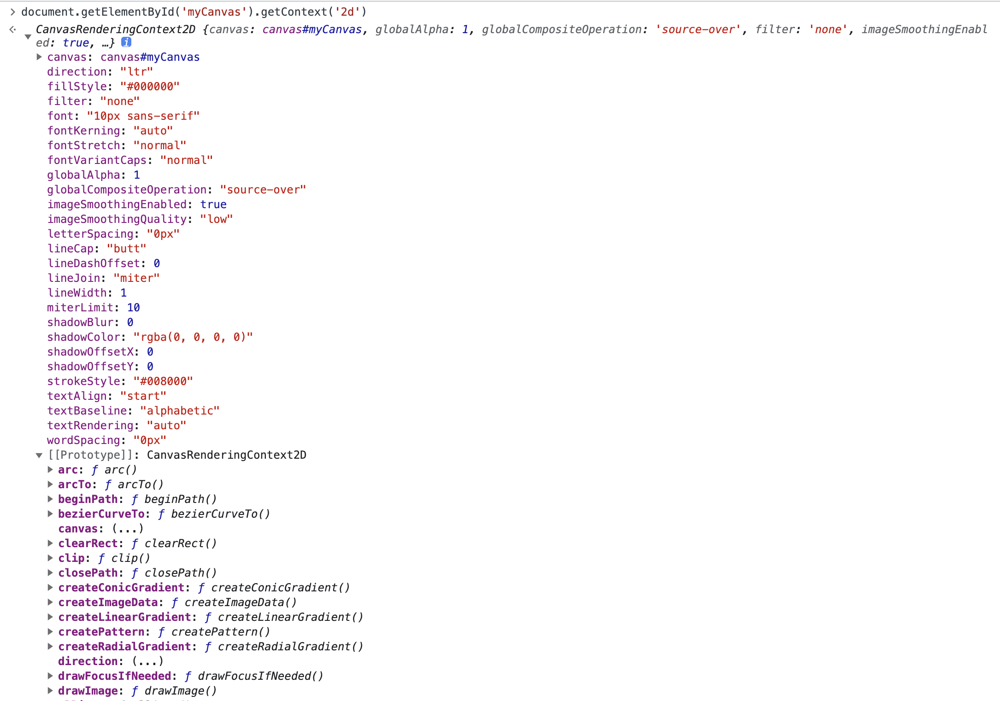
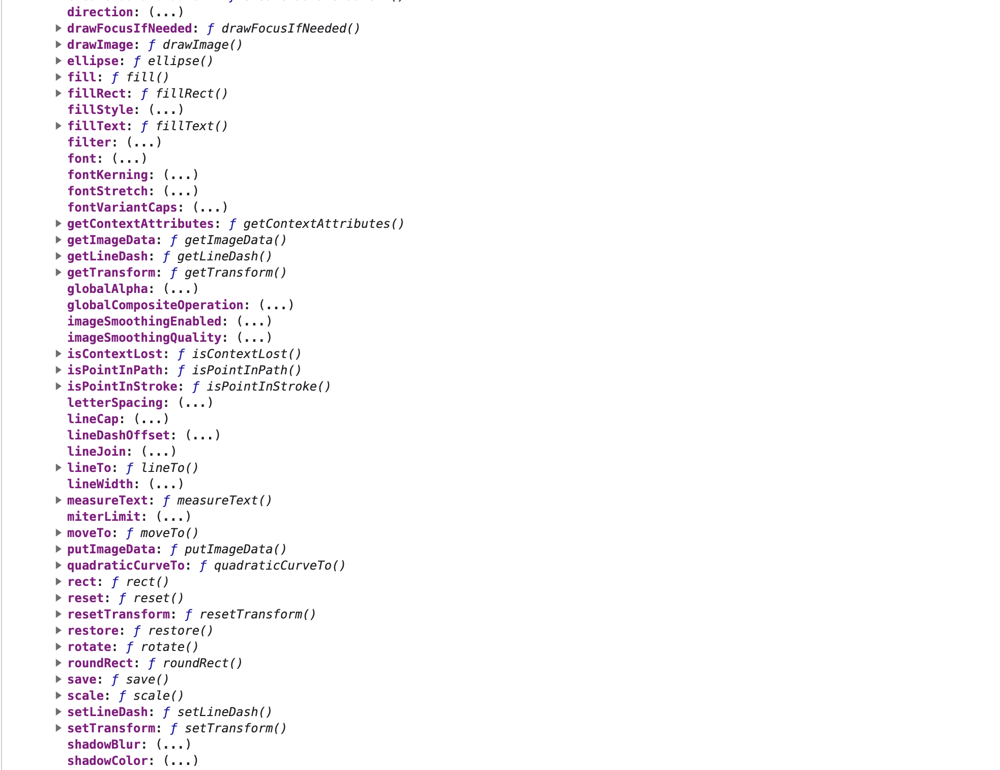


### 基本接口

1. `ctx.beginPath();`，是 Canvas 2D API 通过清空子路径列表开始一个新路径的方法。当你想创建一个新的路径时，调用此方法，开始一个新路径；
   1. 不是开启新的路径，就不需要调用`ctx.beginPath();`；
2. `ctx.closePath();`，**将笔点返回到当前子路径起始点的方法**。它尝试从当前点到起始点绘制一条直线。如果图形**已经是封闭的或者只有一个点，那么此方法不会做任何操作**；
   1. 对于绘制一个矩形，就相当于第四个点到第一个点的这条线的`ctx.moveTo() => ctx.lintTo()`操作；
   2. 对于非封闭图形没什么用，一般只会用在`moveTo + lineTo`这类的操作上；
3. 路径绘制；
   1. `ctx.lineTo()`；
   2. `ctx.moveTo()`；
4. `ctx.clearRect()`是 Canvas 2D API 的方法，这个方法通过把像素设置为透明以达到**擦除一个矩形区域的目的**；
   1. 这里在**canvas绘制动画**的时候，需要不断的clear前面绘制的结果；
5. `ctx.fill()`填充，是 Canvas 2D API 根据当前的填充样式，填充当前或已存在的路径的方法。采取非零环绕或者奇偶环绕规则；
   1. 封闭区域填充；
   2. 通过`ctx.fillStyle();`，设置填充颜色；
6. `ctx.stroke`描边，是 Canvas 2D API 使用非零环绕规则，根据当前的画线样式，绘制当前或已经存在的路径的方法；
   1. 与fill类似，都是绘制前面的绘图样式，对路径进行描边；
7. **便捷的操作**，如绘制一个矩形，填充一个圆等；
   1. `ctx.fillRect()`；
   2. `ctx.fillText()`；
   3. `ctx.rect()`；
      1. 后续你可以填充或者描边矩形；
   4. `ctx.arc()`是 Canvas 2D API 绘制圆弧路径的方法。圆弧路径的圆心在 (x, y) 位置，半径为 r，根据anticlockwise （默认为顺时针）指定的方向从 startAngle 开始绘制，到 endAngle 结束；
      1. `ctx.arc(x, y, radius, startAngle, endAngle, anticlockwise);`，这里设置`endAngle - startAngle >= 2 * Math.PI`，就会得到一个圆；
   5. `ctx.strokeRect()`是 Canvas 2D API 在 canvas 中，使用当前的绘画样式，描绘一个起点在 (x, y)、宽度为 w、高度为 h 的矩形的方法；
   6. `ctx.strokeText()`是 Canvas 2D API 在给定的 (x, y) 位置绘制文本的方法。如果提供了表示最大值的第四个参数，文本将会缩放适应宽度；
      1. 可以用来绘制镂空的文字；
   7. `ctx.roundRect()`圆角矩形；
   8. 二次贝塞尔曲线及三次贝塞尔曲线：
      1. `ctx.quadraticCurveTo(cp1x, cp1y, x, y)`：绘制二次贝塞尔曲线，cp1x,cp1y 为一个控制点，x,y 为结束点;
      2. `ctx.bezierCurveTo(cp1x, cp1y, cp2x, cp2y, x, y)`：绘制三次贝塞尔曲线，cp1x,cp1y为控制点一，cp2x,cp2y为控制点二，x,y为结束点；
8. 变换操作，类似于transform/translate的一系列操作：
   1. `ctx.scale()`是 Canvas 2D API 根据 x 水平方向和 y 垂直方向，为 canvas 单位添加缩放变换的方法；
   2. `ctx.rotate()`是 Canvas 2D API 在变换矩阵中增加旋转的方法。角度变量表示一个顺时针旋转角度并且用弧度表示；
   3. `ctx.translate()`方法对当前网格添加平移变换的方法；
   4. `ctx.transform()`是 Canvas 2D API 使用矩阵多次叠加当前变换的方法，矩阵由方法的参数进行描述。你可以缩放、旋转、移动和倾斜上下文；
   5. `setTransform()`是 Canvas 2D API 使用单位矩阵重新设置（覆盖）当前的变换并调用变换的方法，此变换由方法的变量进行描述；
      1. 相对于transform，这里不会覆盖，会叠加；
9. 状态记录操作：
    1. `ctx.save()`是 Canvas 2D API 通过将当前状态放入栈中，保存 canvas 全部状态的方法；
       1. **会将当前的各种设置的状态保存**，然后在restore的时候，给后续的代码继续使用；
    2. `ctx.restore()`是 Canvas 2D API **通过在绘图状态栈中弹出顶端的状态**，将 canvas **恢复到最近的保存状态的方法**。如果没有保存状态，此方法不做任何改变；
       1. 使用 save() 方法保存默认的状态，使用 restore() 进行恢复；
    3. `ctx.reset()`的方法将呈现上下文重置为其默认状态，允许将其重用于绘制其他内容，而无需显式重置所有属性；
       1. 重置将清除后备缓冲区、图形状态堆栈、任何定义的路径和样式。这包括当前变换矩阵、合成属性、剪切区域、虚线列表、线条样式、文本样式、阴影、图像平滑、滤镜等；
       2. 这里会清空前面绘制的所有的内容，但是**后续新绘制的就不受影响**，比如动画；
10. `ctx.measureText()`，方法返回一个关于被测量文本TextMetrics 对象包含的信息（例如它的宽度）；
    1. 在设置元素位置的时候，可能首先去测量元素的宽度；
11. 图片操作：
    1. `ctx.getImageData()`**返回一个ImageData对象**，用来描述 canvas 区域隐含的像素数据，这个区域通过矩形表示，起始点为*(sx, sy)、宽为sw、高为sh。*；
       1. ImageData对象：接口描述 `<canvas>` 元素的一个隐含像素数据的区域；
          1. **基于这个接口，可以对图片进行像素操作**；
    2. `ctx.putImageData(imageData, dx, dy, dirtyX, dirtyY, dirtyWidth, dirtyHeight)；`是 Canvas 2D API 将数据从已有的 ImageData 对象绘制到位图的方法。如果提供了一个绘制过的矩形，则只绘制该矩形的像素。此方法不受画布转换矩阵的影响。
       1. ImageData() 构造函数返回一个新的实例化的 ImageData 对象，此对象由给定的类型化数组和指定的宽度与高度组成；
       2. `new ImageData(array, width, height);`；
    3. `ctx.drawImage(image, sx, sy, sWidth, sHeight, dx, dy, dWidth, dHeight)`，方法提供了多种在画布（Canvas）上绘制图像的方式。

### canvas绘制动画的原理

周期性的调用绘制方法去绘制页面，同时修改部分属性，达到动画效果。通过加速或者减速实现加速度效果。

1. 执行绘制的方法：
   1. 可以使用setTimeout/setInterval/requestFrameAnimation来进行固定频率的去执行一些绘制额操作；
      1. `requestAnimationFrame(callback)`将请求在浏览器执行下一次重绘之前调用您的动画函数。回调次数通常为每秒 60 次；
2. 每次绘制前，需要`clearRect`，清空绘制的区域；
3. 设置好一个动作后，调用save/restore，来保存这个过程；
4. 具体的动作，如动态的变换一个属性，添加一些内容等。

## canvas的事件处理原理

1. 在canvas上绑定响应的事件，如click、mousedown、mousemove等；
2. 后续的操作，主要就是判断当前的鼠标坐标，是不是在目标元素的正上方，可能会有z轴的叠加；
3. 判断鼠标的坐标方法：
   1. 为了确定点击的是 canvas 中的哪个位置，你可以使用事件对象的坐标信息，例如 clientX 和 clientY 属性。使用这些坐标信息，你可以在 canvas 上进行图形识别，从而确定点击的具体位置；
   2. 一些内置的方法：
      1. `ctx.isPointInPath()`是 Canvas 2D API 用于判断在当前路径中是否包含检测点的方法；
      2. `ctx.isPointInStroke()`是 Canvas 2D API 用于检测某点是否在路径的描边线上的方法；

## 像素操作

[示例代码:https://github.com/qiuwww/blog/blob/master/0.2.HTML/canvas/%E5%83%8F%E7%B4%A0%E6%93%8D%E4%BD%9C](https://github.com/qiuwww/blog/blob/master/0.2.HTML/canvas/%E5%83%8F%E7%B4%A0%E6%93%8D%E4%BD%9C)

### 像素操作原理

1. `getImageData()`**返回一个ImageData对象**，用来描述 canvas 区域隐含的像素数据，这个区域通过矩形表示，起始点为*(sx, sy)、宽为sw、高为sh。*；
2. `Uint8ClampedArray`描述了一个一维数组，包含以 RGBA 顺序的数据，数据使用 0 至 255（包含）的整数表示。

### 添加各种滤镜

1. 通过对像素值进行一系列操作，就可以实现一些特殊的效果：
   1. 黑白化：对数值大于127的设置为255，小于的设置为0；
   2. 马赛克：让一个区域的色值，复用区域内的某一个色值；
   3. 反色：直接用255减去当前的色值；
   4. 其他还有很多可操作的，如放大镜等，不一一列举；


### 检测图片的不同

1. 获取两个图片的像素结果，结果应该是两个长度一致的一维数组；
   1. 依次按照RGBA的对应关系进行排布；
2. 对比差异，只需要对响应位置的参数做差，然后重新绘制，就可以单独看到差异的地方；
   1. 大家来找茬这个游戏，就可以通过类似的方法进行操作，方便快捷的找到图片的不同点；

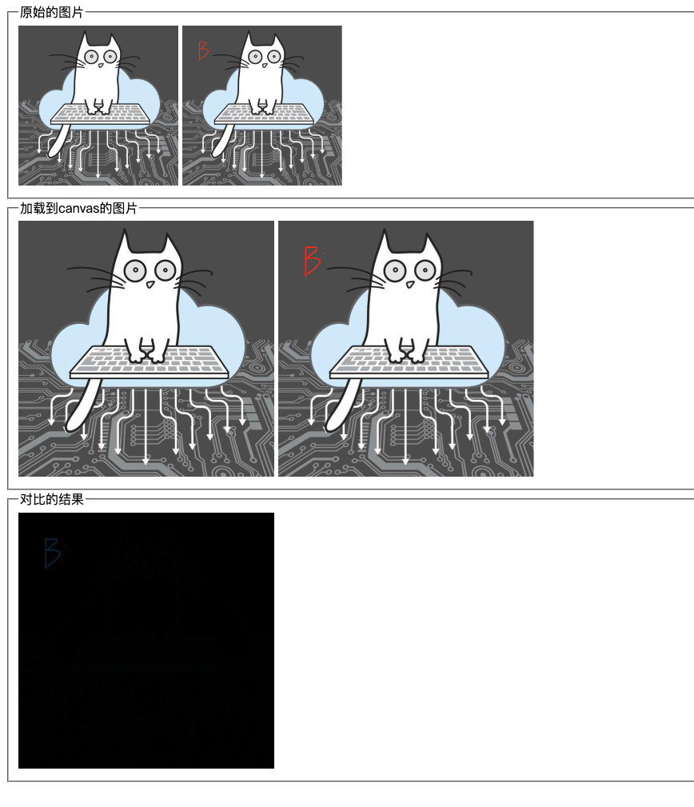

## 图片操作

使用canvas对图片进行操作，主要是将需要的图片绘制到canvas中，然后可以对图片进行拼接、裁剪、组合、缩放等；

[示例代码:https://github.com/qiuwww/blog/blob/master/0.2.HTML/canvas/%E5%9B%BE%E7%89%87%E6%93%8D%E4%BD%9C](https://github.com/qiuwww/blog/blob/master/0.2.HTML/canvas/%E5%9B%BE%E7%89%87%E6%93%8D%E4%BD%9C)

### 图片合成 / 绘制海报 / 水印图片

就是将图片指定的区域，绘制到canvas的指定位置。只要是图片都可以组合，还可以借助前面的方法，对图片进行简单的处理。

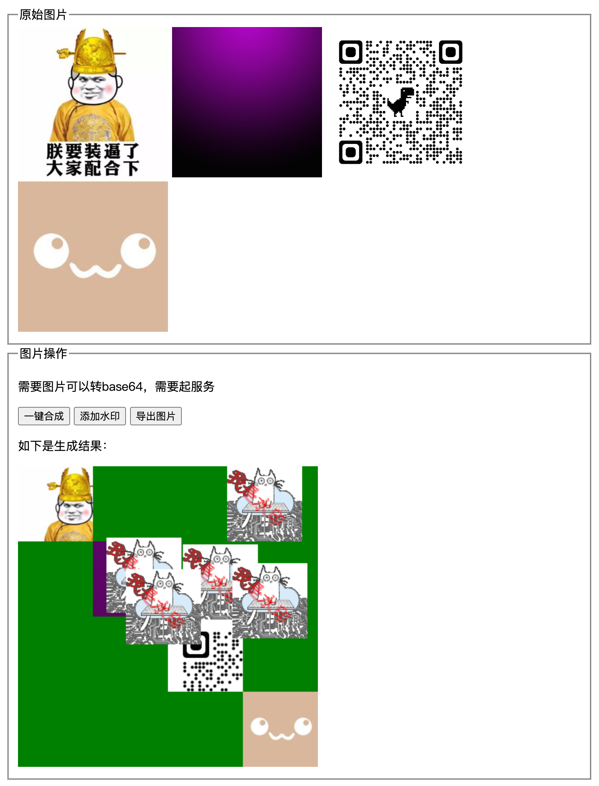

### html导出canvas，然后保存为图片

这里使用`html2canvas`这个包来操作，html转为canvas原理也不难，主要是一些兼容的语法与细节问题，核心就是将html结构化的内容，获取其各种属性（能描述网页的内容信息及样式的），然后逐个会知道目标canvas上，然后再导出为图片，以及进行后续的一些操作。

html2canvas 的原理简单来说就是遍历 dom 结构中的属性然后转化到 canvas 上来渲染出来。

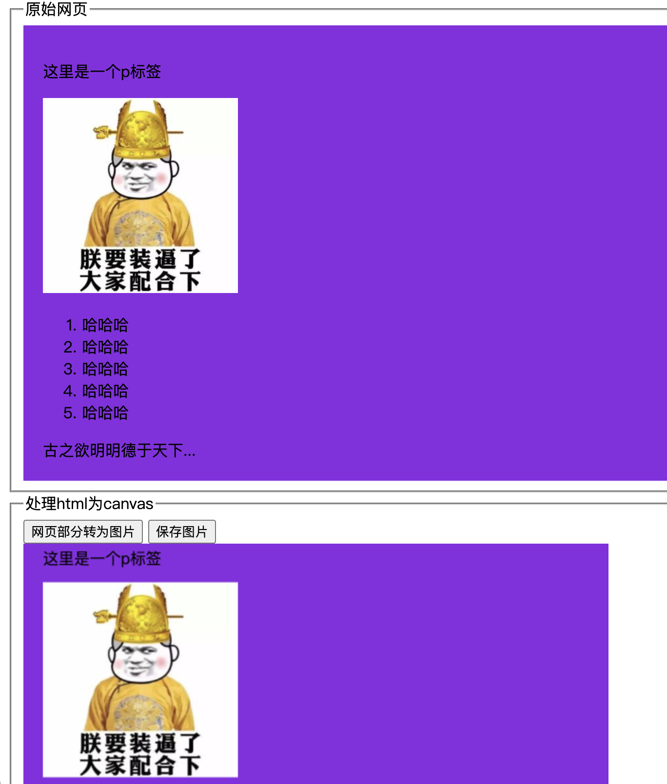

## 分形图

这个很简单，主要是绘制一些线段与封闭图形。采用层级遍及 + 随机的方式，可以构建出来各种各样的图形，这里分享一些自己创建的图形。


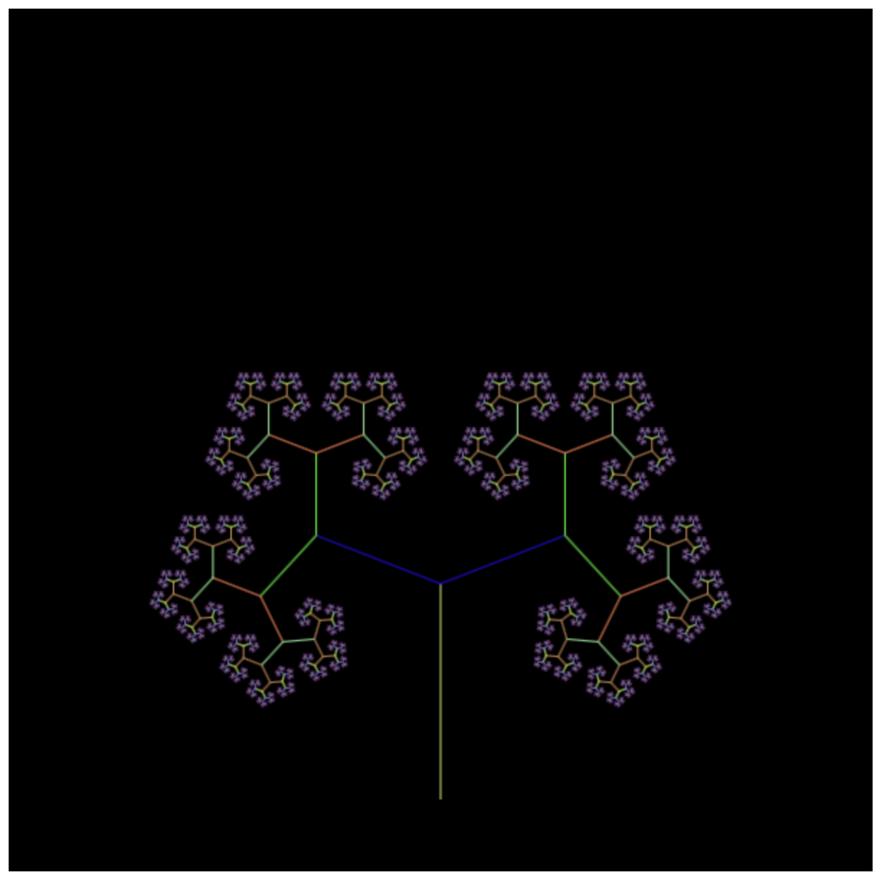
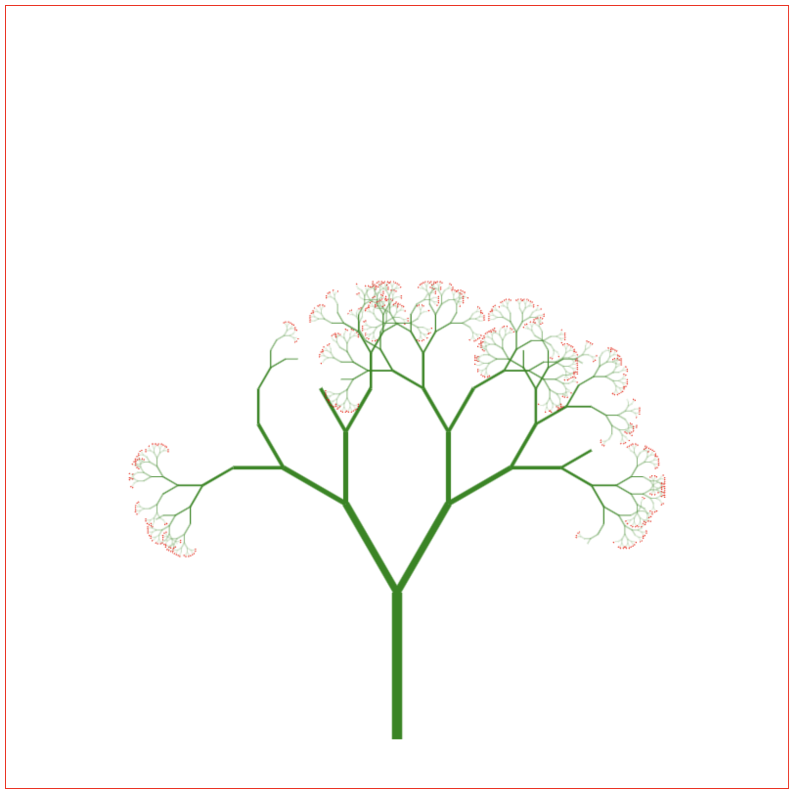

[示例代码:https://github.com/qiuwww/blog/blob/74f914c94945b57b9c10c3723f6ee493c9142298/0.2.HTML/canvas/%E5%88%86%E5%BD%A2%E5%87%A0%E4%BD%95](https://github.com/qiuwww/blog/blob/74f914c94945b57b9c10c3723f6ee493c9142298/0.2.HTML/canvas/%E5%88%86%E5%BD%A2%E5%87%A0%E4%BD%95)。

## 碰撞检测

这个原理也很简单，只需要你在当前时间点，知道目标元素的位置，以及关联的其他元素的位置，然后通过计算就可以知道接下来是不是会发生碰撞，在一个距离范围内，就可以判定为发生了碰撞。这里通常会涉及到速度与加速度的问题。

通常使用直角坐标系进行计算，以左上为原点，下为y轴正方向，右为x轴正方向。

1. 速度的累加就是距离原点的距离，通过距离 R 和角度 angle 来计算当前的位置；
2. 根据当前的位置 + 速度 + 当前的角度来递推当前的位置，前面的累计都保存到当前的位置内。
3. 发生碰撞后，直接将速度减慢

基本图形绘制里边介绍了一个平抛的小球与地面的碰撞，包括加速度、碰撞损耗、水平运动累加等；

如下是一段模仿水波的碰撞示例代码。

[示例代码:https://github.com/qiuwww/blog/blob/master/0.2.HTML/canvas/%E7%A2%B0%E6%92%9E%E6%A3%80%E6%B5%8B/%E6%B0%B4%E6%B3%A2](https://github.com/qiuwww/blog/blob/master/0.2.HTML/canvas/%E7%A2%B0%E6%92%9E%E6%A3%80%E6%B5%8B/%E6%B0%B4%E6%B3%A2)


## 绘制函数

1. 绘制函数，首先绘制坐标系，canvas的体系整体向右下方向为正，与日常的直角坐标系右上的方向，有一些出入，所以需要进行一定的坐标变换；比如以右下(300, 300)为原点，就需要x、y都加上300，然后去计算实际的位置；
2. 这里绘制的都是一些线段，线宽为奇数不能被整除，导致绘制坐标为整数时，上下偏移出0.5像素。又由于0.5像素不能被显示，自动补足为1像素，于是整体像素+1；
   1. 就是要线条的坐标刚好在+0.5的位置上，这里整体向右下偏移0.5；
      1. 解决办法: `var fix1px = (cxt.lineWidth % 2 === 0) ?0: 0.5;`；
         1. `x = x + fix1px`；
         2. `y = y + fix1px`；
3. 要注意坐标轴的刻度与绘制时候的真实长度，这里一般是有一个换算比例的；
4. 内部容易遇到js计算精度的问题，要注意处理；
5. 这里需要用到`eval`来直接计算表达式的值，得到y的坐标位置；
6. 用到的`Math`，可以直接被eval处理；

[示例代码:https://github.com/qiuwww/blog/blob/master/0.2.HTML/canvas/canvas%E7%BB%98%E5%88%B6%E6%95%B0%E5%AD%A6%E5%87%BD%E6%95%B0](https://github.com/qiuwww/blog/blob/master/0.2.HTML/canvas/canvas%E7%BB%98%E5%88%B6%E6%95%B0%E5%AD%A6%E5%87%BD%E6%95%B0)

### 一些简单的函数图像

也可以自定义函数，需要完整的表达式，相乘需要添加*。

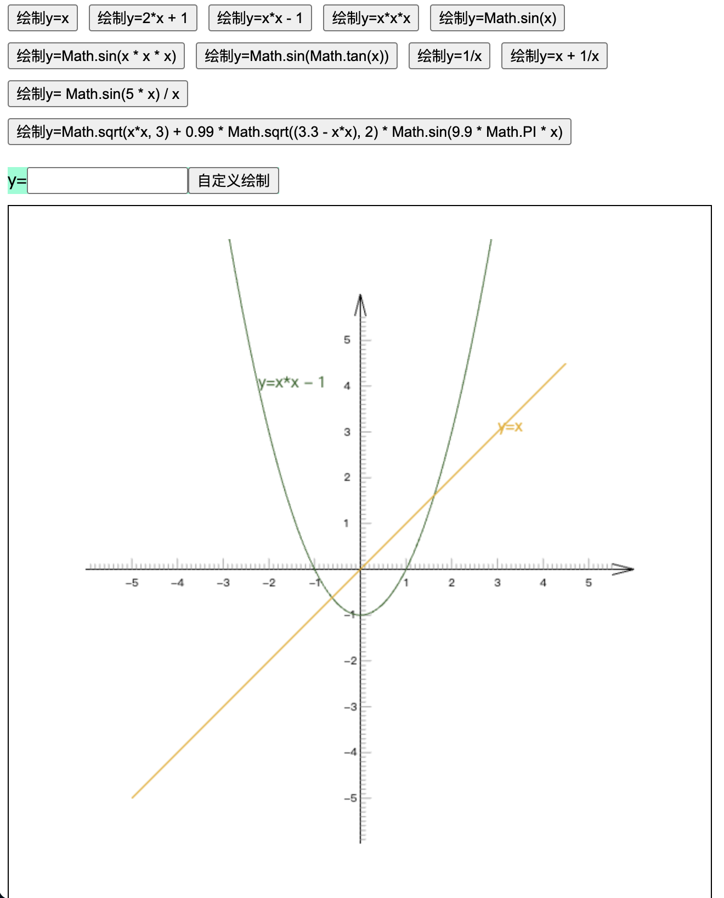
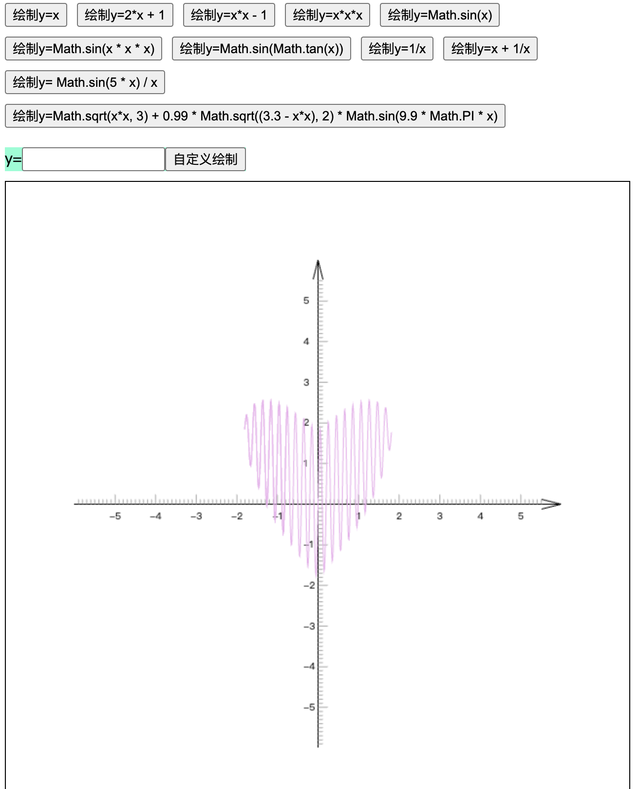


这里后续还可以做的吗，需要对输入进行格式化、函数坐标系可以添加网格、拖拽功能等。

## 绘图工具

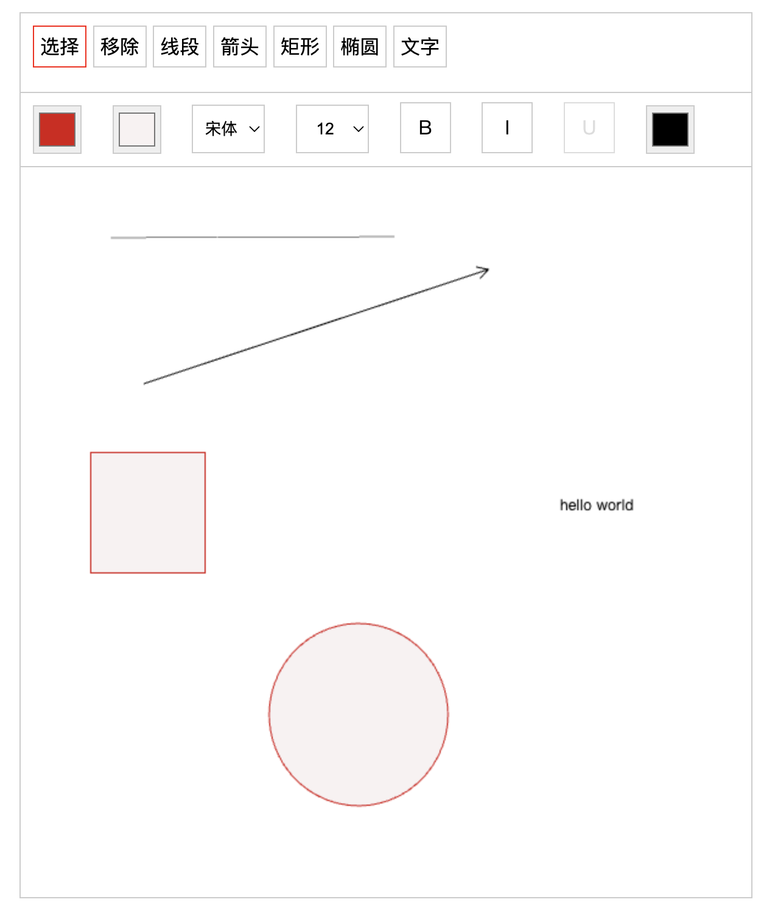

主要功能：

1. 一些基本的图形的绘制；
2. 基本的样式设置；
3. 事件操作，重新选择、删除等；

[示例代码：https://github.com/qiuwww/blog/blob/master/0.2.HTML/canvas/canvas-painter](https://github.com/qiuwww/blog/blob/master/0.2.HTML/canvas/canvas-painter)

## 开发一些小游戏

canvas可以绘制各种图形以及动画，开发一些可交互的小游戏，自然是可以的。比如一个典型的俄罗斯方块小游戏。

如下是自己学习的一个俄罗斯方块游戏。

[俄罗斯方块游戏:https://github.com/qiuwww/blog/blob/master/0.2.HTML/canvas/html5%E5%B0%8F%E6%B8%B8%E6%88%8F/h5%E6%96%B9%E5%9D%97%E6%B8%B8%E6%88%8F](https://github.com/qiuwww/blog/blob/master/0.2.HTML/canvas/html5%E5%B0%8F%E6%B8%B8%E6%88%8F/h5%E6%96%B9%E5%9D%97%E6%B8%B8%E6%88%8F)

[一个基础的移动的元素：https://github.com/qiuwww/blog/blob/master/0.2.HTML/canvas/%E7%BB%98%E5%88%B6%E5%9F%BA%E6%9C%AC%E5%9B%BE%E5%BD%A2/%E7%A7%BB%E5%8A%A8%E7%9A%84%E5%A4%A7%E5%98%B4.html](https://github.com/qiuwww/blog/blob/master/0.2.HTML/canvas/%E7%BB%98%E5%88%B6%E5%9F%BA%E6%9C%AC%E5%9B%BE%E5%BD%A2/%E7%A7%BB%E5%8A%A8%E7%9A%84%E5%A4%A7%E5%98%B4.html)

## more

以上的内容主要介绍了canvas操作2d绘图的内容，使用canvas还可以进行3d的绘制，随着移动端设备性能的提高，这方面还是有很大的发展潜力的。主要webgl及相关的一些操作库。后续会继续介绍相关的内容。

canvas于svg比较类似，使用一些js库，可以操作这些载体，本质上都是对一些结构化的配置进行解析，生成目标元素。

### canvas在node端的使用

1. node环境也是能运行chrome浏览器的，所以自然可以进行相关的操作，能想到的一些应用场景；
   1. 自定义生成验证码；
   2. 对前端上传的图片进行相关的操作，如压缩，解析等；

## 参考

1. [mdn Canvas_API](https://developer.mozilla.org/en-US/docs/Web/API/Canvas_API)；
2. [CanvasPainter](https://github.com/nizniz187/CanvasPainter)；
3. [node-canvas](https://www.npmjs.com/package/canvas)；
4. [qrcode-reader](https://www.npmjs.com/package/qrcode-reader)；
5. [canvas-engine](https://musicfe.com/canvas-engine/)；
6. [canvas线条1px模糊问题](https://blog.csdn.net/Mingyueyixi/article/details/80970144)；
