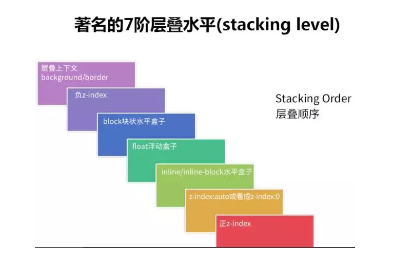

## 从 position: fiexed;失效开始谈起

当元素祖先的 transform 属性非 none 时，**定位容器由视口改为该祖先**(切实感受过被支配的恐惧)。

### Stacking Context -- 堆叠上下文

好的嘛，好的嘛，又冒出新的名词了，堆叠上下文（又译作层叠上下文），又是什么？

**堆叠上下文（Stacking Context）**：堆叠上下文是 HTML 元素的**三维概念**，这些 HTML 元素在一条假想的相对于面向（电脑屏幕的）视窗或者网页的用户的 z 轴上延伸，HTML 元素依据其自身属性按照优先级顺序占用层叠上下文的空间。

概念比较抽象，简单理解，记住 生成了 Stacking Context 的元素会影响该元素的层叠关系与定位关系。

关于 生成了 Stacking Context 的元素会影响该元素的层叠关系 这一点，具体可以看看这篇文章 层叠顺序（**stacking level**）与堆栈上下文（**stacking context**）知多少？

而本文提到了生成了 Stacking Context 的元素会影响该元素定位关系 。按照上面的说法，堆叠上下文的创建，该元素会影响其子元素的固定定位。**设置了 position:fixed 的子元素将不会基于 viewport 定位，而是基于这个父元素。**

### 如何创建堆叠上下文

1. 根元素 (HTML)，
2. z-index 值不为 "auto"的 绝对/相对定位，
3. 一个 z-index 值不为 "auto"的 flex 项目 (flex item)，即：父元素 display: flex|inline-flex，
4. opacity 属性值小于 1 的元素（参考 the specification for opacity），
5. transform 属性值不为 "none"的元素，
6. mix-blend-mode 属性值不为 "normal"的元素，
7. filter 值不为“none”的元素，
8. perspective 值不为“none”的元素，
9. isolation 属性被设置为 "isolate"的元素，
10. position: fixed
11. 在 will-change 中指定了任意 CSS 属性，即便你没有直接指定这些属性的值
12. -webkit-overflow-scrolling 属性被设置 "touch"的元素

## 参照层叠上下文

- 也就是 background-color 永远在最底一层；
- 标准文档流在负的 z-index 之上，这个容易理解；
- 浮动元素会漂到标准文档流上一层，仅仅一点点，可能是 0.00001；
- 也就是说标准文档流处在一个 0-，小于 0，但是大于一切负数；
- inline/inline-block，在浮动元素之上，设置了非负的 z-index 之下；
- z-index 为正，在最上层；

## 缺失的关键信息包括

- 位于最低水平的 border/background 指的是层叠上下文元素的边框和背景色。每一个层叠顺序规则适用于一个完整的层叠上下文元素。
- 原图没有呈现 inline-block 的层叠顺序，实际上，inline-block 和 inline 水平元素是同等 level 级别。
- z-index:0 实际上和 z-index:auto 单纯从层叠水平上看，是可以看成是一样的。注意这里的措辞——“单纯从层叠水平上看”，实际上，两者在层叠上下文领域有着根本性的差异。

## 深层次的理解

装饰 -> 布局 -> 内容
