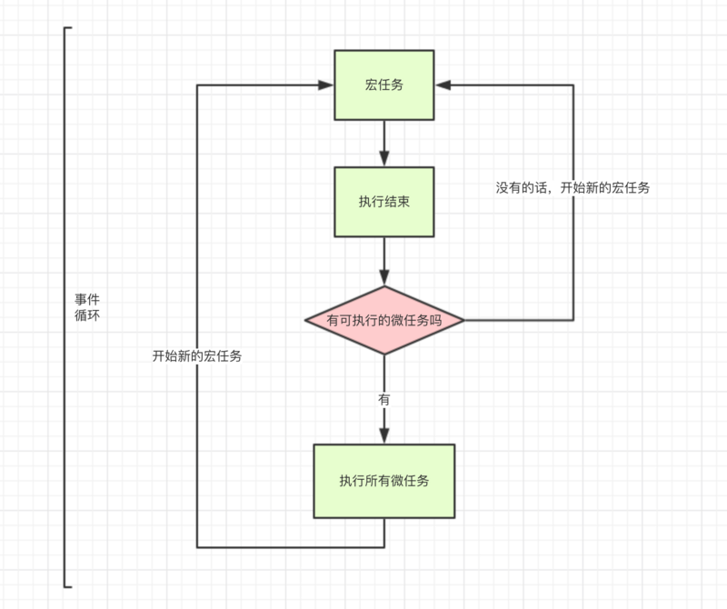

[TOC]

## 参考文章

[JavaScript 执行机制](https://segmentfault.com/a/1190000018227028)
[JS 运行机制及 Event Loop](https://zhuanlan.zhihu.com/p/52114921)
[JS 事件循环机制（event loop）之宏任务/微任务](https://juejin.im/post/5b498d245188251b193d4059)

## JS 语言特点

1. JS 是单线程语言；
2. JS 的 Event Loop 是 JS 的执行机制。

### 主要名词

1. synchronous：同步任务
2. asynchronous：异步任务

3. task queue/callback queue：**任务队列**，保存当前**运行时**需要执行的消息，等待执行
4. execution context stack：**执行栈**

5. heap：堆，对象被分配在一个堆中，即用以**表示一大块非结构化的内存区域**。
6. stack：栈，代码执行顺序栈

7. macro-task：宏任务
8. micro-task：微任务

JavaScript 的**并发模型基于“事件循环”**。

**调用一个函数总是会为其创造一个新的栈帧**。

JavaScript 永不阻塞。

### JS 为什么是单线程的

如果现在有 2 个进程，process1 process2，由于是多进程的 JS，所以他们对同一个 dom，同时进行操作。

process1 删除了该 dom，而 process2 编辑了该 dom，同时下达 2 个矛盾的命令，浏览器究竟该如何执行呢，

**目的就是为了避免出现自相矛盾的操作。**

### JS 为什么需要异步

如果 JS 中不存在异步，只能自上而下执行，如果上一行解析时间很长，那么下面的**代码就会被阻塞**。对于用户而言，阻塞就意味着"**卡死**"，这样就导致了很差的用户体验。

#### JS 单线程又是如何实现异步的呢

是通过的事件循环(event loop)，理解了 event loop 机制，就理解了 JS 的执行机制。

### JS 是按照语句出现的顺序执行的，先后

**代码都是自上而下依次执行**，**同步任务顺序执行，异步任务放入事件列表**，待同步任务执行完成之后，再依次执行。

### 执行栈

一个方法执行会向**执行栈中**加入这个方法的**执行环境**，在这个执行环境中还可以调用其他方法，甚至是自己，**其结果不过是在执行栈中再添加一个执行环境**。

## JS 同步任务与异步任务

JS 任务分类：

1. 同步任务
2. 异步任务

当我们打开网站时，**网页的渲染过程就是一大堆同步任务**，比如页面骨架和页面元素的渲染。

而像加载图片音乐之类**占用资源大、耗时久的任务**，就是**异步任务**。

### 异步任务有哪些

1. 事件处理
2. ajax 请求
3. .then 函数里面是异步任务
4. 图片加载 onload
5. script 脚本下载

### JS 任务的执行顺序，事件循环 Event Loop

1. 主线程执行当下；
2. event loop，保存需要执行的，主线程为空就取一个在主线程执行

具体过程：

1. 同步和异步任务分别进入不同的执行"场所"，**同步的进入主线程，异步的进入 Event Table 并注册回调函数**，当指定的注册事情完成时，**Event Table 会将这个函数移入 Event Queue**；
2. 执行同步代码，这属于**宏任务**；
3. **执行栈为空，查询是否有微任务(当前宏任务衍生的微任务)需要执行**；
4. 执行所有微任务；
5. **此时本轮循环结束**，**开始执行 UI render**。
6. UI render 完毕之后接着下一轮循环，**也就是说 UI render 在本次 event loop 中最后执行**；
7. 然后开始下一轮 `Event loop`，从 task queue 取出一个衍生的宏任务开始执行；
8. **主线程内的任务执行完毕为空，会去 Event Queue 读取对应的函数，进入主线程执行**，上述过程会不断重复，也就是常说的 Event Loop(事件循环)。。

只要主线程空了，就会去读取"任务队列"，这就是 JavaScript 的运行机制。

通过上述的 `Event loop` 顺序可知，如果宏任务中的异步代码有大量的计算并且需要操作 `DOM` 的话，**为了更快的响应界面响应**，我们可以把操作 `DOM` 放入微任务中。

#### 如何知道主线程执行栈为空

JS 引擎存在**monitoring process 进程**，会**持续不断的检查主线程执行栈是否为空**，一旦为空，就会去 Event Queue 那里检查是否有等待被调用的函数。

```js
while (queue.waitForMessage()) {
  queue.processNextMessage();
}
```

如果当前没有任何消息，queue.waitForMessage() 会同步地等待**消息**到达。

## JS 宏任务与微任务

- macro-task(宏任务)

  1. 包括**整体代码 script**，同步代码
  2. setTimeout
  3. setInterval
  4. setImmediate，该方法用来把一些需要长时间运行的操作放在一个回调函数里，在浏览器完成后面的其他语句后，就立刻执行这个回调函数。等于 setTimeout(func, 0)。
  5. I/O

- micro-task(微任务)

  1. 原生 Promise(有些实现的 promise 将 then 方法放到了宏任务中)（定义函数是同步代码，**then 的回掉函数是微任务代码**）
  2. process.nextTick
  3. Object.observe(已废弃)
  4. MutationObserver 记住就行了

- **UI rendering**，需要在微任务之后执行。requestAnimationFrame 也属于这里，**也就是 requestAnimationFrame（重绘之前） 需要在微任务之后执行**。

### 实例，request，异步请求数据

```js
let data = [];
$.ajax({
  url: www.javascript.com,
  data: data,
  success: () => {
    console.log('发送成功!');
  },
});
console.log('代码执行结束');
```

上边代码的执行过程：

1. ajax 进入 Event Table，**注册回调函数 success**。
2. 执行 console.log('代码执行结束')，这个时候主线程执行栈为空，如果 ajax 事件还未完成就会空置。
3. ajax **事件完成，回调函数** success 进入 Event Queue，**等待执行，并不是立即执行**。
4. 主线程从 Event Queue 读取回调函数 success 并执行。

### 异步任务的执行 setTimeout/setInterval

```js
setTimeout(() => {
  task();
}, 3000);

sleep(10000000); // 耗时较长的同步任务
```

1. task()进入 **Event Table 并注册，计时开始**。
2. 执行 sleep 函数，很慢，非常慢，计时仍在继续。
3. 3 秒到了，**计时事件 timeout 完成，task()进入 Event Queue，等待执行**，但是 sleep 也太慢了吧，还没执行完，只好等着。
4. sleep 终于执行完了，task()终于从 Event Queue 进入了主线程执行。

`setTimeout(fn,0)`的含义是，指定某个任务在主线程**最早可得的空闲时间执行**，意思就是不用再等多少秒了，**只要主线程执行栈内的同步任务全部执行完成**，栈为空就马上执行。

对于执行顺序来说，**setInterval** 会**每隔指定的时间将注册的函数置入 Event Queue**，如果前面的任务耗时太久，那么同样需要等待。

对于 `setInterval(fn,ms)`来说，我们已经知道**不是每过 ms 秒会执行一次 fn，而是每过 ms 秒，会有 fn 进入 Event Queue**。一旦 setInterval 的回调函数 fn 执行时间超过了延迟时间 ms，那么就完全看不出来有时间间隔了。

### process.nextTick

process.nextTick(callback)类似 node.js 版的"setTimeout"，在事件循环的下一次循环中调用 callback 回调函数。但是，这里是微任务，而 setTimeout 是宏任务。

### requestAnimationFrame

1. 在下次重绘之前执行一次。
2. 隐藏 tab 的时候，会暂停执行。
3. 在 Web 应用中，**实现动画效果**的方法比较多，JavaScript 中可以通过定时器 setTimeout 来实现，css3 可以使用 transition 和 animation 来实现，html5 中的 canvas 也可以实现。除此之外，html5 还提供一个专门用于**请求动画的 API**，即 **requestAnimationFrame（rAF）**，顾名思义就是 “**请求动画帧**”。
4. window.requestAnimationFrame() 告诉浏览器——你希望执行一个动画，**并且要求浏览器在下次重绘之前调用指定的回调函数更新动画**。该方法需要传入一个回调函数作为参数，该回调函数会在浏览器**下一次重绘（UI Render）之前执行**。

```js
var progress = 0;
//回调函数
function render() {
  progress += 1; //修改图像的位置
  console.log('progress', progress);
  if (progress < 100) {
    //在动画没有结束前，递归渲染
    window.requestAnimationFrame(render);
  }
}
//第一帧渲染
window.requestAnimationFrame(render);
```

#### rAF 的优势

1. **CPU 节能**：
   1. 使用 setTimeout 实现的动画，**当页面被隐藏或最小化时，setTimeout 仍然在后台执行动画任务**，由于此时页面处于不可见或不可用状态，刷新动画是没有意义的，而且还浪费 CPU 资源。
   2. 而 rAF 则完全不同，**当页面处理未激活的状态下，该页面的屏幕绘制任务也会被系统暂停**，因此跟着系统步伐走的 rAF 也会停止渲染，**当页面被激活时，动画就从上次停留的地方继续执行**，有效节省了 CPU 开销。
2. **函数节流**：在**高频率事件**(resize,scroll 等)中，为了**防止在一个刷新间隔内发生多次函数执行**，使用 rAF 可**保证每个绘制间隔内，函数只被执行一次**，这样既能保证流畅性，也能更好的节省函数执行的开销。一个绘制间隔内函数执行多次时没有意义的，因为显示器每 16.7ms 绘制一次，多次绘制并不会在屏幕上体现出来。

### 宏任务与微任务的执行顺序

事件循环的顺序，决定**js 代码的执行顺序**。

宏任务( 内部包括的微任务，也就是宏任务分割了微任务-》微任务) -》 宏任务

1. 进入整体代码(宏任务)后，开始**第一次循环**，接着执行所有的微任务；
2. 然后**再次从宏任务开始**，找到其中一个任务队列执行完毕，再执行所有的微任务。



#### 宏任务与微任务执行过程分析 1

```js
setTimeout(function () {
  console.log('setTimeout');
});

new Promise(function (resolve) {
  console.log('promise');
}).then(function () {
  console.log('then');
});

console.log('console');

// promise
// console
// setTimeout
```

- 这段代码整个**作为一个宏任务**，进入主线程。
- 先遇到`setTimeout`，异步任务，那么**将其回调函数注册后分发（分发时间，取决于定于的延迟时间）到宏任务 Event Queue**。(注册过程与上同，下文不再描述)
- 接下来遇到了 Promise，**new Promise 立即执行**（同步执行），**then 函数分发到微任务 Event Queue**（微任务）。
- 遇到 console.log()，立即执行（同步任务）。
- 好啦，整体代码 script 作为第一个宏任务执行结束，看看有哪些微任务？我们发现了 then 在微任务 Event Queue 里面，执行，这里的 then 微任务是执行当前宏任务产生的，所以本次直接执行，但是 setTimeout 是宏任务，需要下一次事件循环才能执行（也就是衍生的宏任务要等到下次事件循环才能执行）。
- ok，第一轮事件循环结束了，我们**开始第二轮循环**，当然要从宏任务 Event Queue 开始。我们发现了宏任务 Event Queue 中 setTimeout 对应的回调函数，立即执行。 结束。

#### 宏任务与微任务执行过程分析 2

```js
// 这段代码记做宏任务1
console.log('1');

setTimeout(function () {
  // 执行宏任务1中产生的宏任务setTimeout1，需要处理完成，再处理别的地方
  console.log('2');
  process.nextTick(function () {
    console.log('3');
  });
  new Promise(function (resolve) {
    console.log('4');
    resolve();
  }).then(function () {
    console.log('5');
  });
}, 0);

process.nextTick(function () {
  // 执行宏任务1中产生的微任务
  console.log('6');
});

new Promise(function (resolve) {
  // 同步执行
  console.log('7');
  resolve();
}).then(function () {
  // 回掉函数是执行宏任务1中产生的微任务
  console.log('8');
});

setTimeout(function () {
  // 执行宏任务1中产生的宏任务setTimeout2
  console.log('9');
  process.nextTick(function () {
    console.log('10');
  });
  new Promise(function (resolve) {
    console.log('11');
    resolve();
  }).then(function () {
    console.log('12');
  });
}, 0);

// 结果
// 宏任务1直接执行结果
// 1
// 7
// 宏任务1中衍生的微任务的执行结果
// 6
// 8

// 宏任务setTimeout1直接执行结果
// 2
// 4
// 宏任务setTimeout1中衍生的微任务的执行结果
// 3
// 5

// 宏任务setTimeout2直接执行结果
// 9
// 11
// 宏任务setTimeout2中衍生的微任务的执行结果
// 10
// 12
```

##### 第一轮事件循环流程分析如下

- 整体 script 作为第一个宏任务进入主线程，遇到 console.log，**输出 1**。
- 遇到 setTimeout，其回调函数被分发到**宏任务 Event Queue**中。我们暂且记为 setTimeout1。
- 遇到 process.nextTick()，其回调函数被分发到**微任务 Event Queue**中。我们记为 process1。
- 遇到 Promise，new Promise 直接执行，**输出 7**。then 被分发到微任务 Event Queue 中。我们记为 then1。
- 又遇到了 setTimeout，其回调函数被分发到宏任务 Event Queue 中，我们记为 setTimeout2。
- 我们发现了 process1 和 then1 两个微任务。
- 执行 process1,输出 6。
- 执行 then1，输出 8。

第一次时间循环结束：

- 宏任务 Event Queue: setTimeout1、setTimeout2，进入事件循环
- 微任务 Event Queue: process1、then1，这里会在宏任务 1 执行之后执行。

##### setTimeout1 宏任务开始

- 首先输出 2。
- 接下来遇到了 process.nextTick()，同样将其分发到微任务 Event Queue 中，记为 process2。
- new Promise 立即执行输出 4，then 也分发到微任务 Event Queue 中，记为 then2。
- 第二轮事件循环宏任务结束，我们发现有 process2 和 then2**两个微任务可以执行**。
- 输出 3。
- 输出 5。

##### setTimeout2 宏任务开始

- 第三轮事件循环开始，此时只剩 setTimeout2 了，执行。
- 直接输出 9。
- 将 process.nextTick()分发到微任务 Event Queue 中。记为 process3。
- 直接执行 new Promise，输出 11。
- 将 then 分发到微任务 Event Queue 中，记为 then3。

- 第三轮事件循环宏任务执行结束，执行两个微任务 process3 和 then3。
- 输出 10。
- 输出 12。

#### 宏任务与微任务执行过程分析 3

```js
// 1. 加入 tasks 队列，宏任务队列
setTimeout(() => {
  // 7. 首次 eventloop 结束，从 tasks 中取出 setTimeout callback，执行。
  console.log('timer');
  // 8. 加入 microtask 中
  Promise.resolve().then(function () {
    console.log('promise1');
  });
  // 9. task 执行完，清空 micro 队列，输出 'promise1'
}, 0);

// 2. then回掉函数，加入 microtask 队列
Promise.resolve().then(function () {
  // 5. 第一个 microtask 任务
  console.log('promise2');
  // 6. 把 promise3 加入 micro 队列，发现队列不为空，执行输出 'promise3'
  Promise.resolve().then(function () {
    console.log('promise3');
  });
});

// 3. 执行，输出 'script'
console.log('script');
// 4. 第一个 eventloop task 阶段完毕, 开始执行 microtask queue

// script

// promise2
// promise3

// timer
// promise1
```

#### 宏任务与微任务执行过程分析 4

node 在处理一个执行队列的时候不管怎样都会先执行完当前队列，然后再清空微任务队列，再去执行下一个队列。

Node 环境下异步执行顺序与浏览器下 js 执行顺序不完全一致。

```js
console.log('start');
setTimeout(function () {
  console.log(2);
  new Promise((resolve) => {
    console.log('promise');
    resolve();
  }).then(() => {
    console.log('promise then');
  });
}, 0);

setTimeout(() => {
  console.log(3);
}, 0);

console.log('end');
// 浏览器js: start, end, 2, promise, promise then, 3
// node: start, end, 2, promise, 3, promise then
// 目前版本的11.15执行顺序与浏览器一致
```

## JS 为什么要区分微任务和宏任务

promise 是 v8 自带，直接调用底层。

setTimeout 是浏览器/node 环境或者 j2v8 等环境自己封装的 api，性能上不如 promise。

**区分优先级**。16ms 的执行限制。

机场也有 vip 通道，任务分优先级是很正常的，要不然紧急任务怎么插队。
