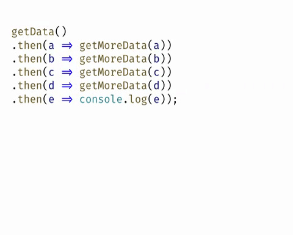

[TOC]

## 是什么

常见场景：

- html 中 js 加载
- js 中，setTimeout/setInterval/事件回调/http 请求/requestAnimationFrame/读写文件，Node.js 中

处理方式：

- 回调函数，callback/promise/\*-yield/async-await
- 发布/订阅( Pub/Sub )

## 为什么需要异步

- JavaScript 是**单线程执行**，**避免引起同时渲染又修改 html** 之类的问题；
- 排队，前面一个任务完成，再执行后面一个任务；
- **死循环**，耗时较长的任务，常见的浏览器无响应（假死）。

所以 js 将任务的执行模式分为两种：同步和异步。

- 同步就是顺序执行，连续的执行
- 异步永远排在同步任务后边，不连续的执行

[JS 的事件循环机制](./BLOG-JavaScript执行机制.md)

## html 中的文件异步加载

正常的页面解析：解析 html 文件，**遇到外部文件，就执行下载线程**，下载完成，按照顺序执行。

[浏览器渲染过程|从输入 url 到页面加载完成的过程都发生了什么](./3.浏览器原理/从输入url到页面加载完成的过程都发生了什么/BLOG-从输入url到页面加载完成的过程都发生了什么.md)

html 下载文件的操作：

- defer 与 async，`<script>`标签的属性
  - defer 延迟脚本。`<script type="text/javascript" defer="defer" src="..."></script>`，设置给 javascript 标签，**立即下载，延时执行**。
  - 异步脚本 async，onload 之前执行，**告诉浏览器不需要等待脚本的下载和执行**，不保证执行顺序。
- 文件加载与页面解析，同时加载 6 个资源，chrome
- **js 延时加载文件，懒加载，使用 js 来生成标签来加载资源**
- [worker，子线程的概念](https://developer.mozilla.org/zh-CN/docs/Web/API/Web_Workers_API)

## js 异步操作有哪些

### setTimeout 与 setInterval

[setTimeout](https://developer.mozilla.org/zh-CN/docs/Web/API/Window/setTimeout)
[setInterval](https://developer.mozilla.org/fr/docs/Web/API/WindowTimers/setInterval)

### 事件

[事件](https://developer.mozilla.org/zh-CN/docs/Web/API/Document_Object_Model/Events)

### http 请求，ajax/fetch

[ajax](https://developer.mozilla.org/zh-CN/docs/Web/Guide/AJAX/Getting_Started)
[fetch](https://developer.mozilla.org/zh-CN/docs/Web/API/Fetch_API/Using_Fetch)

### requestAnimationFrame，下次重绘之前调用指定的回调函数更新动画

[requestAnimationFrame](https://developer.mozilla.org/zh-CN/docs/Web/API/Window/requestAnimationFrame)

### 读写文件，Node.js 中，如 dir.read(callback)

[fs 模块](http://nodejs.cn/api/fs.html)

## js 中异步操作的处理方式

- 回调处理模式
  - callback
  - Promise/A+
  - 生成器 [Generators/yield](https://developer.mozilla.org/zh-CN/docs/Web/JavaScript/Reference/Global_Objects/Generator)
  - async...await
- 发布/订阅( Pub/Sub )，可以执行多个，关联事件回调到对象上
  - [EventEmitter](http://nodejs.cn/api/events.html)
  - [rxjs](https://rxjs-cn.github.io/learn-rxjs-operators/operators/combination/combineall.html)

实例参考[test](./test/index.html)下的 html。

### promise 对象的操作

promise 的 pending 状态可以转为 fulfill（成功状态）和 reject（拒绝状态），

一旦状态确定就不能改变，所以如果是成功，就都走成功链，如果失败就走失败链。

这个时候如果继续返回拿到的 res 对象，就可以继续处理 pending，也就是 then 是可以连续操作，同样 catch 的时候，拿到的是 reject 的返回，**如果继续返回 e，就可以继续 catch 操作**，与 then 操作一致，不过 then 方法不能再处理。

### generator

ES6 提供的一种异步编程解决方案，语法行为与传统函数完全不同。

一个状态机，封装了很多状态。

generator 函数会**返回一个遍历器对象（代表 Generator 函数的内部指针）**，可以依次遍历函数内部的每个状态。

生成器对象是由一个 generator function 返回的,并且它符合可迭代协议和迭代器协议。

generator 函数是**分段执行**的，yield 语句是**暂停执行**的标记，而 next 方法可以**恢复执行**。

```js
function* idMaker() {
  let index = 0;
  while (true) yield index++;
}

let gen = idMaker(); // "Generator { }"
// 通过调用遍历器的next方法使得指针移向下一个状态。
console.log(gen.next().value);
// 0
console.log(gen.next().value);
// 1
console.log(gen.next().value);
// 2
// ...
```

### Async/Await

async 函数就是 generator 函数的语法糖。

async/await 函数的实现，就是将 Generator 函数和自动执行器，包装在一个函数里。

async 函数，就是将 generator 函数的\*换成 async，将 yield 替换成 await。

- async/await 是写异步代码的新方式，以前的方法有回调函数和 Promise。
- async/await 是**基于 Promise 实现**的，它不能用于普通的回调函数。
- async/await 与 Promise 一样，是**非阻塞**的。
- async/await **使得异步代码看起来像同步代码**，这正是它的魔力所在。

async 函数对 generator 的改进：

1. 内置执行器，不需要使用 next()手动执行。
2. await 命令后面**可以是 Promise 对象或原始类型的值**，yield 命令后面只能是 Thunk 函数或 Promise 对象。
3. **返回值是 Promise**。返回非 Promise 时，async 函数会把它包装成 Promise 返回。(Promise.resolve(value))

#### await 原理

- await 是个**运算符，用于组成表达式**，await 表达式的运算结果取决于它**等**的东西。
- 如果它等到的不是一个 Promise 对象，那 await 表达式的**运算结果就是它等到的东西**。
- **如果它等到的是一个 Promise 对象**，await 就忙起来了，**它会阻塞后面的代码**，等着 Promise 对象 resolve，然后得到 resolve 的值，作为 await 表达式的运算结果。

generator 函数的自动执行。
