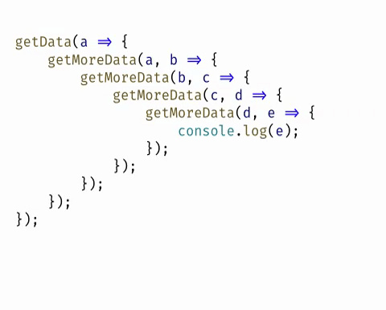

[TOC]

JS 是单线程执行的，但是遇到需要后续执行的或者定时执行的任务，就需要用到异步来处理，就是**未来要做的事情**。

## 异步操作是什么，有哪些

常见场景：

1. setTimeout/setInterval；
2. 事件回调；
3. http 网络请求；
4. requestAnimationFrame；
5. 读写文件；
6. Node.js 中 nextTick 等。

处理方式：

1. 回调函数，具体有如下的处理方式：
   1. callback
   2. promise
   3. \*-yield
   4. async-await
2. 发布/订阅( emit/listen )。

## 为什么需要异步

1. JavaScript 是**单线程执行**，**避免引起同时渲染又修改 dom** 之类的问题；
2. 同步代码依次排队执行，前面一个任务完成，再执行后面一个任务；
3. **死循环**，耗时较长的任务，常见的浏览器无响应（假死）。

所以 js 将任务的执行模式分为两种：同步和异步。

1. 同步就是顺序执行，连续的执行；
2. 异步永远排在同步任务后边，不连续的执行。
3. [JS 的事件循环机制](./BLOG-JavaScript执行机制.md)

## js 异步操作有哪些

### 1.setTimeout 与 setInterval

[setTimeout](https://developer.mozilla.org/zh-CN/docs/Web/API/Window/setTimeout)
[setInterval](https://developer.mozilla.org/fr/docs/Web/API/WindowTimers/setInterval)

### 2.事件

[事件](https://developer.mozilla.org/zh-CN/docs/Web/API/Document_Object_Model/Events)

### 3.http 请求，ajax/fetch

[ajax](https://developer.mozilla.org/zh-CN/docs/Web/Guide/AJAX/Getting_Started)
[fetch](https://developer.mozilla.org/zh-CN/docs/Web/API/Fetch_API/Using_Fetch)

### 4.requestAnimationFrame，下次重绘之前调用指定的回调函数更新动画

[requestAnimationFrame](https://developer.mozilla.org/zh-CN/docs/Web/API/Window/requestAnimationFrame)

### 5.读写文件，Node.js 中，如 dir.read(callback)

[fs 模块](http://nodejs.cn/api/fs.html)

## js 中异步操作的处理方式

1. 回调处理模式
   1. callback
   2. Promise/A+
   3. 生成器 [Generators/yield](https://developer.mozilla.org/zh-CN/docs/Web/JavaScript/Reference/Global_Objects/Generator)
   4. async...await
2. 发布/订阅( Pub/Sub )，可以执行多个，关联事件回调到对象上
   1. [EventEmitter](http://nodejs.cn/api/events.html)
   2. [rxjs](https://rxjs-cn.github.io/learn-rxjs-operators/operators/combination/combineall.html)

实例参考[test](./test/index.html)下的 html。
