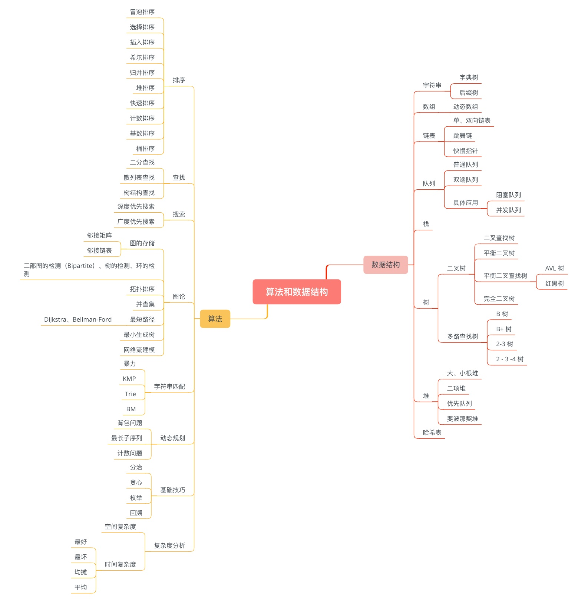

[TOC]

## 算法与数据结构概述



### 数据结构 - Data Structures

1. 数组与链表：单 / 双向链表、跳舞链；
2. 栈与队列；
3. 树与图：最近公共祖先、并查集；
4. 哈希表堆：大 / 小根堆、可并堆；
5. 字符串：字典树、后缀树。

### 算法 - Algorithms

1. 排序算法：**快速排序**、归并排序、计数排序；
   1. 分一般的初级排序算法和高级算法；
2. 搜索算法：回溯、**递归**、剪枝技巧；
3. 图论：**最短路**、最小生成树、网络流建模；
4. 动态规划：**背包问题、最长子序列**、计数问题；
5. 基础技巧：**分治**、倍增、**二分**、贪心。

#### 算法复杂度计算

1. 时间复杂度，主要看执行了多少次访问
   1. 如基础的 for 遍历，每个元素访问一次，时间复杂度就是 n；
   2. 对于二分法查找这类的算法，每次将范围缩小一半，`2^n = k -> n = log2(k)`，时间复杂度就是 logn；
2. 空间复杂度，主要是查看使用的数组/对象的长度，变量的个数；
   1. 典型的数组去重，使用字典的形式，空间换时间；

## 常见题目类型


可以明确的一点是，面试算法题目在难度上（尤其是代码难度上）会略低一些，倾向于考察一些**基础数据结构与算法**，对于高级算法和奇技淫巧一般不作考察。

非常关键的一点，对于一个问题，一定要找到一种最优解。

## 算法问题应该主要考虑的方向

1. 多思考能否使用**位运算**；
2. 考虑是否可以使用**数组下标**；
3. 考虑能否使用**双指针**；
4. 从**递归**到**备忘录**到**递推**或者**动态规划**；
5. 考虑是否可以设置**哨兵位**来处理临届问题。
6. 更多思考方向
   1. 二分法计算，逼近的原理；

### 1.多思考能否使用位运算

#### 按位操作符

[mdn 按位操作符](https://developer.mozilla.org/zh-CN/docs/Web/JavaScript/Reference/Operators/Bitwise_Operators)

按位操作符（Bitwise operators） 将其操作数（operands）当作 32 位的比特序列（由 0 和 1 组成），而不是十进制、十六进制或八进制数值。


所有的按位操作符的操作数都会被转成补码（two's complement）形式的有符号 32 位整数。

补码形式是指一个数的负对应值（negative counterpart）。

#### 按位操作一般使用技巧

##### 按位操作左移<<右移>>，和无符号右移>>>

1. n / 2 等价于 n >> 1， n / 4 等价于 n >> 2 n / 8 等价于 n >> 3，n \* 8 等价于 n << 3。**大部分编译器会自动帮你把 n / 2 优化成 n >> 1**。

##### 按位操作&

1. **n & 1** 等价于 n % 2，**计算数值奇偶性**。
2. 利用 **n & (n - 1)**消去 n 最后的一位 1，(这里的位是二进制的位)。
   1. 判断一个正整数 n 是否为 2 的幂次方
   2. 判断 正整数 n 的二进制表示中有多少个 1

```js
// 1. 判断一个正整数 n 是否为 2 的幂次方
const judege = (n) => {
  return (n & (n - 1)) == 0;
};
// test
judege(63);
judege(1024);
judege(1014);

// 2. 判断 正整数 n 的二进制表示中有多少个 1
const NumberOf12 = (n) => {
  var count = 0;
  var k = 1;
  while (n != 0) {
    count++;
    n = (n - 1) & n;
  }
  return count;
};
// test
NumberOf12(123);
console.log(Number(123).toString(2));
NumberOf12(123000);
console.log(Number(123000).toString(2));
```

##### 按位操作异或(^)

关于异或运算符，我们先来看下他的特性

1. 特性一：两个**相同的数相互异或**，运算结果为 0，例如 n ^ n = 0;
2. 特性二：**任何数和 0 异或，运算结果不变**，例如 n ^ 0 = n;
3. 特性三：支持交换律和结合律，例如 x ^ ( y ^ x) = (x ^ y) ^ x;

应用：

1. 只出现一次的数，**出现两次的数异或的结果都是 0**。

```js
const find = (arr = []) => {
  let tmp = arr[0];
  for (let i = 1; i < arr.length; i++) {
    tmp = tmp ^ arr[i];
  }
  return tmp;
};
// test
var arr1 = [1, 2, 3, 4, 2, 3, 1];
find(arr1);
```

### 2. 考虑是否可以使用数组下标

数组的下标是一个隐含的很有用的数组，特别是**在统计一些数字**，或者判断一些整型数是否出现过的时候。例如，给你一串字母，让你判断这些字母出现的次数时，我们就可以把这些字母作为下标，在遍历的时候，如果字母 a 遍历到，则 arr[a]就可以加 1 了，即 arr[a]++;

#### 具体应用

##### 1.数组排序

**问题**：给你 n 个无序的 int 整型数组 arr，并且这些整数的取值范围都在 0-20 之间，要你在 O(n) 的时间复杂度中**把这 n 个数按照从小到大的顺序打印出来**。

**思路**：对于这道题，如果你是先把这 n 个数先排序，再打印，是不可能 O(n)的时间打印出来的。但是数值范围在 0-20。我们就可以巧用数组下标了。把对应的数值作为数组下标，如果这个数出现过，则对应的数组加 1。

```js
const printInOrder = (arr = []) => {
  let temp = new Array(21);
  for (let i = 0; i < arr.length; i++) {
    // 把数组的数值当作索引填入数组中
    temp[arr[i]] = temp[arr[i]] ? temp[arr[i]] + 1 : 1;
  }
  console.log('temp:', temp);
  // 顺序打印
  for (let k = 0; k < 21; k++) {
    for (let j = 0; j < temp[k]; j++) {
      console.log(k);
    }
  }
};

// test
var arr1 = [1, 2, 3, 4, 20, 2, 12, 20];
printInOrder(arr1);
```

##### 2.判断一个数值是否在一个非常巨大的数组中

**问题**：假如给你 40 亿个非负数的 int 型整数，然后再给你一个非负数的 int 型整数 t ，让你判断 t 是否存在于这 40 亿数中，你会怎么做呢？

**思路**：

1. 直接数组遍历对比，这样需要的内存空间太大；
2. 采用下标法，我们可以把时间复杂度降低位 O(1)；
   1. [参考文章](https://mp.weixin.qq.com/s/r2WtHW7UcinIjelILSnWwg)
   2. 从磁盘加载数据是磁盘 io 操作，是非常慢的；
   3. 申请 40 亿个位就好，40 亿个数中，存在的数就在相应的位置 1，其他位就是 0；
   4. 2 的 32 次方个位，相当于 2 的 29 次方个字节，500MB；
   5. 连续数据简化处理：我们可以先对数据进行一个外部排序，然后用一个初始的数和一个长度构成一个数据结构，来表示一段连续的数；（时间复杂度增高）
   6. 如果数据是 1 2 3 4 6 7……这种的，那么可以用(1,4)和(6,2)来表示，这样一来，连续的数都变成了 2 个数表示；
   7. 多台机器同时查找，每台机器拿到 io 读取结果的部分；

js 根本没法处理 2 的 32 次方的数组，**长度超限**。

### 3. 考虑能否使用双指针

双指针这个技巧，那就更加常用的，特别是在链表和有序数组中。

#### 双指针可以解决的典型问题

1. 给定一个整数**有序数组**和一个**目标值**，找出数组中**和为目标值的两个数**，并且打印出来。参考[从数组中找出三数之和](./算法常见问题/GitBook-从数组中找出三数之和为n.md)

2. 判断单链表**是否有环**，**快慢指针**；参考[判断单链表是否有环](./链表/GitBook-判断单链表是否有环.md)；
3. 如何一次遍历就找到**链表中间位置节点**，快慢指针，二倍关系；
   1. 一样是设置一个快指针和慢指针。慢的一次移动一个节点，而快的两个。
   2. 在遍历链表的时候，当快指针遍历完成时，慢指针刚好达到中点。
4. 单链表中**倒数第 k 个节点**；
   1. 设置两个指针，其中一个指针**先移动 k 个节点**。之后两个指针以相同速度移动。
   2. 当那个先移动的指针遍历完成的时候，第二个指针正好处于倒数第 k 个节点。

### 4. 从递归到 备忘录 到 递推 或者 动态规划

递归类问题，首先要**考虑边界**的问题。

1. 递归
2. =》递归+备忘录
3. =》动态规划
4. =》动态规划优化

当你在使用递归解决问题的时候，要考虑以下两个问题

(1). 是否有**状态重复计算**的，可不可以使用备忘录法来优化。

(2). 是否可以采取**递推的方法来自底向上做**，减少一味递归的开销。

#### 1.对于可以递归的问题务必考虑是否有重复计算的 | 备忘录法

一只青蛙一次可以跳上 1 级台阶，也可以跳上 2 级。求该青蛙跳上一个 n 级的台阶总共有多少种跳法？

这个问题用递归很好解决。假设 f(n) 表示 n 级台阶的总跳数法，则有

`f(n) = f(n-1) + f(n - 2)`。

显然对于 f(n) = f(n-1) + f(n-2) 的递归[斐波那契数列](./算法常见问题/GitBook-斐波那契数列.md)，是有很多重复计算的。

这个时候我们要考虑状态保存。

1. **用 hashMap 来进行保存**，
2. 当然用一个数组也是可以的，这个时候就像我们上面说的**巧用数组下标**了。

#### 2.考虑自底向上

自底向上的做法称之为**递推**。for 循环获取。

```java
public int f(int n) {
    if(n <= 2)
        return n;
    int f1 = 1;
    int f2 = 2;
    int sum = 0;
    // 非递归，单纯的数值计算
    for (int i = 3; i <= n; i++) {
        sum = f1 + f2;
        f1 = f2;
        f2 = sum;
    }
    return sum;
}
```

根据这种带备忘录的递归，往往可以演变成**动态规划**。

[62. 不同路径](https://leetcode-cn.com/problems/unique-paths/)
[64. 最小路径和](https://leetcode-cn.com/problems/minimum-path-sum/)

#### 动态规划

1. 动态规划一般可以自顶向下推算出表达式；
2. 然后，可以**自底向上**写出表达式。
   1. 也可以自顶向下求解；

### 5. 考虑是否可以设置 哨兵 位来处理临届问题

例如插入排序，环形链表等。

## 参考文章

[五大常用算法技巧总结，助你更加快速解题](https://zhuanlan.zhihu.com/p/109431459)
