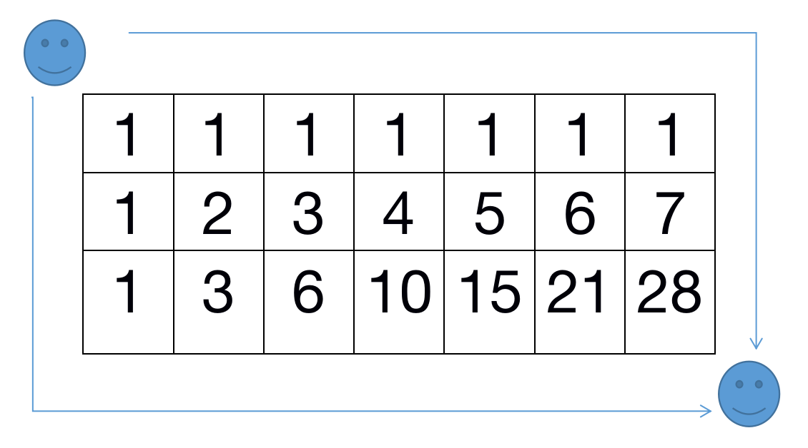

## 问题描述

斐波那契数列（Fibonacci sequence），又称黄金分割数列、因数学家列昂纳多·斐波那契（Leonardoda Fibonacci）以兔子繁殖为例子而引入，故又称为“兔子数列”，指的是这样一个数列：1、1、2、3、5、8、13、21、34、……在数学上，斐波那契数列以如下被以递推的方法定义：F(1)=1，F(2)=1, **F(n)=F(n - 1)+F(n - 2)**（n ≥ 3，n ∈ N\*）

使用代码实现**斐波那契数列**。

## 问题分析

1. 此题应该**避免使用递归**的方法，因为当 count 较大时，**递归的方法耗时较长**。
2. 故考虑使用**迭代法**，可以使用数组记录每一项。
3. 但此题只需要用到前面两项，**从节约空间的角度讲不需要开辟数组**。

## 代码实现

1. 递归(动态规划)；
2. **保存中间结果（备忘录）**的递归；
3. for 循环；
4. 通项公式；
5. 矩阵计算；

```js
// 方法1. 递归
// f(n) = f(n-1) + f(n-2)
// 使用深层遍历生成，递推公式求
// 用 JavaScript 实现斐波那契数列函数,返回第n个斐波那契数。 f(1) = 1, f(2) = 1 等
// 时间与空间复杂度：时间复杂度：O（N2），空间复杂度：O（N）
// 求f(5)，会计算，f4和f3，求f4，会计算f3和f2，又重复计算的问题

function fibonacci1(n) {
  return n < 2 ? n : fibonacci1(n - 1) + fibonacci1(n - 2);
}

// 方法2. 保存中间结果的递归，将结果保存起来，以备后用，降低空间复杂度
// 缓存上一步的计算结果，闭包函数也就是自带一部分变量的函数
// 时间与空间复杂度：这样，每个只会计算一次，时间复杂度基本为 O(n)，空间复杂度O(1)
var fibonacci2 = (function () {
  var memory = {};
  return function (n) {
    console.log('memory:', memory);
    if (n == 0 || n == 1) {
      return n;
    }
    if (memory[n - 2] === undefined) {
      memory[n - 2] = fibonacci2(n - 2);
    }
    if (memory[n - 1] === undefined) {
      memory[n - 1] = fibonacci2(n - 1);
    }
    return (memory[n] = memory[n - 1] + memory[n - 2]);
  };
})();

// 方法3. for循环，通过直接计算，不使用函数的结果
// 因为斐波那契数列可以从左到右顺序的求出每一项的值，因此只需要顺序计算到n项即可，时间复杂度为O(n)的，我们可以把它看成在单链表的最后插入一个右最后一个和倒数第二个指针指向的值来决定的。
// 时间与空间复杂度：时间复杂度：O（N），时间复杂度：O（1）
function fibonacci3(count) {
  if (count < 0) return 0;
  if (count <= 1) return 1;

  var first = 1;
  var second = 1;
  var third = 0;

  for (var i = 2; i <= count; i++) {
    third = first + second;
    first = second;
    second = third;
    console.log('third', third);
  }
  return third;
}

// 方法4. 通项公式
// 时间与空间复杂度：时间复杂度：O（logn），空间复杂度：O（1）
// 会有精度丢失的问题
var fibonacci4 = function (n) {
  return (Math.pow((1 + Math.sqrt(5)) / 2, n) - Math.pow((1 - Math.sqrt(5)) / 2, n)) / Math.sqrt(5);
};

//如下打印出这个数组，不过迭代太深，浏览器可能不执行
function resArr(len) {
  var arr = [];
  for (var i = 1; i < len + 1; i++) {
    arr.push(fibonacci4(i));
  }
  return arr;
}
console.log(resArr(10));

// 5. 矩阵计算
```

## 二维斐波那契数列 ｜ 动态规划

递推公式：`f(m, n) = f(m - 1, n) + f(m, n - 1);`



[62. 不同路径的问题](https://leetcode-cn.com/problems/unique-paths/)

一个机器人位于一个 m x n 网格的左上角 （起始点在下图中标记为“Start” ）。

机器人每次只能向下或者向右移动一步。机器人试图达到网格的右下角（在下图中标记为“Finish”）。

问总共有多少条不同的路径？

[解答](https://leetcode-cn.com/problems/unique-paths/solution/62-bu-tong-lu-jing-by-alexer-660/)

```js
// 直观的递推公式的方式代码
// 动态规划 f(m, n) = f(m - 1, n) + f(m, n - 1);
/**
 * @param {number} m
 * @param {number} n
 * @return {number}
 */

let uniquePaths = function (m, n) {
  // 二维数组保存状态，这样不行，会变成一个
  // let dp = new Array(n).fill(new Array(m).fill(1));
  let dp = new Array(n).fill().map((item) => new Array(m).fill(1));
  for (let j = 1; j < n; j++) {
    for (let z = 1; z < m; z++) {
      dp[j][z] = dp[j - 1][z] + dp[j][z - 1];
    }
  }
  console.log('dp:', dp);
  return dp[n - 1][m - 1];
};
// test
console.log(uniquePaths(7, 3));
console.log(uniquePaths(70, 30));
```

简化版：

由于只关心**最后一个位置的值**，所以前面的空间可以重复使用。

1. 从左上角到右下角的走法 = 从右边开始走的路径总数+从下边开始走的路径总数
2. 下一行的值 = **当前行的值+上一行的值**
3. dp[i][j] = dp[i-1][j]+dp[i][j-1] <=> dp[j] = dp[j]+dp[j-1]
4. 此时的 dp[j-1]代表上一阶段 dp[j]的值
5. 即仅仅维护递推状态的最后两个状态

```js
// 简化版
// dp[j] = dp[j](前一个状态的值)+dp[j-1](数组前一个位置的值)
// 依次遍历会得到：[1,2,3] -> [1,3,6] -> [1,4,10]
/**
 * @param {number} m
 * @param {number} n
 * @return {number}
 */
var uniquePaths = function (m, n) {
  var cur = new Array(n).fill(1);

  for (var i = 1; i < m; i++) {
    // 每移动一列，需要更新两个值
    for (var r = 1; r < n; r++) {
      cur[r] = cur[r - 1] + cur[r];
      console.log('cur', i, cur);
    }
  }
  return cur[n - 1];
};
console.log(uniquePaths(7, 3));
```

## 斐波那契数列的应用

斐波那契数列的**应用**题：

1. 青蛙跳台阶问题 | 上楼梯的算法

一只青蛙一次可以跳上 1 级台阶，也可以跳上 2 级台阶。求该青蛙跳上一个 n 级的台阶总共有多少种跳法。

提示：`f(n) = f(n-1) + f(n-2)`

2. 如果我们用 2*1 的小矩形横着或者竖着去覆盖更大的矩形。请问 8 个 2*1 的小矩形无重叠地覆盖一个 2\*8 的大矩形，总共有多少种方法？

提示：`f(8) = f(7) + f(6)`
