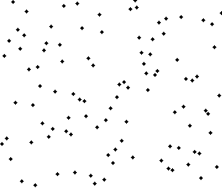

# 冒泡排序

## 原理

冒泡排序（Bubble Sort）也是一种简单直观的排序算法。**它重复地走访过要排序的数列，一次比较两个元素**，如果他们的顺序错误就把他们交换过来。

**走访数列的工作是重复地进行直到没有再需要交换，**也就是说该数列已经排序完成。

这个算法的名字由来是**因为越小的元素会经由交换慢慢“浮”到数列的顶端**。

理论上只需要 arr.length 次。

**summary:** 相邻的数据进行两两比较，小数放在前面，大数放在后面，**按照索引依次向后**，这样一趟下来，最小的数就被排在了第一位，第二趟也是如此，如此类推，直到所有的数据排序完成。

## 说明

### 图片描述

 ###时间与空间复杂度

1. 时间复杂度： O(n^2)，**最好的情况应该是排好的顺序**，然后循环 n 次后，什么也不做操作，冒泡排序可谓是最经典的排序算法了，它是基于比较的排序算法，时间复杂度为 O(n^2)。
   - 其优点是实现简单，n 较小时性能较好。
   - 什么时候最快（Best Cases）：当输入的数据已经是正序时。
   - 什么时候最慢（Worst Cases）：当输入的数据是反序时。
2. 空间复杂度： O(1)；需要交换一个变量。

## 代码实现

```js
// 需要数组的长度
// 需要嵌套遍历所有元素，不断的交换元素位置
function bubble_sort(arr) {
  var len = arr.length;
  var time_complexity = 0;
  // 从index 0 -> len-1，迭代n次
  for (var i = 0; i < len - 1; i++) {
    // 直接声明循环len次
    // 循环次数，等于数组的长度
    // len - 1 - i，每次外循环一次，都会让一个值找到自己的位置，内层循环便少了一次
    // 当前交换，从i开始交换
    for (var j = 0; j < len - 1 - i; j++) {
      // 每次都从头开始
      // 前后比较
      time_complexity++; // 时间复杂度，无论怎样都会一次比较两个数值，所以时间复杂度都为n^2; 算法的空间复杂度为1；
      if (arr[j] < arr[j - 1]) {
        // swap
        // 由小到大排序，第一次会把最大的排在最后，第二次会把第二大的排在倒数第二位。
        var temp = arr[j]; // 交换位置
        arr[j] = arr[j - 1];
        arr[j - 1] = temp;
      }
    }
  }
  console.log(time_complexity);
  return arr;
}

var arr = [1, 2, 5, 4, 6, 9, 8, 5, 3, 2, 8];
bubble_sort(arr);
```

## 算法步骤

1）比较相邻的元素。如果第一个比第二个大，就交换他们两个。
2）**对每一对相邻元素作同样的工作**，从开始第一对到结尾的最后一对。这步做完后，最后的元素会是最大的数。
3）**针对所有的元素重复以上的步骤**，除了最后一个。
4）持续每次对越来越少的元素重复上面的步骤，直到没有任何一对数字需要比较。

## 冒泡排序如何优化

1. 添加标记，**如果内循环不需要再交换了，也就是数组已经有序了**，就不需要再进行后边的操作了。

```c++
void BubbleSort(int arr[], int len)
{
  int i = 0;
  int tmp = 0;
  for (i = 0; i < len - 1; i++)// 确定排序趟数
  {
    int j = 0;
    int flag = 0;
    for (j = 0; j < len - 1 - i; j++)// 确定比较次数
    {
      if (arr[j]>arr[j + 1])
      {
        // 交换
        tmp = arr[j];
        arr[j] = arr[j + 1];
        arr[j + 1] = tmp;
        flag = 1;//加入标记
      }
    }
    if (flag == 0)//如果没有交换过元素，则已经有序
    {
      return;
    }
  }
}

```

2. **一次外层循环嵌套两次内层循环**，内层循环，同时把最小的移动到左边，最大的移动到右边。

```c++
void BubbleSort(int arr[], int len)
{
  int i = 0;
  int j = 0;
  int n = 0;//同时找最大值的最小需要两个下标遍历
  int flag = 0;
  int pos = 0;//用来记录最后一次交换的位置
  int k = len - 1;
  for (i = 0; i < len - 1; i++)//确定排序趟数
  {
    pos = 0;
    flag = 0;
    //正向寻找最大值
    for (j = n; j < k; j++)//确定比较次数
    {
      if (arr[j]>arr[j + 1])
      {
        //交换
        int tmp = arr[j];
        arr[j] = arr[j + 1];
        arr[j + 1] = tmp;
        flag = 1;//加入标记
        pos = j;//交换元素，记录最后一次交换的位置
      }
    }
    if (flag == 0)//如果没有交换过元素，则已经有序,直接结束
    {
      return;
    }
    k = pos;//下一次比较到记录位置即可
    //反向寻找最小值
    for (j = k; j > n; j--)
    {
      int tmp = arr[j];
      arr[j] = arr[j - 1];
      arr[j - 1] = tmp;
      flag = 1;
    }
    n++;
    if (flag == 0)//如果没有交换过元素，则已经有序,直接结束
    {
      return;
    }
  }
}
```
