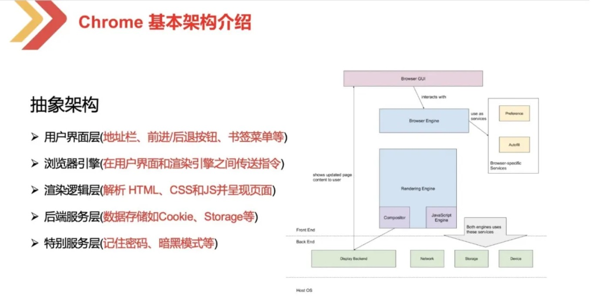

[参考文章](https://mp.weixin.qq.com/s/sFeG_9yuAxH6ZQ-bjWKGuw)

浏览器的主要功能就是向服务器发出请求，在浏览器窗口中展示您选择的网络资源。

## 大体上，浏览器可以分为五部分，可以类比 electron

**用户界面**，主要负责展示页面中，除了 page 本身的内容，我们可以粗略地理解为打开一个空页面的时候呈现的界面就是**浏览器的用户界面(GUI)**。

**浏览器引擎**，这里个人认为主要指的是在用户界面和渲染引擎之间**传递指令**，以及调度浏览器各方面的资源，协调为呈现页面、完成用户指令而工作。

**呈现引擎**，按图中看，包含了一个 **compositor(合成器)和 Javascript Engine(JS 解释引擎)**。分别是负责解析 HTML 和 CSS 内容，并将解析后的内容显示在屏幕上 和 用于解析和执行 JavaScript 代码。

**后端服务层**，这里包含了一些**后端服务**，调用底层的操作。比如网络请求层(network)、数据存储，浏览器需要在硬盘上保存各种数据，例如 Cookie、Storage 等。

**特别服务层**，这里主要指的是**一些浏览器自带的服务**，比如你填完某个网站的账号密码，浏览器可以帮你记住账号密码，又比如开启浏览器的暗黑模式等特殊的服务。

## 每个 tab 页面，单线程，多进程架构

多进程的优势有：

- 防⼀个⻚⾯崩溃影响整个浏览器
- 安全性和沙盒，由于操作系统提供了限制进程权限的方法，因此浏览器可以从某些功能中，对某些进程进行沙箱处理。例如，Chrome 浏览器可以对处理用户输入（如渲染器）的进程，限制其文件访问的权限。
- 进程有⾃⼰的私有内存空间，可以拥有更多的内存。

## 浏览器中页面渲染过程
