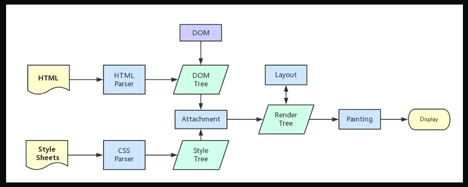

[从进程和线程了解浏览器的工作原理](https://www.jianshu.com/p/8ff15d3a1dfd)
[Node.js 进阶之进程与线程](https://blog.csdn.net/Fuohua/article/details/93463116)

进程（process）和线程（thread）是操作系统的基本概念。

JS 的执行环境主要包括：浏览器和 node。

- 进程，对于浏览器来说可以理解为一个个 tab 页面，node 中的一个个 childProcess。
- 线程，是去做具体的事情的工厂。

## 进程

现代操作系统都是可以同时运行**多个任务的**，比如：用浏览器上网的同时还可以听音乐。对于操作系统来说，**一个任务就是一个进程**，比如打开一个浏览器就是启动了一个浏览器进程，打开一个 Word 就启动了一个 Word 进程。

**官方定义**：进程是 CPU **资源分配的最小单位**（是能拥有资源和独立运行的最小单位）。

在 mac 下，同上，可以通过"活动监视器"来查看进程。

## 线程

有些进程同时不止做一件事，比如 Word，它同时可以进行打字、拼写检查、打印等事情。**在一个进程内部，要同时做多件事，就需要同时运行多个“子任务”**，我们把进程内的这些“子任务”称为线程。

由于每个进程至少要做一件事，**所以一个进程至少有一个线程**。

**系统会给每个进程分配独立的内存**，因此进程有它独立的资源。**同一进程内的各个线程之间共享该进程的内存空间（包括代码段，数据集，堆等）。**

**官方定义**：**线程是 CPU 调度的最小单位**（是建立在进程基础上的一次程序运行单位）。

但同一进程中的多个线程有**各自的调用栈（call stack）**，自己的**寄存器环境（register context）(执行环境)**，自己的**线程本地存储（thread-local storage)**，线程又有单线程和多线程之分，具有代表性的 JavaScript、Java 语言。

## 浏览器的模型 ｜ 浏览器的工作原理 ｜ 浏览器中的进程与线程

**浏览器是多进程的**，有一个**主控进程**，以及**每一个 tab 页面都会新开一个进程**（某些情况下多个 tab 会合并进程）。


### 浏览器包含哪些进程

为了简化理解，这里仅列举主要进程。

- Browser 主进程：浏览器的**主进程，只有一个**。
  - 负责**浏览器界面的显示与交互**；
  - 各个页面（子进程）的管理，创建和销毁其他进程；
  - **网络的资源管理、下载**等。
- Renderer 进程：**也称为浏览器渲染进程或浏览器内核**，内部是**多线程**的。主要负责**页面渲染，脚本执行，事件处理**等。
- 第三方插件进程：**每种类型的插件对应一个进程**，仅当使用该插件时才创建。
- GPU 进程：最多一个，用于 **3D 绘制**等。

### 浏览器多进程的优势有

- 由于默认 新开 一个 tab 页面 新建 一个进程，所以单个 tab 页面崩溃不会影响到整个浏览器；
- 同样，第三方插件崩溃也不会影响到整个浏览器；
- 多进程可以充分利用现代 CPU 多核的优势；
- 方便使用沙盒模型隔离插件等进程，提高浏览器的稳定性。

**系统为浏览器新开的进程分配内存、CPU 等资源**，所以内存和 CPU 的资源消耗也会更大。

### Renderer，浏览器内核（渲染进程）

前面说了这么多的进程，对普通前端操作来说，最重要的还是**渲染进程**。

**浏览器的渲染进程是多线程的**，页面的渲染，JS 的执行，事件的循环等，都在这个进程内执行。

渲染进程通常由以下**常驻线程**组成：

1. **GUI 渲染线程**，负责渲染浏览器界面，**解析 HTML、CSS，构建 DOM tree 和 render tree，布局和绘制等**。当界面需要重绘（repaint）或由于某种操作引发回流（reflow）时，该线程就会执行。
2. **JS 引擎线程**，也称为 JS 内核，**负责解析 JavaScript 脚本**，运行代码。
   1. **JavaScript 是单线程的**。JavaScript 作为浏览器脚本语言，**主要用途是与用户互动以及操作 DOM**。这也决定了它只能是单线程的，否则会带来很复杂的同步问题。
   2. **GUI 渲染线程 与 JS 引擎线程是互斥的**。也就是说在渲染的过程中，需要执行 js 的话，gui 渲染线程就要挂起。**JavaScript 引擎线程和 GUI 渲染线程同时运行**，**浏览器设置 GUI 渲染线程与 JS 引擎为互斥的关系**。当 JS 引擎执行时，GUI 线程被挂起，GUI 更新被保存在一个队列中，等到 JS 引擎线程空闲时立即被执行。
   3. JS 执行阻塞页面加载。**当浏览器在执行 JavaScript 的时候，GUI 渲染线程会被保存在一个队列中，直到 JS 程序执行完成，才会接着执行**。因此如果 JS 执行时间过长，就会造成页面的渲染不连贯，导致页面渲染加载阻塞。
3. **事件触发控制线程**，**当一个事件被触发时，该线程会把事件添加到待处理队列的队尾，等待 JS 引擎处理**。这些事件可以是当前执行的代码块，如**定时任务**；也可以是来自浏览器内核的其他线程，如：**鼠标点击**、**Ajax 异步请求**等。但由于 JS 是单线程的，这些事件都需要排队等待 JS 引擎处理。
4. **定时触发器线程**，setTimeout 和 setInterval 所在的线程。**浏览器定时计数器并不是由 JS 引擎计数的，因为 JS 是单线程的，如果处于阻塞线程状态就会影响计时的准确**，所以通过单独的线程来计时并触发定时更为合理。
5. **异步 http 请求线程**，XMLHttpRequest 在建立连接后，通过浏览器新开一个线程请求，**一旦检测到状态变更并且设置有回调函数，异步线程就产生状态变更事件，将这个回调再放入事件队列中，等待 JS 引擎空闲时处理**。

### Browser 进程和 Renderer 进程的通信过程

打开浏览器的一个 tab 页时，我们看下其中的大致过程：

1. Browser 进程收到**用户请求**（浏览器主进程管理的输入框，输入地址开始请求），**通过网络下载获取页面内容**，然后将该任务通过**RendererHost 接口**传递给 Renderer 进程（具体的 **tab 的进程下的渲染进程**）；
2. Renderer 进程的 Renderer 接口收到消息，简单解释后，**交给 GUI 渲染线程开始渲染**；
3. GUI 渲染线程接收请求，**加载网页并渲染网页**，这个过程中可能需要 **Browser 进程获取资源**和 **GPU 进程来帮助渲染**，也可能会有 JS 引擎线程操作 DOM（可能造成回流并重绘）；
4. 最后 Renderer 进程**将结果传递给 Browser 进程**；

Browser 进程接收到结果，**并将结果绘制出来**。

到这里应该对浏览器的运作有一定理解了，我们再来看下浏览器是怎么渲染页面的。

### 浏览器的渲染流程，GUI



1. 解析 HTML 文件(Browser 进程下载的)，生成 DOM tree；同时解析 CSS 文件以及样式元素中的样式数据，生成 **CSS Rules**。
2. 合并构建 render tree：根据 DOM tree 和 CSS Rules 来构建 render tree，它可以让浏览器按照正确的顺序绘制内容。
3. 布局（layout / reflow）：计算各元素尺寸、位置。
4. 绘制（paint）：绘制页面像素信息。
5. 浏览器将**各层信息发送给 GPU，GPU 将各层信息合成（composite），显示在屏幕上**。

补充：

Webkit 将 render tree 中的元素称为 **render object （或 renderer）**，每一个 render object 都代表一个的矩形区域，通常对应于相关节点的 CSS 框，这些矩形的排列顺序就是它们在屏幕上显示的顺序。

Render object 和 DOM 节点是相对应的，但并非一一对应。**非可视化的 DOM 元素不会插入 render tree 中**，例如“head”元素 和 一些 display: none 的节点就没必要放在 render tree 中了。

## node 的模型｜ node 中的进程与线程

Node.js 里通过 `childProcess` 开启一个**服务进程**，多进程就是**进程的复制（fork）**，fork 出来的每个进程都拥有自己的独立空间地址、数据栈，一个进程无法访问另外一个进程里定义的变量、数据结构，只有建立了 **IPC 通信**，进程之间才可数据共享。

Node.js 是 Javascript 在服务端的运行环境，**构建在 chrome 的 V8 引擎之上**，基于事件驱动、非阻塞 I/O 模型，充分利用操作系统提供的异步 I/O 进行多任务的执行，**适合于 I/O 密集型的应用场景**，因为异步，程序无需阻塞等待结果返回，而基于回调通知的机制，原本同步模式等待的时间，则可以用来处理其它任务，在 Web 服务器方面，著名的 Nginx 也是采用此模式（事件驱动），Nginx 采用 C 语言进行编写，主要用来做高性能的 Web 服务器，不适合做业务。Web 业务开发中，**如果你有高并发应用场景那么 Node.js 会是你不错的选择**。

在单核 CPU 系统之上我们采用 单进程 + 单线程 的模式来开发。**在多核 CPU 系统之上，可以通过 child_process.fork 开启多个进程**（Node.js 在 v0.8 版本之后新增了 Cluster 来实现多进程架构） ，即 多进程 + 单线程 模式。注意：开启多进程不是为了解决高并发，主要是解决了单进程模式下 Node.js CPU 利用率不足的情况，充分利用多核 CPU 的性能。

### [Process，主进程，相当于浏览器的主进程](http://nodejs.cn/api/process.html)

Node.js 中的进程 Process 是一个全局对象。

- process.env：环境变量，例如通过 process.env.NODE_ENV 获取不同环境项目配置信息
- process.nextTick：这个在谈及 Event Loop 时经常为会提到，相当于 setTimeout
- process.pid：获取当前进程 id
- process.ppid：当前进程对应的**父进程**
- process.cwd()：获取**当前进程工作目录**
- process.platform：获取**当前进程运行的操作系统平台**
- process.uptime()：当前进程已运行时间，例如：pm2 守护进程的 uptime 值
  进程事件：process.on(‘uncaughtException’, cb) 捕获异常信息、process.on(‘exit’, cb）进程推出监听
- 三个标准流：process.stdout 标准输出、process.stdin 标准输入、process.stderr 标准错误输出

### Nodejs 进程创建

- child_process.spawn()：适用于**返回大量数据**，例如图像处理，二进制数据处理。
- child_process.exec()：适用于**小量数据**，**maxBuffer 默认值为 200 \* 1024 超出这个默认值将会导致程序崩溃**，数据量过大可采用 spawn。
- child_process.execFile()：类似 child_process.exec()，区别是不能通过 shell 来执行，不支持像 I/O 重定向和文件查找这样的行为
- child_process.fork()： **衍生新的进程，进程之间是相互独立的**，每个进程都有自己的 V8 实例、内存，系统资源是有限的，不建议衍生太多的子进程出来，通长根据系统 CPU 核心数设置。

#### fork 子进程充分利用 CPU 资源

### Nodejs 多进程架构模型

多进程架构解决了单进程、单线程无法充分利用系统多核 CPU 的问题，通过上文对 Node.js 进程有了初步的了解，本节通过一个 Demo 来展示如何启动一批 Node.js 进程来提供服务。

```js
const worker = fork('worker.js');
worker.on('message', function (message) {});
worker.send('server', server);
```

### 守护进程

Node.js 开发的同学们可能熟悉，当我们打开终端执行  node app.js  开启一个服务进程之后，这个终端就会一直被占用，**如果关掉终端，服务就会断掉，即前台运行模式**。如果采用守护进程进程方式，这个终端我执行  node app.js  开启一个服务进程之后，我还可以在这个终端上做些别的事情，且不会相互影响。

在实际工作中对于守护进程并不陌生，例如 PM2、Egg-Cluster 等。
