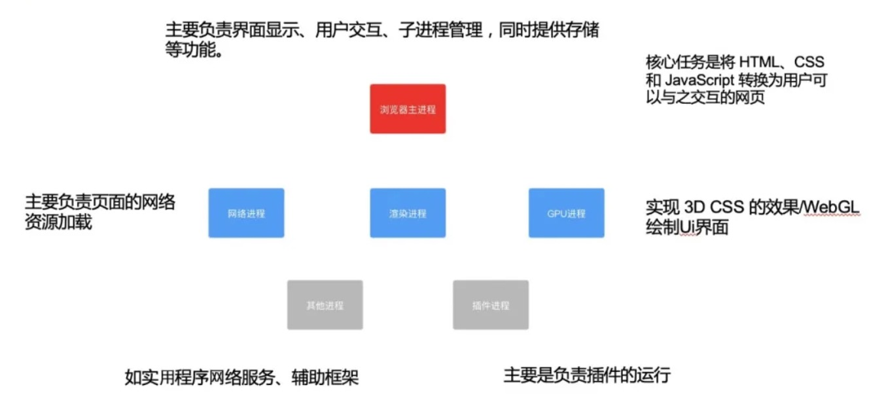

浏览器是前端开发的宿主环境，只有熟悉浏览器的各种特性，了解原理，才能实现各种网页效果。本次专题课针对浏览器的底层，重点介绍网页引擎的执行机制，下面就是课程大纲。

（1）浏览器架构及原理：多进程架构，TCP/UDP 处理，HTTP 请求流程，网页渲染流程。

（2）JS 执行机制及 V8 原理：变量提升、调用栈、原型链、编译及解释执行过程、垃圾回收机制、EventLoop、promise、async/await。

（3）浏览器页面及安全知识要点：虚拟 DOM、渲染流水线、性能优化、同源策略、XSS 攻击、XSRF 攻击。

## 一、事件机制

### 1.1 事件触发三阶段

- document 往事件触发处传播，遇到注册的捕获事件会触发
- 传播到事件触发处时触发注册的事件
- 从事件触发处往 document 传播，遇到注册的冒泡事件会触发

事件触发一般来说会按照上面的顺序进行，但是也有特例，如果给一个目标节点同时注册冒泡和捕获事件，事件触发会按照注册的顺序执行

```js
// 以下会先打印冒泡然后是捕获
node.addEventListener(
  'click',
  event ={
    console.log('冒泡');
  },
  false,
);
node.addEventListener(
  'click',
  event ={
    console.log('捕获 ');
  },
  true,
);
```

### 1.2 注册事件

- 通常我们使用 `addEventListener` 注册事件，该函数的第三个参数可以是布尔值，也可以是对象。对于布尔值 `useCapture` 参数来说，该参数默认值为 `false` 。`useCapture` 决定了注册的事件是捕获事件还是冒泡事件
- 一般来说，我们只希望事件只触发在目标上，这时候可以使用 `stopPropagation` 来阻止事件的进一步传播。通常我们认为 `stopPropagation` 是用来阻止事件冒泡的，其实该函数也可以阻止捕获事件。`stopImmediatePropagation` 同样也能实现阻止事件，但是还能阻止该事件目标执行别的注册事件

```javascript
node.addEventListener(
  'click',
  event ={
    event.stopImmediatePropagation();
    console.log('冒泡');
  },
  false,
);
// 点击 node 只会执行上面的函数，该函数不会执行
node.addEventListener(
  'click',
  event ={
    console.log('捕获 ');
  },
  true,
);
```

### 1.3 事件代理

如果一个节点中的子节点是动态生成的，那么子节点需要注册事件的话应该注册在父节点上

```html
<ul id="ul">
  <li>1</li>
  <li>2</li>
  <li>3</li>
  <li>4</li>
  <li>5</li>
</ul>
<script>
  let ul = document.querySelector('##ul');
  ul.addEventListener('click', event ={
    console.log(event.target);
  });
</script>
```

事件代理的方式相对于直接给目标注册事件来说，有以下优点

- 节省内存
- 不需要给子节点注销事件

## 五、渲染机制

**浏览器的渲染机制一般分为以下几个步骤**

- 处理 `HTML` 并构建 `DOM` 树。
- 处理 `CSS` 构建 `CSSOM` 树。
- 将 `DOM` 与 `CSSOM` 合并成一个渲染树。
- 根据渲染树来布局，计算每个节点的位置。
- 调用 `GPU` 绘制，合成图层，显示在屏幕上

- 在构建 CSSOM 树时，会阻塞渲染，直至 CSSOM 树构建完成。并且构建 CSSOM 树是一个十分消耗性能的过程，所以应该尽量保证层级扁平，减少过度层叠，越是具体的 CSS 选择器，执行速度越慢
- 当 HTML 解析到 script 标签时，会暂停构建 DOM，完成后才会从暂停的地方重新开始。也就是说，如果你想首屏渲染的越快，就越不应该在首屏就加载 JS 文件。并且 CSS 也会影响 JS 的执行，只有当解析完样式表才会执行 JS，所以也可以认为这种情况下，CSS 也会暂停构建 DOM

### 5.1 图层

一般来说，可以把普通文档流看成一个图层。特定的属性可以生成一个新的图层。不同的图层渲染互不影响，所以对于某些频繁需要渲染的建议单独生成一个新图层，提高性能。但也不能生成过多的图层，会引起反作用

**通过以下几个常用属性可以生成新图层**

- 3D 变换：`translate3d`、`translateZ`
- `will-change`
- `video`、`iframe` 标签
- 通过动画实现的 `opacity` 动画转换
- `position: fixed`

### 5.2 重绘（Repaint）和回流（Reflow）

- 重绘是当节点需要更改外观而不会影响布局的，比如改变 color 就叫称为重绘
- 回流是布局或者几何属性需要改变就称为回流

回流必定会发生重绘，重绘不一定会引发回流。回流所需的成本比重绘高的多，改变深层次的节点很可能导致父节点的一系列回流

**所以以下几个动作可能会导致性能问题**：

- 改变 window 大小
- 改变字体
- 添加或删除样式
- 文字改变
- 定位或者浮动
- 盒模型

**很多人不知道的是，重绘和回流其实和 Event loop 有关**

- 当 Event loop 执行完 `Microtasks` 后，会判断 `document` 是否需要更新。因为浏览器是 `60Hz`的刷新率，每 `16ms`才会更新一次。
- 然后判断是否有 `resize` 或者 `scroll` ，有的话会去触发事件，所以 `resize` 和 `scroll` 事件也是至少 `16ms` 才会触发一次，并且自带节流功能。
- 判断是否触发了`media query`
- 更新动画并且发送事件
- 判断是否有全屏操作事件
- 执行 `requestAnimationFrame` 回调
- 执行 `IntersectionObserver` 回调，该方法用于判断元素是否可见，可以用于懒加载上，但是兼容性不好
- 更新界面
- 以上就是一帧中可能会做的事情。如果在一帧中有空闲时间，就会去执行 `requestIdleCallback` 回调

**减少重绘和回流**

- 使用 `translate` 替代 `top`
- 使用 `visibility` 替换`display: none` ，因为前者只会引起重绘，后者会引发回流（改变了布局）
- 不要使用 `table` 布局，可能很小的一个小改动会造成整个 table 的重新布局
- 动画实现的速度的选择，动画速度越快，回流次数越多，也可以选择使用 `requestAnimationFrame`
- `CSS` 选择符从右往左匹配查找，避免 `DOM` 深度过深
- 将频繁运行的动画变为图层，图层能够阻止该节点回流影响别的元素。比如对于 `video`标签，浏览器会自动将该节点变为图层

## Chrome页面呈现原理与性能优化

[参考文章](https://mp.weixin.qq.com/s/sFeG_9yuAxH6ZQ-bjWKGuw)

浏览器的主要功能就是向服务器发出请求，在浏览器窗口中展示您选择的网络资源。

### 大体上，浏览器可以分为五部分，可以类比 electron


**用户界面**，主要负责展示页面中，除了 page 本身的内容，我们可以粗略地理解为打开一个空页面的时候呈现的界面就是**浏览器的用户界面(GUI)**。

**浏览器引擎**，这里个人认为主要指的是在用户界面和渲染引擎之间**传递指令**，以及调度浏览器各方面的资源，协调为呈现页面、完成用户指令而工作。

**呈现引擎**，按图中看，包含了一个 **compositor(合成器)和 Javascript Engine(JS 解释引擎)**。分别是负责解析 HTML 和 CSS 内容，并将解析后的内容显示在屏幕上 和 用于解析和执行 JavaScript 代码。

**后端服务层**，这里包含了一些**后端服务**，调用底层的操作。比如网络请求层(network)、数据存储，浏览器需要在硬盘上保存各种数据，例如 Cookie、Storage 等。

**特别服务层**，这里主要指的是**一些浏览器自带的服务**，比如你填完某个网站的账号密码，浏览器可以帮你记住账号密码，又比如开启浏览器的暗黑模式等特殊的服务。

### 每个 tab 页面，单线程，多进程架构



多进程的优势有：

- 防⼀个⻚⾯崩溃影响整个浏览器
- 安全性和沙盒，由于操作系统提供了限制进程权限的方法，因此浏览器可以从某些功能中，对某些进程进行沙箱处理。例如，Chrome 浏览器可以对处理用户输入（如渲染器）的进程，限制其文件访问的权限。
- 进程有⾃⼰的私有内存空间，可以拥有更多的内存。
