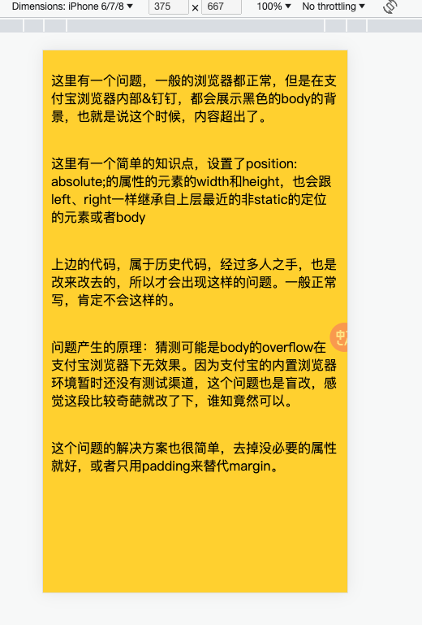

# BLOG-支付宝内置浏览器的一些兼容问题处理

最近接手一些老项目的任务，主要修改一部分ui的兼容问题，页面要在支付宝app内打开，然而我们也只能在自己的正式版本里边打开。没有给提供debug版本的app，所以调试过程还是比较麻烦的。

原始开发的时候，直接在chrome内进行开发，只在最后才对支付宝app进行兼容性测试，还好问题不是很多。

主要是如下两个问题，主要的问题是chrome和微信下都是正常的，只在uc相关的一些浏览器内会出现。主要

## 页面超出滚动，overflow不生效

正常的情况：



不正常的时候的表现，具体表现就是在uc系浏览器下会展示出来body部分的背景，页面会超出，看起来像是overflow没效果：


具体代码案例：

```html
<!DOCTYPE html>
<html lang="en">
  <head>
    <meta charset="UTF-8" />
    <meta name="viewport" content="width=device-width, initial-scale=1.0" />
    <title>demo1</title>
  </head>
  <body>
    <style>
      html,
      body {
        margin: 0;
        overflow: hidden;
        background-color: black;
      }
      .demo {
        height: 100%;
        background-color: crimson;
      }
      .box {
        /* 这里的代码本身就有问题，设置了高度100%，又设置margin-bottom，正常感觉是肯定要超出的，但是又在外层设置了overflow*/
        background-color: gold;
        position: absolute;
        width: 100%;
        height: 100%;
        margin-bottom: 50px;

        overflow: hidden;
      }
      .box p {
        padding: 10px;
      }
    </style>

    <div class="demo">
      <div class="box">
        <p>
          这里有一个问题，一般的浏览器都正常，但是在支付宝浏览器内部&钉钉，都会展示黑色的body的背景，也就是说这个时候，内容超出了。
        </p>
        <p>
          这里有一个简单的知识点，设置了position:
          absolute;的属性的元素的width和height，也会跟left、right一样继承自上层最近的非static的定位的元素或者body
        </p>
        <p>
          上边的代码，属于历史代码，经过多人之手，也是改来改去的，所以才会出现这样的问题。一般正常写，肯定不会这样的。
        </p>
        <p>
          问题产生的原理：猜测可能是body的overflow在支付宝浏览器下无效果。因为支付宝的内置浏览器环境暂时还没有测试渠道，这个问题也是盲改，感觉这段比较奇葩就改了下，谁知竟然可以。
        </p>
        <p>这个问题的解决方案也很简单，去掉没必要的属性就好，或者只用padding来替代margin。</p>
      </div>
    </div>
  </body>
</html>
```

可测试地址二维码：


微信、其他浏览器扫码可查看

## flex与overflow结合导致的元素被挤压的问题

## 浏览器内核不支持的问题处理

1. 支付宝浏览器内核的一些兼容问题；
2. 查看浏览器内核：
   1. navigator.userAgent；

### 对比浏览器内核

1. 支付宝小程序的webview：'Mozilla/5.0 (Android 9.0; Mi 10 Pro Build/QKQ1) AppleWebKit/603.1.30 (KHTML, like Gecko) Mobile/15E148 ChannelId(0) LyraVM Nebula  AlipayDefined(nt:WIFI,ws:360|0|2.75) AliApp(AP/10.3.70) AlipayClient/10.3.70 Language/zh-Hans AlipayIDE'
   1. 'Mozilla/5.0 (Android 9.0; Mi 10 Pro Build/QKQ1) AppleWebKit/603.1.30 (KHTML, like Gecko) Mobile/15E148 ChannelId(0) LyraVM Nebula  AlipayDefined(nt:WIFI,ws:360|0|2.75) AliApp(AP/10.3.70) AlipayClient/10.3.70 Language/zh-Hans AlipayIDE MiniProgram'

2. chrome：'Mozilla/5.0 (iPhone; CPU iPhone OS 13_2_3 like Mac OS X) AppleWebKit/605.1.15 (KHTML, like Gecko) Version/13.0.3 Mobile/15E148 Safari/604.1'

3. 支付宝app：$$Mozilla/5.0(Linux U: Android13 zh-CN Mi 10 Pro Build/
TKQ1.221114.001) AppleWebKit/537.36(KHTMLlike Gecko)Version/4.0 Chrome/69.0.3497100 UWS/3.22.2.59 Mobile Safari/53736 UCBS/322.2.59 230213152242 Channelld(0) NebulaSDK/1.8.100112 Nebula AlipayDefined(nt:4Gws:393|0|2.75) AliApp(AP/10.5.8.8000) AlipayClient/10.5.8.8000 Language/zh-Hans useStatusBar/true isConcaveScreen/true Region/CNAriver/1.0.0

#### <https://blog.csdn.net/qq_42363090/article/details/112535117，用谷歌浏览器模拟微信和支付宝浏览器环境>

<https://blog.csdn.net/weixin_44142611/article/details/107067626，这个也是不行的>

### 现在的问题就是支付宝内的浏览器内核比较高，并且出了样式的问题，别的位置模拟不出来这个结果

### <https://m-test.funtown.cn/main?id=cef5cf43eaee43e5b27c2c0e30c9df2d&vconsole=9999&test=testtest，标记调试>

### 这里的100%，确实包括了浏览器的导航的高度，就导致实际占有的高度是755 - 导航高度，但是100%后，导航被加了进去

1. 主动去计算导航的高度，然后删除；
2. 正常应该是688，这里相差67px；

### style

1. height: -webkit-fill-available;

## 关于今天遇到的三个问题

```css
/* <!-- 默认的样式 --> */
{
      /* 原本设置的滚动方式，表现就是在一般的浏览器内都可以正常滚动，但是在支付宝浏览器内不能滚动，会被压缩在一起 */
     display: flex;
     flex-direction: column;
     flex: 1;
     overflow-x: hidden;
     overflow-y: auto;
     width: 100%;
   
   /* 修改为如下方式，可以滚动了 */
    flex-direction: row;
    overflow: scroll;
    flex-wrap: wrap;
}
```

## 最主要的一个问题是，没法本地调试，只能每次发布测试环境，忙试

1. 后续，需要配置好charles本地代理工具，遇到限制不严重的，可以代理本地的文件到测试手机；
2. 最好能拿到本地开发环境；
3. 遇到问题不要慌，通常情况下只是没想道，一般都不困难；
   1. 从根本上对问题进行分析；
4. 调试技术很重要，特别是在移动端，特定的运行场景，不方便复现的时候，就很考验调试技术和基础工具支持了；
5. 不要写那多的骚操作代码，正常一点；

以前遇到一个人非要问我写数组有没有遇到什么问题。自己通常正常操作，肯定也不会遇到，这尼玛真没法回答的问题

## 开发的流程

1. 本地修改，提交到开发分支feat-test；
2. 线上合并到test；
3. test检测到变化，自动执行流水线；
4. 发布到线上；
5. 获取发布的地址；
6. 转换为二维码；
7. 支付宝扫码查看页面；

## 开发调试环境

1. 对外有 debug的支付宝版本，但是没找到；
2. 代理本地html，似乎也是行不通，charles；
3. chrome远程调试h5；
   1. <https://www.frontendjs.com/article/6201d1a4e8a3c7241be33282>
4. 每次都发布到测试环境；
5. vconsole，对于处理样式兼容问题，用途不大；
