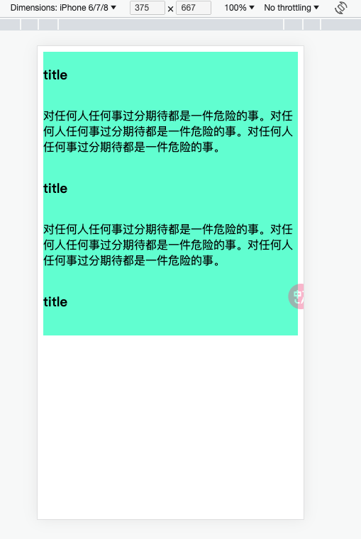

# BLOG-支付宝内置浏览器的一些兼容问题处理

最近接手一些老项目的任务，主要修改一部分ui的兼容问题，页面要在支付宝app内打开，然而我们也只能在自己的正式版本里边打开。没有给提供debug版本的app，所以调试过程还是比较麻烦的。

原始开发的时候，直接在chrome内进行开发，只在最后才对支付宝app进行兼容性测试，还好问题不是很多。

主要是如下两个问题，主要的问题是chrome和微信下都是正常的，只在uc相关的一些浏览器内会出现。

## 页面超出滚动，overflow不生效

正常的情况，微信、其他浏览器扫码可查看：


不正常的时候的表现，具体表现就是在uc系浏览器下会展示出来body部分的背景，页面会超出，看起来像是overflow没效果：


具体代码案例：

```html
<!DOCTYPE html>
<html lang="en">
  <head>
    <meta charset="UTF-8" />
    <meta name="viewport" content="width=device-width, initial-scale=1.0" />
    <title>demo1</title>
  </head>
  <body>
    <style>
      html,
      body {
        margin: 0;
        overflow: hidden;
        background-color: black;
      }
      .demo {
        height: 100%;
        background-color: crimson;
      }
      .box {
        /* 这里的代码本身就有问题，设置了高度100%，又设置margin-bottom，正常感觉是肯定要超出的，但是又在外层设置了overflow*/
        background-color: gold;
        position: absolute;
        width: 100%;
        height: 100%;
        margin-bottom: 50px;

        overflow: hidden;
      }
      .box p {
        padding: 10px;
      }
    </style>

    <div class="demo">
      <div class="box">
        <p>
          这里有一个问题，一般的浏览器都正常，但是在支付宝浏览器内部&钉钉，都会展示黑色的body的背景，也就是说这个时候，内容超出了。
        </p>
        <p>
          这里有一个简单的知识点，设置了position:
          absolute;的属性的元素的width和height，也会跟left、right一样继承自上层最近的非static的定位的元素或者body
        </p>
        <p>
          上边的代码，属于历史代码，经过多人之手，也是改来改去的，所以才会出现这样的问题。一般正常写，肯定不会这样的。
        </p>
        <p>
          问题产生的原理：猜测可能是body的overflow在支付宝浏览器下无效果。因为支付宝的内置浏览器环境暂时还没有测试渠道，这个问题也是盲改，感觉这段比较奇葩就改了下，谁知竟然可以。
        </p>
        <p>这个问题的解决方案也很简单，去掉没必要的属性就好，或者只用padding来替代margin。</p>
      </div>
    </div>
  </body>
</html>
```

可测试地址二维码：


## flex与overflow结合导致的元素被挤压的问题

正常的情况，微信、其他浏览器扫码可查看：



不正常的时候的表现，具体表现就是在uc系浏览器下会压缩内容，不出现滚动条：


具体代码案例：

```html
<!DOCTYPE html>
<html lang="en">
  <head>
    <meta charset="UTF-8" />
    <meta name="viewport" content="width=device-width, initial-scale=1.0" />
    <title>demo2</title>
  </head>
  <body>
    <style>
      html,
      body {
        margin: 0;
      }
      .demo {
        height: 400px;
        display: flex;
      }
      .list {
        padding: 10px;
        background-color: aquamarine;

        display: flex;
        align-items: center;

        width: 100%;

        flex-direction: column;
        flex: 1;
        overflow-x: hidden;
        overflow-y: auto;

        /* 修改为如下方式，可以滚动了 */
        /* flex-direction: row;
        overflow: scroll;
        flex-wrap: wrap; */
      }
      .item {
        padding-bottom: 10px;
        display: flex;
        flex-direction: column;
        width: 100%;
        height: 150px;
      }
    </style>
    <div class="demo">
      <div class="list">
        <div class="item">
          <h3>title</h3>
          <p>
            对任何人任何事过分期待都是一件危险的事。对任何人任何事过分期待都是一件危险的事。对任何人任何事过分期待都是一件危险的事。
          </p>
        </div>
        <div class="item">
          <h3>title</h3>
          <p>
            对任何人任何事过分期待都是一件危险的事。对任何人任何事过分期待都是一件危险的事。对任何人任何事过分期待都是一件危险的事。
          </p>
        </div>
        <div class="item">
          <h3>title</h3>
          <p>
            对任何人任何事过分期待都是一件危险的事。对任何人任何事过分期待都是一件危险的事。对任何人任何事过分期待都是一件危险的事。
          </p>
        </div>
        <div class="item">
          <h3>title</h3>
          <p>
            对任何人任何事过分期待都是一件危险的事。对任何人任何事过分期待都是一件危险的事。对任何人任何事过分期待都是一件危险的事。
          </p>
        </div>
        <div class="item">
          <h3>title</h3>
          <p>
            对任何人任何事过分期待都是一件危险的事。对任何人任何事过分期待都是一件危险的事。对任何人任何事过分期待都是一件危险的事。
          </p>
        </div>
      </div>
    </div>
  </body>
</html>
```

可测试地址二维码：


## 总结

1. 对于h5，可以通过添加url上的可变参数，来控制页面的调试工具的展示，是一个不错的方案；
   1. 比如在url上添加`vConsole=1`，来初始化vConsole，并展示出来调试框，类似的可以用在其他的一些调试工具和方法；
2. 对于h5的调试，最好的方式还是连接到本地开发环境，在真机上运行本地的开发代码，类似微信开发工具相关的功能，日常可用的方式如：
   1. chrome的`chrome://inspect/#devices`远程调试；
   2. charles代理工具，代理本地服务到特定预设的域名；
      1. 127.0.0.1:3000 => test.aaa.com，处理跨域限制；
3. 调试技术很重要，特别是在移动端，特定的运行场景，不方便复现的时候，就很考验调试技术和基础工具掌握程度了；
4. **不要写那多的骚操作代码**，正常一点写；
   1. 上边的两个问题，可能是一些历史的问题，多人累加的结果，日常开发避免这些骚操作，正常的写，一般也不会出现这些奇怪的问题；

[测试代码github地址](https://github.com/qiuwww/blog/blob/28eaedb74e0973bfc6dca2f5dd22c20fd32fe538/6.%E8%BF%90%E8%A1%8C%E7%8E%AF%E5%A2%83/%E6%B5%8F%E8%A7%88%E5%99%A8%E5%85%BC%E5%AE%B9%E6%80%A7%E9%97%AE%E9%A2%98/%E6%94%AF%E4%BB%98%E5%AE%9D%E5%85%BC%E5%AE%B9%E6%80%A7%E9%97%AE%E9%A2%981)。
