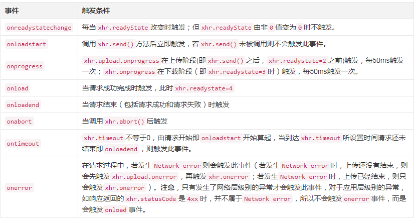
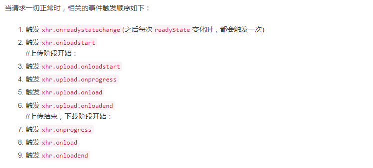

## Ajax

### 发送 Ajax 请求的五个步骤（XMLHttpRequest 的工作原理）

1. 创建`XMLHttpRequest` 对象。
2. 使用`open`方法设置请求的参数。`open(method, url, 是否异步)`。
3. 发送请求。
4. 注册事件。 注册`onreadystatechange`事件，状态改变时就会调用。如果要在数据完整请求回来的时候才调用，我们需要手动写一些判断的逻辑。
5. 获取返回的数据，更新 UI。

### 发送 get 请求和 post 请求

#### `get`请求举例

```html
<!DOCTYPE html>
<html lang="en">
  <head>
    <meta charset="UTF-8" />
    <title>Document</title>
  </head>
  <body>
    <h1>Ajax 发送 get 请求</h1>
    <input type="button" value="发送get_ajax请求" id="btnAjax" />

    <script type="text/javascript">
      // 绑定点击事件
      document.querySelector('#btnAjax').onclick = function() {
        // 发送ajax 请求 需要 五步

        // （1）创建异步对象
        var ajaxObj = new XMLHttpRequest();

        // （2）设置请求的参数。包括：请求的方法、请求的url。
        ajaxObj.open('get', '02-ajax.php');

        // （3）发送请求
        ajaxObj.send();

        //（4）注册事件。 onreadystatechange事件，状态改变时就会调用。
        //如果要在数据完整请求回来的时候才调用，我们需要手动写一些判断的逻辑。
        ajaxObj.onreadystatechange = function() {
          // 为了保证 数据 完整返回，我们一般会判断 两个值
          if (ajaxObj.readyState == 4 && ajaxObj.status == 200) {
            // 如果能够进到这个判断 说明 数据 完美的回来了,并且请求的页面是存在的
            // 5.在注册的事件中 获取 返回的 内容 并修改页面的显示
            console.log('数据返回成功');

            // 数据是保存在 异步对象的 属性中
            console.log(ajaxObj.responseText);

            // 修改页面的显示
            document.querySelector('h1').innerHTML = ajaxObj.responseText;
          }
        };
      };
    </script>
  </body>
</html>
```

#### `post` 请求举例

```html
<!DOCTYPE html>
<html lang="en">
  <head>
    <meta charset="UTF-8" />
    <title>Document</title>
  </head>
  <body>
    <h1>Ajax 发送 get 请求</h1>
    <input type="button" value="发送put_ajax请求" id="btnAjax" />
    <script type="text/javascript">
      // 异步对象
      var xhr = new XMLHttpRequest();

      // 设置属性
      xhr.open('post', '02.post.php');

      // 如果想要使用post提交数据,必须添加此行
      xhr.setRequestHeader('Content-type', 'application/x-www-form-urlencoded');

      // 将数据通过send方法传递
      xhr.send('name=fox&age=18');

      // 发送并接受返回值
      xhr.onreadystatechange = function() {
        // 这步为判断服务器是否正确响应
        if (xhr.readyState == 4 && xhr.status == 200) {
          alert(xhr.responseText);
        }
      };
    </script>
  </body>
</html>
```

#### 4.3 onreadystatechange 事件

注册 `onreadystatechange` 事件后，每当 `readyState` 属性改变时，就会调用 `onreadystatechange` 函数。

`readyState`：（存有 `XMLHttpRequest` 的状态。从 `0` 到 `4` 发生变化）

- `0`: 请求未初始化
- `1`: 服务器连接已建立
- `2`: 请求已接收
- `3`: 请求处理中
- `4`: 请求已完成，且响应已就绪

#### 4.4 ajax 请求中事件的触发条件



#### 4.5 ajax 请求中事件的触发顺序



#### 4.6 实际开发中用的 原生 Ajax 请求

```js
var util = {};
//获取 ajax 请求之后的json
util.json = function(options) {
  var opt = {
    url: '',
    type: 'get',
    data: {},
    success: function() {},
    error: function() {},
  };
  util.extend(opt, options);
  if (opt.url) {
    //IE兼容性处理：浏览器特征检查。检查该浏览器是否存在XMLHttpRequest这个api，没有的话，就用IE的api
    var xhr = XMLHttpRequest ? new XMLHttpRequest() : new window.ActiveXObject('Microsoft.XMLHTTP');
    var data = opt.data,
      url = opt.url,
      type = opt.type.toUpperCase();
    dataArr = [];
  }

  for (var key in data) {
    dataArr.push(key + '=' + data[key]);
  }

  if (type === 'GET') {
    url = url + '?' + dataArr.join('&');
    xhr.open(type, url.replace(/\?$/g, ''), true);
    xhr.send();
  }

  if (type === 'POST') {
    xhr.open(type, url, true);
    // 如果想要使用post提交数据,必须添加此行
    xhr.setRequestHeader('Content-type', 'application/x-www-form-urlencoded');
    xhr.send(dataArr.join('&'));
  }

  xhr.onload = function() {
    if (xhr.status === 200 || xhr.status === 304) {
      //304表示：用缓存即可。206表示获取媒体资源的前面一部分
      var res;
      if (opt.success && opt.success instanceof Function) {
        res = xhr.responseText;
        if (typeof res === 'string') {
          res = JSON.parse(res); //将字符串转成json
          opt.success.call(xhr, res);
        }
      }
    } else {
      if (opt.error && opt.error instanceof Function) {
        opt.error.call(xhr, res);
      }
    }
  };
};
```

## 防止重复发送 ajax 请求

1. 连续多次请求的终止，**后一次取消前一次**（与 setTimeout 类似）；
2. 直接结束所有请求（本页面内数据切换）；
3. 请求是不是真的需要发出？

## 具体场景

有很多的应用场景都会遇到重复提交问题，比如：

- 点击提交按钮两次。
- 点击刷新按钮。
- 使用浏览器后退按钮重复之前的操作，导致重复提交表单。
- 使用浏览器历史记录重复提交表单。
- 浏览器重复的 HTTP 请求。

## 具体处理方式

1. **触发条件锁定**：一次发送结束（成功或者失败返回之后，才允许下一次的请求发送）；

```js
//  独占型提交只允许同时存在一次提交操作，并且直到本次提交完成才能进行下一次提交。
module.submit = function() {
  if (this.promise_.state() === 'pending') {
    return;
  }
  return (this.promise_ = $.post('/api/save'));
};
```

2. 下一次请求发出的时候，**终止上一次还没有返回的请求（abort）**, 这里 promise 需要处理封装；节约时间，多提交几次，停下来总是会返回结果。

```js
// 贪婪型提交无限制的提交，但是以最后一次操作为准；亦即需要尽快给出最后一次操作的反馈，而前面的操作结果并不重要。
  module.submit = function() {
      this.promise_.abort()
    }
    // todo
  }
```

3. 函数节流，大于某个时间间隔才允许再次提交；

```js
//  节制型提交
//  无论提交如何频繁，任意两次有效提交的间隔时间必定会大于或等于某一时间间隔；即以一定频率提交。
module.submit = throttle(150, function() {
  // todo
});
```

4. 函数去抖动，像是 1 的操作，直接限定时间间隔，没有 1 好操作，各有适用场景吧；

```js
//  懒惰型提交
//  任意两次提交的间隔时间，必须大于一个指定时间，才会促成有效提交；即不给休息不干活。
module.submit = debounce(150, function() {
  // todo
});
```

5. **后端添加约束**，相同的临近请求不做处理，防止重复提交数据

在数据库里添加唯一约束或创建唯一索引，防止出现重复数据。这是最有效的防止重复提交数据的方法。

## fetch

```js
fetch(`http://i.baidu.com/calendars/calendars/listInfo`)
  .then(res => res.text()) // 声明返回的数据的格式，返回的格式可以是下边注释
  .then(res => {
    console.log(res);
  }); // 具体的调用

// text() - 以string的形式生成请求text
// json() - 生成JSON.parse(responseText)的结果
// blob() - 生成一个Blob
// arrayBuffer() - 生成一个ArrayBuffer
// formData() - 生成格式化的数据，可用于其他的请求

// 就这个格式
fetch(`http://i.baidu.com/calendars/calendars/listInfo`)
  .then(res => res.json()) // 声明返回的数据的格式，返回的格式可以是下边注释
  .then(res => {
    console.log(res);
  }) // 具体的调用
  .catch(function(e) {
    // 错误处理
    console.log('Oops, error');
  });

// 写一个较好的封装

// fetch() 必须接受一个参数——资源的路径。无论请求成功与否，它都返回一个 promise 对象，resolve 对应请求的 Response。
// 你也可以传一个可选的第二个参数—— init（参考 Request）。
// 做了兼容性处理，需要配置支持es7的环境
let dataRequest = async (url = '', data = {}, type = 'GET', method = 'fetch') => {
  type = type.toUpperCase();
  // if (type == 'GET') {
  // 不管怎么样都要拼接，不通过url，特殊字符就不会被解析
  let dataStr = ''; //数据拼接字符串
  Object.keys(data).forEach(key => {
    dataStr += key + '=' + data[key] + '&';
  });

  if (dataStr !== '') {
    dataStr = dataStr.substr(0, dataStr.lastIndexOf('&'));
    url = url + '?' + dataStr;
  }
  // }
  if (window.fetch && method == 'fetch') {
    let requestConfig = {
      credentials: 'include',
      method: type,
      headers: {
        Accept: 'application/json',
        'Content-Type': 'application/json',
      },
      mode: 'cors',
      cache: 'default',
    };

    if (type == 'POST') {
      Object.defineProperty(requestConfig, 'body', {
        // 麻痹的，这里的数据不是一个json字符串，而是一个key=value&型字符串
        // value: JSON.stringify(data)
        value: dataStr,
      });
    }

    try {
      const response = await fetch(url, requestConfig);
      const responseJson = await response.json(); // 这里可以修改fetch的返回类型
      return responseJson;
    } catch (error) {
      throw new Error(error);
    }
  } else {
    return new Promise((resolve, reject) => {
      let requestObj;
      if (window.XMLHttpRequest) {
        requestObj = new XMLHttpRequest();
      } else {
        requestObj = new ActiveXObject();
      }

      let sendData = '';
      if (type == 'POST') {
        sendData = JSON.stringify(data);
      }

      requestObj.open(type, url, true);
      requestObj.setRequestHeader('Content-Type', 'application/x-www-form-urlencoded');
      requestObj.send(sendData);

      requestObj.onreadystatechange = () => {
        if (requestObj.readyState == 4) {
          if (requestObj.status == 200) {
            let obj = requestObj.response;
            if (typeof obj !== 'object') {
              obj = JSON.parse(obj);
            }
            resolve(obj);
          } else {
            reject(requestObj);
          }
        }
      };
    });
  }
};

let response = dataRequest(`http://i.baidu.com/calendars/calendars/listInfo`);

response.then(res => {
  // 已略过了 response => response.json() 这一步
  console.log(res);
});
```
