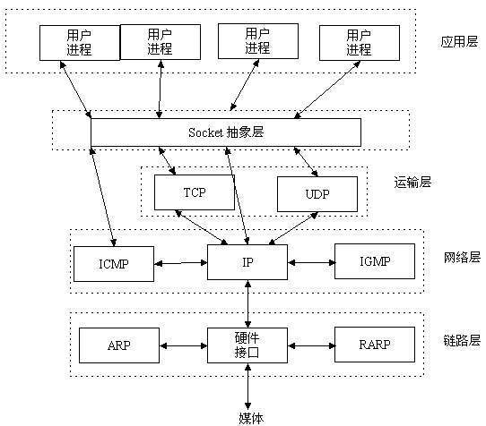
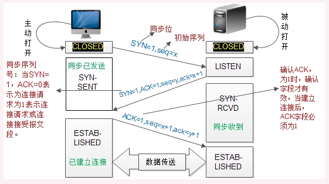
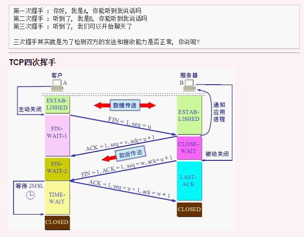

## 五层协议

1. 物理层
2. 数据链路层
3. **网络层**(ip)
4. 传输层(tcp)
5. 应用层(http)

## 五层协议的体系结构

### 五层协议是什么

- 物理层：将这些比特流(0101)与光电信号进行转换
- 数据链路层：数据在这一层不再是以比特流的形式传输，而是**分割成一个一个的帧再进行传输**
- 网络层：有了网络层，数据便能跨域不同的数据链路传输。
- 传输层：这一层主要重点是两个协议 : UDP 和 TCP
- 应用层：最著名的就是 HTTP, FTP 了，还有一个重要的 DNS

### 网络层

如果只有数据链路层没有网络层，数据就只能在同一条链路上传输，不能跨链路传输。

#### IP 地址和 MAC 地址

IP 地址又称为**软件地址**，存储在计算机的存储器上，IPv4 地址为 32 位, IPv6 地址为 128 位。

- **网络层以上使用 IP 地址，数据链路层以下使用 MAC 地址**
- **IP 地址是逻辑地址**，**MAC 地址是物理地址**
- IP 分组中首部的源地址和目的地址在传输中不会改变，MAC 帧中首部的源地址和目的地址每到一个路由器会改变一次

### 传输层

这一层是重中之重，因为数据链路层，网络层这两层的数据传输都是不可靠的，尽最大能力交付的。

什么意思的？就是它们不负责提交给你的就是正确的数据。然而这一层的 TCP 协议将要提供可靠传输，

这一层主要重点是两个协议 : UDP 和 TCP

**UDP 主要特点 :**

- 无连接
- 尽最大努力交付，不保证交付
- 面向报文:  应用层交下来的报文直接加上 UDP 头部就往 IP 层扔, 不合并也不拆分
- 没有拥塞控制
- 支持一对一, 一对多, 多对一和多对多的交互通信
- 首部开销小, 只有 8 个字节

**TCP 主要特点 :**

- 面向连接的运输层协议
- 每一条 TCP 连接只能有 2 个端点, TCP 是点对点的
- 提供可靠交付
- 全双工通信
- 面向字节流

### 应用层

应用层协议最著名的就是 HTTP, FTP 了，还有一个重要的 DNS

## TCP

tcp3 次握手

tcp 属于哪一层（1 物理层 -> 2 数据链路层 -> 3 网络层(ip)-> 4 传输层(tcp) -> 5 应用层(http)）

### TCP 传输的三次握手四次挥手策略

为了准确无误地把数据送达目标处，TCP 协议采用了**三次握手策略**。用 TCP 协议把数据包送出去后，**TCP 不会对传送后的情况置之不理，它一定会向对方确认是否成功送达**。握手过程中使用了 TCP 的标志：SYN 和 ACK。

### TCP 三次握手的步骤

是一个相互确认是否可以正常收发消息的过程。

1. 发送端（如浏览器）首先发送一个**带 SYN 标志**的数据包给对方。
2. 接收端收到后，**回传一个带有 SYN/ACK 标志**的数据包以示**传达确认信息**。
3. 最后，**发送端再回传一个带 ACK 标志的数据包，代表“握手”结束**。

若在握手过程中某个阶段莫名中断，TCP 协议会**再次以相同的顺序发送相同的数据包**，**断连重发**。

#### Q : 为什么要三次握手, 两次不可以吗 | http 建立连接过程，为什么不是四次或两次握手

避免消息不对应。

A : 试想一下, A 第一次发送请求连接, 但是在网络某节点滞留了, **A 超时重传**, 然后这一次一切正常, A 跟 B 就愉快地进行数据传输了.

等到连接释放了以后, 那个迷失了的连接请求突然到了 B 那, 如果是两次握手的话, B 发送确认, 它们就算是建立起了连接了.

事实上 A 并不会理会这个确认, 因为我压根没有要传数据啊. 但是 B 却傻傻地以为有数据要来, 苦苦等待. 结果就是造成资源的浪费.

### 断开一个 TCP 连接则需要“四次握手”

1. A：请求关闭链接；
2. B：好的，我知道了
3. B：我的数据也发完了，不会再给你发了
4. A：好的，我知道了

具体的步骤：

1. 第一次挥手：**主动关闭方发送一个 FIN**，**用来关闭主动方到被动关闭方的数据传送**，也就是**主动关闭方告诉被动关闭方：我已经不 会再给你发数据了**(当然，在 fin 包之前发送出去的数据，如果没有收到对应的 ack 确认报文，主动关闭方依然会重发这些数据)，但是，**此时主动关闭方还可 以接受数据**。

2. 第二次挥手：**被动关闭方收到 FIN 包后，发送一个 ACK 给对方**，确认序号为收到序号+1（与 SYN 相同，一个 FIN 占用一个序号）

3. 第三次挥手：**被动关闭方发送一个 FIN**，用来关闭被动关闭方到主动关闭方的数据传送，**也就是告诉主动关闭方，我的数据也发送完了**，不会再给你发数据了

4. 第四次挥手：主动关闭方收到 FIN 后，发送一个 ACK 给被动关闭方，**确认序号为收到序号+1**，至此，完成四次挥手

#### Q : 为什么要四次挥手, 而不是两次, 三次

A :  首先, 由于 **TCP 的全双工通信**, 双方都能作为数据发送方.
A 想要关闭连接, 必须要等数据都发送完毕, 才发送 FIN 给 B. (此时 A 处于半关闭状态)
然后, B 发送确认 ACK, 并且 B 此时如果要发送数据, 就发送(例如做一些释放前的处理)
再者, B 发送完数据之后, 发送 FIN 给 A. (此时 B 处于半关闭状态)
然后, A 发送 ACK, 进入 TIME-WAIT 状态
最后, 经过 2MSL 时间后没有收到 B 传来的报文, 则确定 B 收到了 ACK 了. (此时 A, B 才算是处于完全关闭状态)

### TCP 和 UDP 的区别

1. TCP（Transmission Control Protocol，传输控制协议）是基于连接的协议，也就是说，在正式收发数据前，必须和对方建立可靠的连接。**一个 TCP 连接必须要经过三次“对话”才能建立起来**。

2. UDP（User Data Protocol，用户数据报协议）是与 TCP **相对应的协议**。**它是面向非连接的协议**，**它不与对方建立连接，而是直接就把数据包发送过去**！ UDP 适用于一次只传送少量数据、**对可靠性要求不高的应用环境**。

### 试简述 TCP 协议在数据传输过程中收发双方是如何保证数据包的可靠性的

1. 为了保证数据包的可靠传递，发送方必须**把已发送的数据包保留留在缓冲区**;
2. 并为每个已发送的数据包**启动一个超时定时器器**;
3. 如在定时器超时之前收到了了对方发来的**应答信息**(可能是对本包的应答，也可以是 对本包后续包的应答)，则释放该数据包占用的缓冲区;
4. 否则，**重传该数据包**，直到收到应答或重传次数超过规定的最大次数为止。
5. 接收方收到数据包后，**先进行 CRC 校验**，如果正确则把数据交给上层协议，然后给 发送方发送一一个**累计应答包，表明该数据已收到**，如果接收方正好也有数据要发给发送 方，应答包也可在数据包中捎带过去。
