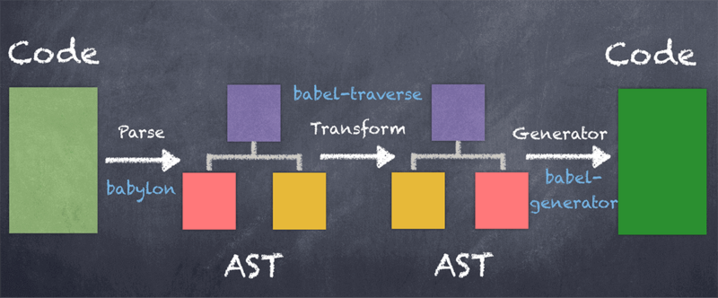

## 怎么用

具体的去写工具对拿到的字符串代码进行分析也是可以的。现在大可不必，有很多可用的工具，本次应用babel来对做一些基础的操作，验证相关模块的一些功能。

基本的思路参考如下的路线：

<!-- !是否需要重新绘制一下，这里的code-ast -->

### 我们使用AST树操作去修改源码时，一般分为三个步骤

1. parser: 将代码字符串转换为AST树，即生成一个JSON对象
2. transform: 使用工具对生成的AST树进行增删查改等操作
3. generate: 将修改完毕的AST树重新转换为源码字符串

### babel

下面先介绍下babel相关工具库，以及一些API，了解完这些基础概念后，我们会利用这些工具操作AST来编写一个babel插件。

1. @babel/parser 可以把源码转换成AST
2. @babel/traverse用于对 AST 的遍历，维护了整棵树的状态，并且负责替换、移除和添加节点
3. @babel/generate 可以把AST生成源码，**同时生成sourcemap**
4. @babel/types 用于 AST 节点的 Lodash 式工具库, 它包含了构造、验证以及变换 AST 节点的方法，对编写处理 AST 逻辑非常有用
5. @babel/template**可以简化AST的创建逻辑**
6. @babel/code-frame可以打印代码位置
7. @babel/core Babel 的编译器，核心 API 都在这里面，比如常见的 transform、parse,并实现了插件功能
8. babylon Babel 的解析器，以前叫babel parser,是基于acorn扩展而来，扩展了很多语法,可以支持es2020、jsx、typescript等语法

### babel工具包，这里主要用到的一些babel

1. [@babel/parser](https://www.babeljs.cn/docs/babel-parser)；
   1. 将代码转为ast；
   2. babel之前的版本是直接调用了recast库，来生成的AST。现在的@babel/parser很大程度借鉴了acorn。
2. [@babel/traverse](https://babeljs.io/docs/babel-traverse)；
   1. 这个库主要是遍历AST，操作Node上的节点。
   2. [Babel源码解析之@babel/traverse](https://juejin.cn/post/7041069084292677663/)；
   3. `traverse(ast, opts)`；
      1. 如果opts的key为enter/exit，在进入每一个节点的时候都会调用此函数，如果key为Node.type，则只有在解析到对应的节点时才调用此函数。
3. [@babel/types](https://www.babeljs.cn/docs/babel-types)；
   1. 对上边的ast进行遍历操作；
   2. types已经集成到@babel/core里，当然也可以单独安装；
   3. @babel/types的用途主要有3种：
      1. 类型集合
      2. 类型判断
      3. 创建节点
   4. [@babel/types深度应用](https://juejin.cn/post/6984945589859385358#heading-4)
   5. 一些常用的方法(主要是一些元素的判断&生成)：
      1. type.jsxAttribute
      2. type.jsxIdentifier
      3. type.stringLiteral
      4. type.jsxElement
      5. type.jsxOpeningElement
      6. type.jsxClosingElement
      7. type.jsxText
      8. type.objectProperty
      9. type.identifier
      10. type.callExpression
      11. type.memberExpression
      12. type.isJSXElement(node)
4. [@babel/generator](https://www.babeljs.cn/docs/babel-generator)；
   1. Turns an AST into code.
   2. path是一个对象，它表示两个节点之间的关联，我们可以通过path.node来访问其节点属性、通过path.parentPath访问其父路径等等；
5. [babel-core] / [@babel/core](https://babeljs.io/docs/babel-core):
   1. Since Babel 7 the Babel team switched to scoped packages, so you now have to use @babel/core instead of babel-core.
   2. But in essence, @babel/core is **just a newer version of babel-core**.
   3. babel的使用方式有多种：
      1. 可以直接引入核心库@babel/core，通过调用babel.transformSync等方法进行转化。
      2. 引入脚手架@babel/cli和核心库@babel/core，通过`npx babel src --out-dir lib`等方式进行转化；
   4. @babel/core是babel的核心，**主要起串联的作用，功能包括加载配置、调用@babel/parser解析AST、调用@babel/traverse遍历并操作AST、调用@babel/generator生成代码**。
   5. 我们顺便看一下@babel/core所暴露出的API。主要有以下几种：
      1. transform，参数为code，进行转换
         1. code是字符串类型的代码；
      2. transformFile，参数为文件名
      3. transfromFromAst，参数为AST
      4. parse，参数为code，生成AST

### babel的 原理

babel 是一个**转译器**，感觉相对于**编译器 compiler**，叫转译器 transpiler 更准确，**因为它只是把同种语言的高版本规则翻译成低版本规则**，而不像编译器那样，输出的是另一种更低级的语言代码。

但是和编译器类似，babel 的转译过程也分为三个阶段：

- parsing、
- transforming、
- generating，

以 ES6 代码转译为 ES5 代码为例，babel 转译的具体过程如下：

1. ES6 代码输入 ==》
2. babylon 进行解析**babel-parse** ==》
3. 得到 AST ==》
4. plugin 用 **babel-traverse** 对 AST 树进行遍历转译 ==》
5. 得到新的 AST 树==》
6. 用 **babel-generator** 通过 AST 树生成 ES5 代码。

[babel 语法树解析](./babel语法树解析.png)

esprima、estraverse 和 escodegen 模块是 babel 操作 AST 的三个重要模块，也是实现 babel 的核心依赖，下面是分别介绍三个模块的作用。

- esprima 将 JS 转换成 AST
- estraverse 遍历和修改 AST
- escodegen 将 AST 转换成 JS

### 实现 Babel 语法转换插件，babel 转换 ES6 语法到 ES5

实现语**法转换插件**需要借助 babel-core 和 babel-types 两个模块，其实这两个模块就是依赖 esprima、estraverse 和 escodegen 的。

这里可以通过`babel-core`和`babel-types`来实现常用的一些插件，就是通过修改语法树的方式来实现代码的转换。

`npm install babel-core babel-types`

具体参考：[实现 Babel 语法转换插件](https://segmentfault.com/a/1190000016706589)

### 常用插件及其作用，Toolings

- **@babel/parser** 将源代码解析成 AST。
- **@babel/generator** 将 AST 解码生 js 代码。
- @babel/core 包括了整个 babel 工作流，也就是说在@babel/core 里面我们会使用到@babel/parser、transformer[s]、以及@babel/generator。
- @babel/code-frame **用于生成错误信息**并且打印出错误原因和错误行数。（其实就是个 console 工具类）
- @babel/helpers 也是工具类，提供了一些内置的函数实现，主要用于 babel 插件的开发。
- @babel/runtime 也是工具类，但是是为了 babel 编译时提供一些基础工具库。作用于 transformer[s]阶段，当然这是一个工具库，如果要使用这个工具库，还需要引入@babel/plugin-transform-runtime，它才是 transformer[s]阶段里面的主角。
- @babel/template 也是工具类，主要用途是**为 parser 提供模板引擎**，更加快速的转化成 AST
- **@babel/traverse** 也是工具类，主要用途是来**遍历 AST 树**，也就是在@babel/generator 过程中生效。
- **@babel/types** 也是工具类，主要用途是在创建 AST 的过程中**判断各种语法的类型。**

#### eui-server 中用到的 babel 模块

- "@babel/generator": "^7.7.4", 生成 es5
- "@babel/parser": "^7.7.5", 解析
- "@babel/traverse": "^7.7.4", 遍历
- "@babel/types": "^7.7.4", 方法集
