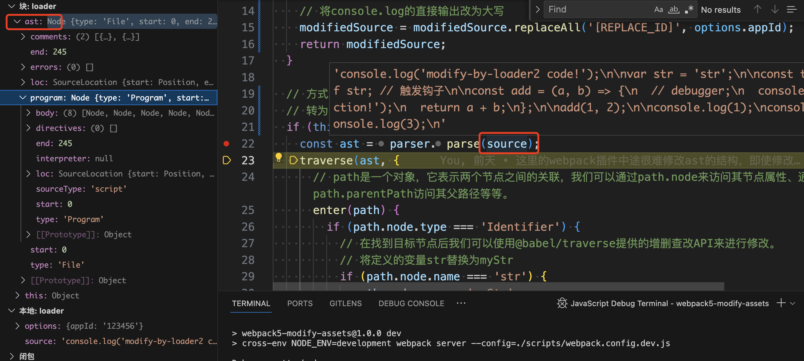
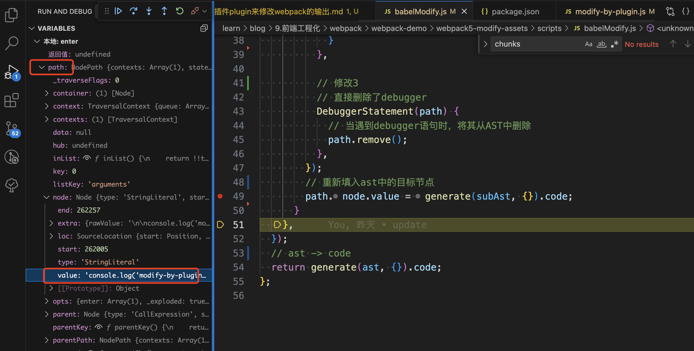

# 修改 webpack 的输出结果的两种方法

## 前端工程化

**前端工程化**是一种方法论和实践，旨在提高前端开发团队的效率、代码质量、可维护性，并促进协作。它涵盖了许多不同的工具、流程和最佳实践，用于优化前端开发过程的各个方面。

工欲善其事，必先利其器。前端工程化的问题从最开始的刀耕火种到后边的百花齐放，随着时间的推移与前端项目的复杂程度递增，需要学习和使用各种各样的工具来方便我们完成工作。

对于一个前端来说，日常最常接触的就是项目的**项目构建和打包**了，从最开始的 `grunt`、`gulp` 到后边的 `webpack`、`vite` 等。

本文主要介绍如何个人对于使用 webpack 的 loader 与插件对输出结果的一些处理，有助于对于 webpack 的原理有更深入的理解。

## webpack 介绍

webpack 是一个用于现代 JavaScript 应用程序的静态模块打包工具。当 webpack 处理应用程序时，它会在内部从一个或多个入口点构建一个 依赖图(dependency graph)，然后将你项目中所需的每一个模块组合成一个或多个 bundles，它们均为静态资源，用于展示你的内容。

**webpack 的构建过程**是通过 Compiler 控制流程，Compilation 专业解析，ModuleFactory 生成模块，Parser 解析源码，最后通过 Template 组合模块，输出打包文件的过程。

直观的理解过程：**webpack 就是打散源码再重组的过程**，能保证代码的完整性及先后顺序。

## 搭建 webpack 基础开发环境

接下来就从 0 来搭建一个 webpack5 的开发环境，首先我们要了解一下主要的配置点。

### 搭建 webpack 开发环境应该关注的方面 / 配置相关核心概念

webpack 至少需要两套配置，一个用来开发，一个用来打包成线上运行的代码；

1. entry：入口起点(entry points)，所有内容的起点，资源读取解析的入口；
   1. 支持单文件入口、数组 、对象语法这三种形式；
2. output：告知 webpack 如何向硬盘写入编译文件，用于指定在打包后生成的文件的 URL 路径，不同于 entry，这里只能有一个地址；
   1. path 用于指定存放结果的目录；
   2. 通常可以通过配置 filename 来配置输出文件的文件名形式，如`filename: '[name]-[hash:6].js',`表示文件名加 hash 的形式，文件修改后 hash 会响应改变；
   3. publicPath 这个属性，通常在 dev 和 prod 环境下是不同的，表示当前文件的引用根地址，通常情况下，开发服务器配置`publicPath: '/'`，而在 build 后的文件夹，如果 dist 目录整体部署，通常引用资源文件都是相对地址，都需要配置`publicPath: './'`；
3. module.rules：用来配置 loader 这些，用于指定不同类型的文件的处理方式。loader 是 Webpack 的一个关键概念，**它们用于处理不同类型的模块**。加载器允许你在加载模块之前对其进行转换或处理；
   1. loader 用于对模块的源代码进行转换。
   2. 在基础项目中，需要不同的 loader 去处理不同类型的文件，最基础的是`babel-loader`，通常用作处理 js，其他常用如：`less-loader`、`style-loader`、`file-loader`、`vue-loader`等；
   3. 多个 loader 从后往前一次套用；
4. plugins：插件是 Webpack 的另一个关键概念，**它们用于执行各种任务，从而优化和定制构建过程**。插件可以用于生成 HTML 文件、提取 CSS、代码分割、代码压缩等任务，这个就是主要干活的；
5. resolve：用于定义如何解析模块路径以及确定模块的位置；
6. mode：是 webpack5 新增的一个配置，相当于 webpack 预设的一些对应环境的优化手段；
   1. 有'development'、'production'和'none'三种模式；
7. devServer：是一个用于开发环境的 Webpack 插件，它提供了一个内置的开发服务器，用于快速开发和测试你的前端应用程序。
8. devtool：用于控制生成源代码映射文件，以便在开发和调试过程中更轻松地定位和解决问题。源代码映射文件允许你在浏览器中调试与转换后的代码对应的源代码，从而更容易识别错误和问题。
9. 其他还有一些配置，这里不一一列举；

详细参考可以查看[官方文档](https://webpack.docschina.org/concepts/)，这里只做简单的说明。

### 上手操作

```bash
# 1.添加基本的项目构建
$: cd target-folder
$: mkdir webpack5-modify-assets
$: cd webpack5-modify-assets/
$: git init
$: yarn init -y
$: mkdir src scripts public
$: echo node_modules > .gitignore
$: echo dist >> .gitignore
$: touch public/index.html
$: touch scripts/webpack.config.base.js
$: touch src/index.js
```

1. 然后在入口`public/index.html`和`src/index.js`添加基础的内容；
2. 在`scripts/webpack.config.base.js`进行基础的配置；
3. 添加`babel.config.js`文件；
4. 添加`package.scripts`执行命令；
5. 添加必要的依赖包，包括 webpack 相关、babel 相关、loader；
6. 参考[webpack cli 文档](https://webpack.docschina.org/api/cli/)来了解 Webpack CLI 的使用方式；

```bash
/webpack/webpack-demo/webpack5-modify-assets
├── babel.config.js # babel-loader的插件配置文件
├── package.json
├── dist # 打包的文件目录
├── public
|  ├── favicon.ico
|  └── index.html
├── scripts
|  ├── babelModify.js # 用作处理code
|  ├── loader-modify.js # loader
|  ├── plugin-modify.js # 插件
|  ├── webpack.config.base.js # webpack基础配置
|  ├── webpack.config.dev.js # 开发环境
|  └── webpack.config.prod.js # 生产环境
├── src # 要处理的代码
|  ├── ast.js
|  ├── index.js
|  └── modify-by-plugin.js
└── yarn.lock
```

[具体参考代码](https://github.com/qiuwww/blog/blob/57ad5d7cf43764dcae8a8d310c3b358b5c1467fb/9.%E5%89%8D%E7%AB%AF%E5%B7%A5%E7%A8%8B%E5%8C%96/webpack/webpack-demo/webpack5-modify-assets)。

## webpack 的基本原理

webpack 的工作原理可以概括为：从入口文件开始，分析依赖关系，通过加载器处理不同类型的模块，通过插件执行各种任务，最终输出打包后的文件。webpack 的强大之处在于其高度可配置性和可扩展性，允许开发者根据项目需求定制构建流程，从而满足不同项目的需求。

### webpack 的生命周期 / webpack 运行的基本流程

webpack 的生命周期是指 webpack **在执行其构建任务时所经历的一系列阶段**。这些生命周期钩子来帮助开发者在构建项目时进行定制化处理。webpack 的运行也是基于这些阶段进行的。这些阶段包括：

1. 初始化阶段（ Initialization Phase ）：webpack 在这个阶段中会解析配置文件，并初始化一些全局变量和模块；
   1. **这里就是整合所有的配置信息的阶段**，这些全局、插件、babel 的配置信息会被整合到一起，给后续使用；
2. 解析阶段（ Parse Phase ）：webpack 在这个阶段中会**解析所有的输入文件**，包括 JavaScript、CSS、图像等。**它会将这些文件解析成抽象语法树（AST）**，以便进行进一步的处理；
   1. **这里其实就是 bebel 处理的阶段**，这里的资源在 bebel 处理之后都是一团一团的代码块；
   2. 这里的 ast 可能还需要对这里的代码块进行处理，继续解析成 ast；
3. 变换阶段（ Transform Phase ）：webpack 在这个阶段中会应用一些变换，**例如代码压缩、语法转换等**。这些变换是通过插件实现的，webpack 会在这个阶段中调用相应的插件来执行这些变换；
   1. 插件的工作阶段；
4. 代码分离阶段（ Code Splitting Phase ）：如果配置了**代码分离**，webpack 会在这个阶段中**将大型的 JavaScript 文件分割成多个较小的文件，以便在浏览器中按需加载**；
   1. 进行如按需加载、判断依赖、分割代码等操作；
5. 生成阶段（ Generate Phase ）：webpack 在这个阶段中会根据配置文件中的规则，**生成最终的输出文件**。这些文件可以是 JavaScript 文件、CSS 文件、图像文件等；
6. 浏览器加载阶段（ Load Phase ）：webpack 在这个阶段中会加载生成的输出文件，并将它们注入到浏览器中；
   1. dev 模式的热更新。

这些阶段是 webpack 构建过程的核心，它们共同协作以完成 webpack 的构建任务。了解这些阶段可以帮助你更好地理解 webpack 的工作原理，并更好地使用它来构建你的项目。

### webpack 的生命周期钩子

webpack 最重要的两个资源就是 compiler 和 compilation 对象。理解它们的角色是扩展 webpack 引擎重要的第一步。

Compiler 和 Compilation 都继承自 Tapable，可以直接在 Compiler 和 Compilation 对象上广播和监听事件。

Tapable 的机制应用了观察者模式，和 Node.js 中的 EventEmitter 非常相似。

#### [Tapable 类](https://webpack.docschina.org/api/plugins/#tapable)

`Tapable` 是 webpack 内部使用的一个插件系统，**它提供了一种灵活的方式来管理和应用插件，以扩展和定制 webpack 的行为**。`Tapable` 实际上是 webpack 插件系统的核心，而插件系统是 webpack 构建过程的基础。

以下是一些关于 `Tapable` 类的基本介绍和概念：

1. **事件驱动体系**：`Tapable` 是一个事件驱动的插件系统，它允许你在不同的生命周期阶段监听和触发事件。这些事件对应 webpack 构建过程中的不同阶段，如编译、模块解析、资源生成等。
2. **插件**：在 `Tapable` 中，插件是一个具有特定方法的 JavaScript 对象。插件可以监听事件，并在事件发生时执行自定义逻辑。这使得开发者可以扩展 webpack 的功能，以满足特定项目需求。
3. **事件监听和触发**：`Tapable` 提供了一系列的方法，如 `tap`、`tapAsync`、`tapPromise` 等，用于监听事件。开发者可以使用这些方法将插件注册到事件上。然后，webpack 在相应的生命周期阶段触发事件，并执行已注册的插件。
4. **异步支持**：`Tapable` 提供了异步事件处理的机制，使插件可以执行异步操作。这对于一些耗时的操作，如文件读写、网络请求等，非常有用。
5. **钩子（Hooks）**：`Tapable` 使用钩子来管理事件，每个事件对应一个钩子。钩子提供了标准的 API，使插件开发更加一致和易于理解。常见的钩子包括 `SyncHook`、`AsyncSeriesHook`、`AsyncParallelHook` 等，它们分别用于同步事件、异步串行事件和异步并行事件。
6. **内置钩子**：webpack 内部使用了大量的内置钩子来管理构建过程，同时也允许开发者自定义钩子来扩展功能。

`Tapable` 的强大之处在于它为 webpack 插件提供了一种松耦合的扩展机制，使得开发者可以通过插件来干预 webpack 的构建过程，而不需要修改 webpack 的源代码。这使得 webpack 可以适应各种不同的项目需求，从简单的静态资源打包到复杂的前端工程化和优化。

总之，`Tapable` 是 webpack 插件系统的核心，它为 webpack 提供了一种高度可扩展的机制，使得开发者可以通过插件来自定义和扩展 webpack 的行为。

```ts
interface Tap {
  name: string;
  type: string;
  fn: Function;
  stage: number;
  context: boolean;
  before?: string | Array;
}
```

##### 钩子的类型

1. `tap: (name: string | Tap, fn: (context?, ...args) => Result) => void`；
   1. 同步 hook 只能使用 tap 方法；
2. `tapAsync: (name: string | Tap, fn: (context?, ...args, callback: (err, result: Result) => void) => void) => void`；
   1. 当我们用 tapAsync 方法来绑定插件时，*必须*调用函数的最后一个参数 callback 指定的回调函数。
3. `tapPromise: (name: string | Tap, fn: (context?, ...args) => Promise<Result>) => void`；
   1. 当我们用 tapPromise 方法来绑定插件时，*必须*返回一个 promise ，异步任务完成后 resolve 。

#### Compiler 和 Compilation 的关系

1. **compiler 对象代表的是构建过程中不变的 webpack 环境**，整个 webpack 从启动到关闭的生命周期。针对的是 webpack。
2. **compilation 对象只代表一次新的编译**，只要项目文件有改动，compilation 就会被重新创建。针对的是随时可变的项目文件。
3. **如果把 compiler 算作是总控制台，那么 compilation 则专注于编译处理这件事上**。

#### Compiler，编译器，[compiler 钩子](https://webpack.docschina.org/api/compiler-hooks/)

1. Compiler 模块是 webpack 的主要引擎，它通过 CLI 或者 Node API 传递的**所有选项**创建出一个 compilation 实例。
2. 它扩展（extends）自 Tapable 类，**用来注册和调用插件**。 **大多数面向用户的插件会首先在 Compiler 上注册**。
3. 具体就是**依次调用插件的 apply 方法**，并将 compiler 对象 (包含 webpack 的各种配置信息) 传进去供 plugin 使用，**compiler 包含整个构建流程的全部钩子，通过它可以把控整个 webpack 构建周期**。
4. 在运行期间 compiler **会根据 webpack 不同阶段触发的各种事件钩子**，执行插件附加/绑定在 hook 上的函数。
5. **compiler 只是负责维持生命周期运行的功能**，所有的加载、打包和写入工作，都被委托到注册过的插件上了。
6. webpack 使用 webpackOptionsDefaulter 和 webpackOptionsApply 来配置 Compiler 实例以及所有内置插件。
7. Compiler 类实例化并注册 plugins 后，**若 webpack 函数接收了回调 callback，会执行 compiler.run()方法**，webpack 即刻开启编译之旅。如果未指定 callback 回调，则需要用户自己调用 run 方法来启动编译。
8. **webpack 从执行到结束，Compiler 只会实例化一次**。生成的 compiler 对象记录了 webpack 当前运行环境的完整的信息，该对象是全局唯一的，**插件可以通过它获取到 webpack config 信息，如 entry、output、loaders 等配置**。
   1. 这里的插件的 config 信息，会合并插件初始化的时候的参数；
9. 在 compiler 类中，提供了三种类型的内置解析器：
   1. normal: 通过绝对或相对路径解析模块。
   2. context: 在给定的上下文中解析模块。
   3. loader: 解析 webpack loader。
   4. **请注意，resolve 配置会影响 normal 解析器和 context 解析器**，**而“ resolveLoader 用于修改 loader 解析器**。

##### 具体的 compiler 钩子

1. beforeRun，读取配置文件，准备启动；
   1. beforeRun 在 webpack 开始读取配置之前，该钩子将被调用；
   2. 初始化参数 从配置文件和 Shell 语句中读取与合并参数，得出最终的参数；
   3. 这个 async 钩子，在这个钩子中绑定了读取文件的对象。
      1. `webpack --hot -w` => `{ hot: true, profile: false, watch: true,}`;
   4. config 的合并与插件加载；
      1. webpack 将 webpack.config.js 中的各个配置项拷贝到 options 对象中，并加载用户配置在 webpack.config.js 的 plugins 。
2. run，在编译之前有缓存，则启用缓存；
3. watchRun，在使用 webpack-dev-server 进行开发时，该钩子将被调用；
4. beforeCompile，开始编译前的准备，创建的 ModuleFactory，创建 Compilation，并绑定 ModuleFactory 到 Compilation 上。
   1. 同时处理一些不需要编译的模块，比如 ExternalModule（远程模块）和 DllModule（第三方模块）。
5. compile，编译了，这里的编译只是处理配置文件，生成基础的 compilation；
   1. 开始编译 用上一步得到的参数初始化 Compiler 对象，加载所有配置的插件，执行对象的 run 方法开始执行编译；
6. seal 封装构建结果；
7. make，从 Compilation 的 addEntry 函数，开始构建模块；
   1. 这个钩子就是正式启动编译了，所以这个钩子执行完毕就意味这编译结束了，可以进行封装 seal 了。
8. afterCompile，编译结束了；
9. shouldEmit，获取 compilation 发来的电报，确定编译时候成功，是否可以开始输出了。
10. emit，输出文件了；
11. afterEmit，输出完毕；
12. done，无论成功与否，一切已尘埃落定。
13. assetEmitted 生命周期钩子是在所有资源（如 JavaScript、CSS、图片等）都已经生成到输出目录中后，即 webpack 打包完毕后触发的。
14. normalModuleFactory：NormalModuleFactory 创建之后调用`compiler.hooks.normalModuleFactory`:
    1. 回调参数：normalModuleFactory；
    2. Compiler 使用 NormalModuleFactory 模块生成各类模块。从入口点开始，此模块会分解每个请求，解析文件内容以查找进一步的请求，然后通过分解所有请求以及解析新的文件来爬取全部文件。在最后阶段，每个依赖项都会成为一个模块实例。
    3. compiler.hooks.normalModuleFactory.tap，这里是可以获取到 ast 的结果的；

##### compiler.hooks.normalModuleFactory 与 compiler.hooks.emit 的区别

1. Compiler.hooks.normalModuleFactory 钩子**在 webpack 编译过程中的"Module"创建阶段被调用**。**在这个阶段，webpack 已经解析了模块的源代码，并将其转换为抽象语法树（AST）**。但是，webpack 还没有将该模块的代码实际编译为 JavaScript 代码。**通过在 Compiler.hooks.normalModuleFactory 钩子中添加自定义逻辑，您可以在 webpack 编译过程中改变模块的行为，例如添加自定义代码、修改模块的依赖关系、注入自定义函数等。**
2. 相比之下，**Compiler.hooks.emit 钩子在 webpack 编译过程的后期被调用。**在这个阶段，webpack 已经将所有的模块编译为 JavaScript 代码，并将它们合并到一个或多个文件中。
   1. 通过在 Compiler.hooks.emit 钩子中添加自定义逻辑，您可以在 webpack 编译过程中改变输出文件的行为，例如添加自定义代码、修改输出文件的路径等。

总的来说，**Compiler.hooks.normalModuleFactory 钩子更适合用于改变模块的行为**，而 Compiler.hooks.emit 钩子更适合用于改变输出文件的行为。您可以根据具体需求选择使用哪个钩子。

#### Compilation 编译对象，[compilation 钩子](https://webpack.docschina.org/api/compilation-hooks/)

如果说 Compiler 是流程，那么 Compilation 就是编译主场了。也就是源代码经过他加工之后才得到了升华变成了规规矩矩的模样。

Compilation 对象代表了一次资源版本构建。当运行 webpack 开发环境中间件时，每当检测到一个文件变化，就会创建一个新的 compilation，从而生成一组新的编译资源。一个 Compilation 对象表现了当前的模块资源、编译生成资源、变化的文件、以及被跟踪依赖的状态信息，简单来讲就是把本次打包编译的内容存到内存里。Compilation 对象也提供了插件需要自定义功能的回调，以供插件做自定义处理时选择使用拓展。

##### Compilation 具体的钩子

`Compilation` 对象具有许多可用于监听和扩展构建过程的钩子（hooks）。以下是一些常见的 `Compilation` 钩子：

1. buildModule：在构建模块（Module）时触发，可以用于监听和修改模块的构建过程。
2. succeedModule：在成功构建模块后触发，可以用于处理成功构建模块的逻辑。
3. failedModule：在构建模块失败时触发，可用于处理构建失败的模块。
4. finishModules：在所有模块构建完成后触发，可以执行一些收尾工作。
5. seal：在构建过程封存前触发，允许在最终资源生成之前进行一些操作。
6. optimize：在资源优化过程开始前触发，可以用于自定义资源优化逻辑。
7. optimizeAssets：在资源优化过程中触发，可以监听和修改资源的优化过程。
8. optimizeChunkAssets：在块资源优化过程中触发，可用于自定义块资源的优化逻辑。
9. optimizeTree：在资源树优化过程中触发，允许修改资源树的优化逻辑。
10. afterOptimizeTree：在资源树优化完成后触发，可用于处理优化完成后的资源树。
11. beforeHash：在计算输出文件的哈希之前触发，可以监听和修改哈希生成的逻辑。
12. afterHash：在输出文件哈希计算完成后触发，可用于处理生成的哈希值。
13. beforeModuleAssets：在生成模块资源之前触发，可用于在模块资源生成前执行一些操作。
14. moduleAsset：在生成模块资源时触发，可监听和修改模块资源的生成。
15. processAssets：在生成资源（如 JavaScript 文件、CSS 文件等）时触发，可以监听和修改资源的生成。

这些钩子允许开发者在 webpack 构建过程中的不同阶段执行自定义操作，以满足特定的需求或优化构建结果。插件可以通过监听这些钩子来扩展 webpack 的功能，执行各种自定义逻辑，如资源优化、哈希生成、资源生成等。

## 通过 webpack 修改输出的方式

使用 webpack 来修改要执行的源码，返回处理过后的代码。因为这个过程是很多插件的基本操作，可以方便我们理解插件的运行逻辑与开发流程。本次主要设计到使用 loader 和 plugin 来修改源代码，并返回结果。

Compiler 代表着 webpack 从启动到关闭的整个生命周期，**而 Compilation 只代表来一次编译，而修改源码的时机正好需要在编译的过程中修改**。

1. 使用 webpack 修改输出代码的方式可以有如下：
   1. 使用自定义 loader；
   2. 使用自定义 plugin；
      1. 可以选择在 compilation/emit 等周期内，修改 compilation.assets 的内容；
2. 修改输出结果的方式：
   1. 直接操作字符串，使用 String 和 RegExp 的一系列方法，对字符串的内容进行增删改查，但是这样不是很安全；
   2. 转为 ast，基本思路 code -> ast -> code 的方式；
      1. 这里可以参考文章[使用 AST 抽象语法树处理代码](https://juejin.cn/post/7288229413035130938)；

## 开发 loader 来修改代码输出

使用 loader 来修改源代码，比较靠近源代码，处理比较靠前，是很方便的。

### [开发一个 loader 的基本步骤](https://webpack.docschina.org/contribute/writing-a-loader/)

loader 的串行处理类似于一个管道，后边的拿到前面传递的字符串结果，经处理后，继续传递个后边的 loader。

```js
// my-custom-loader.js
module.exports = function (source) {
  // 你的loader逻辑将在这里
  let modifiedSource = source;
  // 你可以使用正则表达式、字符串替换、AST转换等方法来修改源代码。
  // ...
  return modifiedSource;
};
```

### 本示例中的 loader

**原始代码**：

```js
// webpack5-modify-assets/src/modify-by-loader.js
console.log('modify-by-loader code!');

console.log('appId', '[REPLACE_ID]');

document.querySelector('#modify-by-loader').innerHTML = `<h3>appId:[REPLACE_ID]</h3>`;

// webpack5-modify-assets/src/modify-by-loader2.js
console.log('modify-by-loader2 code!');

var str = 'str';

const typeA = typeof str; // 触发钩子

const add = (a, b) => {
  // debugger;
  console.log('add function!');
  return a + b;
};

add(1, 2);

console.log(1);
console.log(2);
console.log(3);
```

**经 loader 处理**：

```js
// webpack5-modify-assets/scripts/loader-modify.js

const { getOptions } = require('loader-utils');
const parser = require('@babel/parser');
const traverse = require('@babel/traverse').default;
const generate = require('@babel/generator').default;
const types = require('@babel/types');

module.exports = function loader(source) {
  const options = getOptions(this);
  // 方式一
  // 判断目标文件，并直接修改code
  if (this.resourcePath.endsWith('src/modify-by-loader.js')) {
    // 直接修改js字符串代码
    let modifiedSource = `${source} \n console.log("loader-modify add!");`;
    // 将console.log的直接输出改为大写
    modifiedSource = modifiedSource.replaceAll('[REPLACE_ID]', options.appId);
    return modifiedSource;
  }

  // 方式二
  // 转为ast处理后再转为code
  if (this.resourcePath.endsWith('src/modify-by-loader2.js')) {
    const ast = parser.parse(source);
    traverse(ast, {
      // path是一个对象，它表示两个节点之间的关联，我们可以通过path.node来访问其节点属性、通过path.parentPath访问其父路径等等。
      enter(path) {
        if (path.node.type === 'Identifier') {
          // 在找到目标节点后我们可以使用@babel/traverse提供的增删查改API来进行修改。
          // 将定义的变量str替换为myStr
          if (path.node.name === 'str') {
            path.node.name = 'myStr';
          }
        }
      },

      // 匹配肩头函数
      ArrowFunctionExpression(path) {
        // 通过参数a，b进行判断目标函数
        if (path.node.params.map((item) => item.name).join('') === 'ab') {
          // 参数添加c
          path.node.params.push(types.identifier('c'));
          // body里边添加一条语句，打印a,b,c
          path.node.body.body.unshift(
            types.callExpression(types.identifier('console.log'), [
              types.stringLiteral('add by loader-modify: '),
              types.identifier('a'),
              types.identifier('b'),
              types.identifier('c'),
            ]),
          );
        }
      },
    });
    return generate(ast, {}).code;
  }
  // 在目标文件后边追加内容
  return source;
};
```




**目标结果**，这里的 `[REPLACE_ID]` 被修改为配置的 option 里边设置的 appId 了，变量名`str`也被替换为了`myStr`，函数 add 添加了一个参数，并且再 body 中添加了一条打印信息。

## 3-3.开发插件 plugin 来修改 webpack 的输出

plugin 有很多的生命周期，但是目标代码地址都在 compilation.assets，所以修改代码都是基于此。

### 开发一个 webpack 插件的[基本步骤](https://webpack.docschina.org/contribute/writing-a-plugin/#creating-a-plugin)

webpack 插件由以下组成：

1. 一个 JavaScript 命名函数或 JavaScript 类。
2. 在插件函数的 prototype 上定义一个 apply 方法。
3. 指定一个绑定到 webpack 自身的事件钩子。
4. 处理 webpack 内部实例的特定数据。
5. 功能完成后调用 webpack 提供的回调。

```js
// 一个 JavaScript 类
class MyExampleWebpackPlugin {
  // 在插件函数的 prototype 上定义一个 `apply` 方法，以 compiler 为参数。
  apply(compiler) {
    // 指定一个挂载到 webpack 自身的事件钩子。
    compiler.hooks.emit.tapAsync('MyExampleWebpackPlugin', (compilation, callback) => {
      console.log('这是一个示例插件！');
      console.log('这里表示了资源的单次构建的 `compilation` 对象：', compilation);

      // 用 webpack 提供的插件 API 处理构建过程
      compilation.addModule(/* ... */);

      callback();
    });
  }
}
```

### 本示例中的 plugin

**原始代码**：

```js
// webpack5-modify-assets/src/modify-by-plugin.js
console.log('modify-by-plugin!');
function square(n) {
  console.log('n', n);
  return n * n;
}

square(2);

debugger;

var hahaha = 9527;

console.log('heiheihei');
```

```js
// webpack5-modify-assets/scripts/babelModify.js
const parser = require('@babel/parser');
const fs = require('fs');
const traverse = require('@babel/traverse').default;
const generate = require('@babel/generator').default;
const types = require('@babel/types');

// 这里仍旧修改的是assets，但是对内部进行了二次ast转换，找到目标代码，进行了修改
module.exports = function (code) {
  // 拿到文件的code，转为ast结构
  const ast = parser.parse(code);
  fs.writeFileSync(__dirname + '/middle/input1.json', JSON.stringify(ast));
  fs.writeFileSync(__dirname + '/middle/input1.js', code);

  traverse(ast, {
    enter(path) {
      // 匹配到name是n的改为x
      // 这里匹配到目标source
      if (
        path.node.type === 'StringLiteral' &&
        path.node.value.includes(
          '# sourceURL=webpack://webpack5-modify-assets/./src/modify-by-plugin.js?',
        )
      ) {
        const subAst = parser.parse(path.node.value);
        fs.writeFileSync(__dirname + '/middle/input2.json', JSON.stringify(subAst));
        fs.writeFileSync(__dirname + '/middle/input2.js', path.node.value);

        traverse(subAst, {
          enter(path) {
            // 操作1，修改结果
            if (path.node.type === 'NumericLiteral' && path.node.value === 9527) {
              // 替换数值类型9527为9528
              path.node.value = 9528;
            }
            // 操作2，修改目标字符串
            if (path.node.type === 'StringLiteral' && path.node.value === 'heiheihei') {
              path.node.value = 'heiheihei heiheihei';
            }
          },

          // 修改3
          // 直接删除了debugger
          DebuggerStatement(path) {
            // 当遇到debugger语句时，将其从AST中删除
            path.remove();
          },
        });
        // 重新填入ast中的目标节点
        path.node.value = generate(subAst, {}).code;
      }
    },
  });
  // ast -> code
  return generate(ast, {}).code;
};
```

**经 plugin 处理**：

```js
// webpack5-modify-assets/scripts/plugin-modify.js

const pluginName = 'PluginModify';
const babelModify = require('./babelModify.js');

/**
 * 这里似乎可以这样理解：
 * 1. assets代表的是原始的代码，修改了会影响到目标结果；=> 修改模块代码:在 compilation 阶段，你可以监听 optimize-chunk-assets 事件，它会提供输出的 chunk 对象。你可以遍历这些 chunk，获取模块的代码，然后修改代码，最后通过 compilation.assets 对象将修改后的代码重新写入到输出文件中。
 *   1.1 都是走到了compilation.assets[fileName]；
 * 2. chunks和modules修改了也只是修改了，没什么用；
 * 3. compiler.hooks.normalModuleFactory应该也是同样的问题
 */

class PluginModify {
  constructor(options = {}) {
    this.options = options;
  }

  apply(compiler) {
    // 方式一
    compiler.hooks.emit.tapAsync(pluginName, (compilation, cb) => {
      //可遍历出所有的资源名
      for (var filename in compilation.assets) {
        // console.log('MyModifyOutput name==', filename);
      }
      compilation.chunks.forEach(function (chunk) {
        chunk.files.forEach(function (filename) {
          // compilation.assets 存放当前所有即将输出的资源
          let source = compilation.assets[filename].source();
          // 这里可以根据扩展名进行不同的操作

          if (filename.includes('.js') && filename.includes('modifyByPlugin')) {
            // 方式一
            source =
              "console.log('哈哈哈哈哈😄');\n" +
              source +
              "\n;console.log('add by plugin-modify-1!');";
            // 方式二
            // 通过babel分析后，结构化添加
            source = babelModify(source);
            source = `${source}`;
          }

          // 这里修改的是assets
          compilation.assets[filename] = {
            source: function () {
              return source;
            },
            size: function () {
              return source.length;
            },
          };
        });
      });
      cb();
    });

    // !这个会在emit前面添加
    compiler.hooks.compilation.tap(pluginName, (compilation) => {
      compilation.hooks.optimizeChunkAssets.tapAsync(pluginName, (chunks, callback) => {
        chunks.forEach((chunk) => {
          // 遍历块的所有文件
          chunk.files.forEach((file) => {
            if (file.endsWith('.js')) {
              // 获取文件内容
              // webpack处理过的代码
              let source = compilation.assets[file].source();
              // 在文件开头添加自定义注释
              source = `/* ¥¥¥¥¥¥¥¥¥¥¥¥¥¥¥¥¥¥¥¥¥ */\n${source}`;
              // 将修改后的内容写回文件
              compilation.assets[file] = {
                source: () => source,
                size: () => source.length,
              };
            }
          });
        });

        // 执行回调函数
        callback();
      });
    });

    compiler.hooks.done.tap(pluginName, (compilation) => {
      console.log('webpack 构建完毕！！！');
    });
  }
}

module.exports = PluginModify;
```




**目标结果**，这里首先通过 code 直接拼接的方式，添加了一段打印信息。然后修改了变量的 value，删除了 debugger 字段。

## 总结

通过这个插件的开发，整体的学习了一下 webpack 的配置及 babel 的使用，以及 ast 的使用，对 webpack 打包的中间产物有了一定的了解。

## 参考文档

1. [webpack 官方文档](https://webpack.docschina.org/concepts/)；
2. [webpack5 和 webpack4 的区别有哪些](https://www.cnblogs.com/Hsong/p/15894515.html)；
3. [webpack 自定义插件](https://webpack.docschina.org/contribute/writing-a-plugin/)；
4. [Compilation Object](https://webpack.docschina.org/api/compilation-object/)；
5. [使用 AST 抽象语法树处理代码](https://juejin.cn/post/7288229413035130938)；
6. [webpack 插件开发及修改源码的几种方式](https://www.haorooms.com/post/webpack_plugin_changcode)；
7. [小程序 webpack 插件](https://github.com/listenzz/MyMina/blob/master/README.md)；
8. [compiler 钩子](https://webpack.docschina.org/api/compiler-hooks/)；
9. [NormalModuleFactory Hooks](https://webpack.docschina.org/api/normalmodulefactory-hooks/)；
10. [JavascriptParser Hook](https://xie.infoq.cn/article/e61d3035bd82680f71d6b9936)

[测试代码位置](https://github.com/qiuwww/blog/blob/57ad5d7cf43764dcae8a8d310c3b358b5c1467fb/9.%E5%89%8D%E7%AB%AF%E5%B7%A5%E7%A8%8B%E5%8C%96/webpack/webpack-demo/webpack5-modify-assets)。
