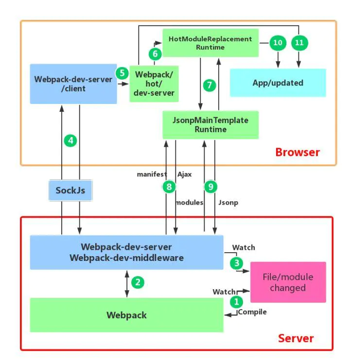

[非常值得一读：「吐血整理」再来一打 Webpack 面试题](https://mp.weixin.qq.com/s?__biz=MzAxODE2MjM1MA==&mid=2651558192&idx=1&sn=ac9daccc20950b26b1670d2621376d7c&chksm=802546f1b752cfe7e4eb564437070b8cef9c91ab2827e7fc21fff48c0d17c24eac3214f7d1cd&scene=0&xtrack=1#rd)
[深度掌握 webpack 的 5 个关键点](https://mp.weixin.qq.com/s/ciyc9z8ZaVwSpriQoUCHHA)
[带你深度解锁 Webpack 系列(优化篇)](https://mp.weixin.qq.com/s/1BdKGW43MqWWsdQJ7MYI7w)

## loader 与 plugin 的区别

1. Loader 本质就是一个函数，在该函数中对接收到的内容进行转换，返回转换后的结果。因为 Webpack 只认识 JavaScript，所以 Loader 就成了翻译官，**对其他类型的资源进行转译的预处理工作**。
2. Plugin 就是插件，**基于事件流框架 Tapable**，插件可以**扩展 Webpack 的功能**，在 Webpack 运行的生命周期中会广播出许多事件，**Plugin 可以监听这些事件，在合适的时机通过 Webpack 提供的 API 改变输出结果**。
3. Loader **在 module.rules 中配置**，作为模块的解析规则，类型为数组。每一项都是一个 Object，内部包含了 test(类型文件)、loader、options (参数)等属性。
4. Plugin 在 plugins 中**单独配置**，类型为数组，**每一项是一个 Plugin 的实例，参数都通过构造函数传入**。

## webpack 的构建流程 ｜ 运行机制 ｜ Webpack 构建流程简单说一下

Webpack 的运行流程是一个**串行的过程**，从启动到结束会依次执行以下流程：

1. **初始化参数**：从配置文件和 Shell 语句中**读取与合并参数**，得出最终的参数；
2. 开始**编译**：**用上一步得到的参数初始化 Compiler 对象**，**加载所有配置的插件，执行对象的 run 方法开始执行编译**；
3. 确定入口：根据配置中的 entry **找出所有的入口文件**；
4. 编译模块：从入口文件出发，**调用所有配置的 Loader 对模块进行翻译**，再找出该模块依赖的模块，再**递归本步骤**直到所有入口依赖的文件都经过了本步骤的处理；
5. **完成模块编译（loader 预处理）**：在经过第 4 步使用 Loader 翻译完所有模块后，得到了每个模块被翻译后的**最终内容以及它们之间的依赖关系**
6. 输出资源：**根据入口和模块之间的依赖关系**，**组装成一个个包含多个模块的 Chunk**，再把**每个 Chunk 转换成一个单独的文件加入到输出列表**，这步是可以修改输出内容的最后机会；
7. 输出完成：在确定好输出内容后，**根据配置确定输出的路径和文件名，把文件内容写入到文件系统**；
8. 在以上过程中，Webpack 会在**特定的时间点广播出特定的事件（插件的监控事件的周期，并执行回调）**，插件在监听到感兴趣的事件后会执行特定的逻辑，并且插件可以调用 Webpack 提供的 API 改变 Webpack 的运行结果。

**简单说**：

1. 初始化：**启动构建，读取与合并配置参数**，**加载 Plugin，实例化 Compiler、（loader）**；
2. 编译：从 **Entry** 出发，针对每个 Module **串行调用对应的 Loader** 去翻译文件的内容，再找到该 Module 依赖的 Module，**递归地进行编译处理**；
3. 插件处理：在以上过程中，Webpack 会在**特定的时间点广播出特定的事件（插件的监控事件的周期，并执行回调）**，插件在监听到需要修改的事件后会执行特定的逻辑，并且插件可以**调用 Webpack 提供的 API 改变 Webpack 的运行结果**；
4. 输出：将**编译后的 Module 组合成 Chunk**，将 Chunk 转换成文件，输出到文件系统中。

## source map 是什么？生产环境怎么用

source map 是**将编译、打包、压缩后的代码映射回源代码的过程**。打包压缩后的代码不具备良好的可读性，**想要调试源码就需要 soucre map**。

map 文件只要不打开开发者工具，浏览器是不会加载的。

**线上环境一般有三种处理方案**：

1. hidden-source-map：借助第三方错误监控平台 Sentry 使用
2. nosources-source-map：只会显示具体行数以及查看源代码的错误栈。安全性比 sourcemap 高
3. sourcemap：通过 nginx 设置将 .map 文件只对白名单开放(公司内网)

注意：**避免在生产中使用 inline- 和 eval-**，因为它们会增加 bundle 体积大小，并降低整体性能。

## 模块打包原理

Webpack **实际上为每个模块创造了一个可以导出和导入的环境**，本质上并没有修改 代码的执行逻辑，**代码执行顺序与模块加载顺序也完全一致**。

## 文件监听原理

原理：**轮询判断文件的最后编辑时间是否变化**，如果某个文件发生了变化，并不会立刻告诉监听者，而是**先缓存起来，等 aggregateTimeout 后再执行**。

Webpack 开启监听模式，有两种方式：

1. 启动 webpack 命令时，带上 --watch 参数
2. 在配置 webpack.config.js 中设置 watch:true

## Webpack 的热更新原理



[webpack HRM](https://www.jianshu.com/p/2410022eb597)

Webpack 的热更新又称热替换（Hot Module Replacement），缩写为 HMR。这个机制可以做到**不用刷新浏览器**而将新变更的模块替换掉旧的模块，这里的热更新，主要是，在**整体页面不刷新的形式下，使页面进行局部更新**。

1. webpack **监听(轮训页面修改时间)到文件的变化**，**进行新的编译和打包**，并且以简单的 js 对象保存在内存中。
2. webpack 与 devServer 进行交互，告诉 webpack 要保存代码到内存中。
3. devServer 对文件的监控，并且**通过配置来告诉 devServer 是刷新还是进行热更新**。
4. devServer **通过 sock.js 和浏览器建立 websock 长链接**，把 webpack 编译代码各阶段信息**告诉浏览器(包括更新模块的 hash)**，就是通过这一个 hash 来进行更新的。
5. webpack 通过 devServer 的配置和传递给他的信息（也就是第二步监听的信息）来决定是否进行浏览器刷新或者热更新。
6. webpack 的 **HotModuleReplacement** 通过 JsonpMainTemplate.runtime 向 server 端发送 Ajax 请求，服务端返回一个 json，**该 json 包含了所有要更新的模块的 hash 值**，获取到更新列表后，该模块再次通过 jsonp 请求，获取到最新的模块代码。这就是上图中 7、8、9 步骤。
7. HotModulePlugin 将会对新旧模块进行对比，决定是否更新模块，在决定更新模块后，检查模块之间的依赖关系，更新模块的同时更新模块间的依赖引用。
8. 当 HMR 失败后，回退到 live reload 操作，刷新浏览器。

总结概括：

**HMR 的核心**：就是客户端从服务端拉取更新后的文件，准确的说是 chunk diff (chunk 需要更新的部分)，实际上 **WDS 与浏览器之间维护了一个 Websocket**，当本地资源发生变化时，WDS 会向浏览器推送更新，**并带上构建时的 hash**，让客户端与上一次**资源进行对比（通过 hash 值）**。**客户端对比出差异后会向 WDS 发起 Ajax 请求来获取更改内容(文件列表、hash)**，这样客户端就可以再借助这些信息继续向 WDS 发起 jsonp 请求获取该 chunk 的增量更新。

## 文件指纹是什么？怎么用

文件指纹是**打包后输出的文件名的后缀**。

1. Hash：和**整个项目的构建相关**，只要项目文件有修改，整个项目构建的 hash 值就会更改；
2. Chunkhash：和 Webpack 打包的 chunk 有关，**不同的 entry 会生出不同的 chunkhash**；
3. Contenthash：**根据文件内容来定义 hash**，文件内容不变，则 contenthash 不变。

## 如何优化 Webpack 的构建速度 ｜ webpack 优化策略，<提高 dev 及 build 的速度>

[参考文章](https://juejin.im/post/5d614dc96fb9a06ae3726b3e)

### 1. 使用工具分析各部分执行时常

[Speed Measure Plugin(for webpack)](https://www.npmjs.com/package/speed-measure-webpack-plugin)

参考代码 scripts。

### 2. 具体优化策略

#### 0.使用高版本的 Webpack 和 Node.js

1. V8 带来的优化（for of 替代 forEach、Map 和 Set 替代 Object、includes 替代 indexOf）
   1. 默认使用**更快的 md4 hash 算法**，替代 md5 hash
   2. webpacks AST 可以**直接从 loader 传递给 AST**，减少解析时间
   3. 使用字符串方法替代正则表达式

#### 1.缓存，cache-loader，充分利用缓存提升二次构建速度

1. cache-loader，插件开启，缓存及并行。
2. terser-webpack-plugin 开启缓存。

#### 2.多进程/多实例构建，HappyPack(不维护了)、thread-loader

它把**任务分解给多个子进程去并发的执行**，子进程处理完后再把结果发送给主进程。

happypack，多核开启，提高编译速度，MiniCssExtractPlugin 必须置于 cache-loader 执行之后，否则无法生效。

**thread-loader** 和 Happypack 我对比了一下，构建时间基本没什么差别。不过 thread-loader 配置起来为简单。

#### 3.抽离，Externals || dll

常见的方案有两种:

1. 一种是使用 **webpack-dll-plugin** 的方式，在首次构建时候就将这些**静态依赖单独打包**，后续只需要引用这个早就被打好的静态依赖包即可，有点类似“预编译”的概念；

2. 另一种，也是**业内常见的 [Externals](https://webpack.docschina.org/configuration/externals/) 的方式**，我们将这些不需要打包的静态资源从构建逻辑中剔除出去，而使用 CDN 的方式，去引用它们。

Externals 使用主要三步：参照 jquery 引入。

1. html 引入；
2. externals 声明；
3. 文件内导入。

##### dll

首先从前面的介绍，至少可以看出 dll 的两个作用：

1. **分离代码**，业务代码和第三方模块可以被打包到不同的文件里，这个有几个好处：
   1. 避免打包出单个文件的大小太大，不利于调试；
   2. 将单个大文件拆成多个小文件之后，一定情况下有利于加载（不超出浏览器一次性请求的文件数情况下，并行下载肯定比串行快）
2. **提升构建速度**。第三方库没有变更时，由于我们只构建业务相关代码，相比全部重新构建自然要快的多。

原理：

1. DLLPlugin 就是将包含**大量复用模块且不会频繁更新的库进行编译，只需要编译一次**，编译完成后存在指定的文件（这里可以称为动态链接库）中。在之后的构建过程中不会再对这些模块进行编译，而是**直接使用 DllReferencePlugin** 来引用动态链接库的代码。因此可以大大提高构建速度。一般会对常用的第三方模块使用这种方式，例如 react、react-dom、lodash 等等。只要这些模块不升级更新，这些动态链接库就不需要重新编译。

2. 原理我觉得，主要是引入的每一个部分成为单独的 chunk，会有一个配置文件来单独声明`webpack.dll.config.js（dllConfigPath: required, your Dll Config Path, support absolute path.）`。把这些文件，单独拿出来打包成一个文件。

使用：

需要通过两个内置插件的配合使用。它们分别是：

1. DllPlugin 插件：用于打包出一个个单独的动态链接库文件；
2. DllReferencePlugin 插件：用于在主配置文件中去引入 DllPlugin 插件打包好的动态链接库文件。

#### 4.提取页面公共资源

抽离公共代码是对于多页应用来说的，如果多个页面引入了一些公共模块，那么可以把这些公共的模块抽离出来，单独打包。公共代码只需要下载一次就缓存起来了，避免了重复下载。

1. 使用 html-webpack-externals-plugin，**将基础包通过 CDN 引入**，不打入 bundle 中；
2. 使用 **SplitChunksPlugin** 进行(公共脚本、基础包、页面公共文件)分离(Webpack4 内置) ，替代了 CommonsChunkPlugin 插件
3. 基础包分离：因为如今团队在实践**前端微服务**，因此**每一个子模块都被拆分成了一个单独的 repo**，因此我们的项目与生俱来就继承了集群编译的基因，但是如果把这些子项目以 entry 的形式打在一个 repo 中，也是一个很常见的情况，这时候，就需要进行拆分，集群编译便能发挥它的优势。

##### 代码分割的本质是什么？有什么意义

[webpack 代码分割](https://zhuanlan.zhihu.com/p/80342739)

本质其实就是在**源代码直接上线**和打包成唯一脚本 main.bundle.js 这两种极端方案之间的一种更适合实际场景的中间状态。

用可接受的服务器性能压力增加来换取更好的用户体验。

常见有三种方式进行代码分割，分别如下：

1. **Entry Points**：入口文件设置的时候可以配置，也就是多个入口，分别打包成多个 chunk，(vender)；
2. **CommonsChunkPlugin**：（抽离多入口的公共代码）上篇文章讲了一下应用，更详细的信息可以查看官网；
3. **Dynamic Imports**：**动态导入**。通过模块的**内联函数调用来分割**，这篇文章主要会结合 vue-router 分析一下这种方式。
   1. Webpack 的动态分割主要方式是使用符合 ECMAScript **提案的 import() 语法**。
   2. import('path/to/module') -> Promise，传入模块的路径，import() 会返回一个 Promise。这个模块就会被当作分割点。**意味着这个模块和它的子模块都会被分割成一个单独的 chunk**。
   3. 并且，在 webpack 配置文件的 output 字段，**需要添加一个 chunkFileName 属性。它决定非入口 chunk 的名称**。
   4. 我们最终想要达到这样一个效果：
      1. **把每个路由所包含的组件**，都分割成一个单独的 bundle；
      2. **当路由被访问的时候才加载该路由对应的 bundle**；

## 如何更好地优化打包资源，<压缩体积，分包>

### 1.分析文件打包大小

使用插件分析：webpack-bundle-analyzer。

### 2.具体优化策略

[参考文章](https://mp.weixin.qq.com/s/H-w4LtY3qVNAQLiyGFsEaA)

1. 减小打包的**整体体积**；
   - 代码压缩，MiniCssExtractPlugin，UglifyJsPlugin
   - **移除不必要的模块**，(仅仅引入而未在代码中使用，该模块仍然会被打包)
   - 按需引入模块，`import Button from 'antd/es/button';`
   - 选择可以替代的体积较小的模块，moment -> DateTime
2. Code Splitting: **按需加载**，优化页面首次加载体积。如根据路由按需加载，根据是否可见按需加载
   - 使用 **React.lazy() 动态加载组件**
   - 使用 lodable-component **动态加载路由**，组件或者模块
3. Bundle Splitting：**分包**，**根据模块更改频率分层次打包，充分利用缓存**
   - webpack-runtime: 应用中的 webpack 的版本比较稳定，分离出来，保证长久的永久缓存
   - react-runtime: react 的版本更新频次也较低
   - vendor: **常用的第三方模块打包在一起**，如 lodash，classnames 基本上每个页面都会引用到，但是它们的更新频率会更高一些

## 提升体验

### 编译的时候给出更多的提示，termainl 界面更方便展示

#### 展示进度条，progress-bar-webpack-plugin

#### 完成提醒，webpack-build-notifier

#### dashboard 输出，webpack-dashboard

## 抽取公共文件是怎么配置的

1. CommonsChunkPlugin
2. DllReferencePlugin
3. entry: {vender:[]}

## 如何配置把 js、css、html 单独打包成一个文件

也就是需要 css 和 js 内联到 html 文件内部。

[html-webpack-inline-source-plugin](https://www.npmjs.com/package/html-webpack-inline-source-plugin)

这样，不需要提取 css 文件了。

```js
plugins: [
  new HtmlWebpackPlugin({
    inlineSource: '.(js|css)$', // embed all javascript and css inline
  }),
  new HtmlWebpackInlineSourcePlugin(),
];
```

## webpack 打包，commonjs 与 esm 有什么区别

1. webpack 既支持 commonjs 规范也支持 AMD 规范，这就意味着 AMD 的经典语法是可以正常使用的。
2. **babel 默认会把 ES6 的模块转化为 commonjs 规范的**。
3. 其中 presets 里面的 env 的 options 中有一个 **modules: false,这是指示 babel 如何去处理 import 和 exports 等关键子，默认处理成 require 形式**。如果加上此 option，那么 babel 就不会吧 import 形式，转变成 require 形式。为 webpack 进行 **tree-shaking** 创造了条件。

这里通过 babel-loader，引用内置的插件，处理不同类型的引入：

babel-plugin-import:

```js
import { Button } from 'antd';
ReactDOM.render(<Button>xxxx</Button>);
      ↓ ↓ ↓ ↓ ↓ ↓
var _button = require('antd/lib/button');
ReactDOM.render(<_button>xxxx</_button>);
```

也就是说，所有的资源引入，如图片，js，css，最终都可以转为 require 引入资源。
