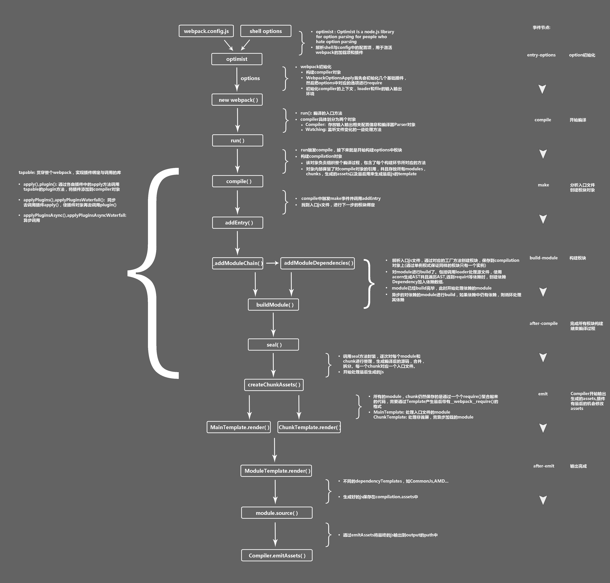

[非常值得一读：「吐血整理」再来一打 Webpack 面试题](https://mp.weixin.qq.com/s?__biz=MzAxODE2MjM1MA==&mid=2651558192&idx=1&sn=ac9daccc20950b26b1670d2621376d7c&chksm=802546f1b752cfe7e4eb564437070b8cef9c91ab2827e7fc21fff48c0d17c24eac3214f7d1cd&scene=0&xtrack=1#rd)
[深度掌握 webpack 的 5 个关键点](https://mp.weixin.qq.com/s/ciyc9z8ZaVwSpriQoUCHHA)
[带你深度解锁 Webpack 系列(优化篇)](https://mp.weixin.qq.com/s/1BdKGW43MqWWsdQJ7MYI7w)

## 目标

- js 的处理：转换 ES6 代码，解决浏览器兼容问题
- css 的处理：编译 css，自动添加前缀，抽取 css 到独立文件
- html 的处理：复制并压缩 html 文件
- dist 的清理：打包前清理源目录文件
- assets 的处理：静态资源处理
- server 的启用：development 模式下启动服务器并实时刷新

## 常用插件

- ProgressPlugin（webpack 自带）：用于统计打包进度
- CleanWebpackPlugin：清理指定目录的文件
- DllPlugin（webpack 自带）：预打包文件
- DllReferencePlugin（webpack 自带）：项目打包引用预打包生成的文件
- HappyPack：运用多核加速打包
- ExtractTextPlugin：将打包中的 css 单独抽离出来
- DefinePlugin（webpack 自带）：在 webpack 层面定义项目中可以使用的全局变量 与 EnvironmentPlugin 的形式不同而已
- CopyWebpackPlugin：将指定目录的文件赋值到指定目录下
- CommonsChunkPlugin（webpack 自带 optimize）将部分包单独打包为一个文件，高效利用缓存
- HtmlWebpackPlugin：webpack 打包后自动生成 html 页面
- ParallelUglifyPlugin：加速压缩，并行

## 介绍 WebPack 是什么，有什么优势

- WebPack 是一款[模块加载器]兼[打包工具]，用于把各种静态资源（js/css/image 等）作为模块来使用
- WebPack 的优势：
  - WebPack **同时支持 commonJS 和 AMD/CMD**，方便代码迁移
  - 不仅仅能被模块化 JS ，还包括 CSS、Image 等，常见的资源都是可以处理的
  - 能替代部分 grunt/gulp 的工作，如**打包、压缩混淆**、图片 base64
  - 扩展性强，**插件机制完善**，特别是支持 React 热插拔的功能

## 可优化的地方

- 生产环境去除调试信息；
- 缓存包编译结果；

## webpack4 的新特性

### 官方宣布不再支持 Node 4

[Node 6](https://link.juejin.im/?target=https%3A%2F%2Fnodejs.org%2Fen%2Fblog%2Frelease%2Fv6.0.0%2F)

使用的是 v8 5.0 版本，支持 93%的 ES6 语法。不难看出，这个决定是为了更好的利用 ES6 语法的优势，来编写出更加整洁和健壮的代码。

> 备注：当使用[webpack4](https://link.juejin.im/?target=https%3A%2F%2Ftwitter.com%2Fhashtag%2Fwebpack%3Fsrc%3Dhash%26ref_src%3Dtwsrc%255Etfw)时，确保使用 Node.js 的版本 >= 8.9.4。因为 webpack4 使用了很多 JS 新的语法，它们在新版本的 v8 里经过了优化。

### webpack 需要设置 mode 属性，可以是 development 或 production

**通过 mode, 你可以轻松设置打包环境。**如果你将 mode 设置成 development，你将获得最好的开发阶段体验。这得益于 webpack 针对开发模式提供的特性：

- 浏览器调试工具
- 注释、开发阶段的详细错误日志和提示
- 快速和优化的增量构建机制
  如果你将 mode 设置成了 production, **webpack 将会专注项目的部署**，包括以下特性：
  - 开启所有的优化代码
  - 更小的 bundle 大小
  - 去除掉只在开发阶段运行的代码
  - Scope hoisting 和 Tree-shaking

### webpack4 删除了 CommonsChunkPlugin 插件

它使用内置 API **optimization.splitChunks** 和 **optimization.runtimeChunk**，这意味着 webpack 会默认为你生成共享的代码块。

### 其它插件变化如下

- NoEmitOnErrorsPlugin 废弃，使用 optimization.noEmitOnErrors 替代，在生产环境中默认开启该插件。
- ModuleConcatenationPlugin 废弃，使用 optimization.concatenateModules 替代，在生产环境默认开启该插件。
- NamedModulesPlugin 废弃，使用 optimization.namedModules 替代，在生产环境默认开启。
- uglifyjs-webpack-plugin 升级到了 v1.0 版本, 默认开启缓存和并行功能。

### DefinePlugin 可以在编译时期创建全局变量

该特性适用于开发版本同线上版本在某些常量上有区别的场景。
比如，可能会通过全局变量定义是否需要打印日志，在开发版中打印日志，
而在先上版本不打印日志。

### Webpack 4 支持零配置使用

webpack 4 的零配置主要应用于：

- entry 默认设置为 ./src/index.js
- output 默认设置为 ./dist/main.js
- production 和 development 两种模式

```json
"scripts": {
  "dev": "webpack --mode development ./src/javascripts/index.js --output ./dist/js/main.js",
  "build": "webpack --mode production ./src/javascripts/index.js --output ./dist/js/main.js"
}
```

## 打包的时候去掉 console.log 与 debugger

```js
new webpack.optimize.UglifyJsPlugin({
  minimize: true,
  compress: {
    warnings: false,
  },
});
```

这里的插件已经从 webpack 上移除，需要单独引入使用。

```js
const = require('uglifyjs-webpack-plugin');
```

## 主要配置属性

### module

webpack 通过 loader 可以**支持各种语言和预处理器编写模块**。
loader 描述了 webpack 如何处理 **非 JavaScript(non-JavaScript) _模块_(css，img...)**，并且在 bundle 中引入这些依赖。
webpack 提供了可定制的、强大和丰富的 API，允许任何技术栈使用 webpack，保持了在你的开发、测试和生成流程中无侵入性(non-opinionated)。

### plugins

插件目的在于解决 **loader** 无法实现的其他事。

webpack 插件是一个具有 apply 属性的 **JavaScript 对象**。apply 属性会被 webpack compiler 调用，并且 compiler 对象可在**整个编译生命周期访问**。

由于插件可以携带参数/选项，你必须在 webpack 配置中，向 plugins 属性传入 new 实例。

### entry points

入口起点

### output

配置 output 选项可以控制 webpack 如何**向硬盘写入编译文件**。注意，即使可以存在多个入口起点，但**只指定一个输出配置**。

### mode，4 新增

提供 mode 配置选项，告知 webpack 使用相应模式的**内置优化**。

#### 支持的字段

- development

会将 process.env.NODE_ENV 的值设为 development。启用 NamedChunksPlugin 和 NamedModulesPlugin。

- production

会将 process.env.NODE_ENV 的值设为 production。启用 FlagDependencyUsagePlugin, FlagIncludedChunksPlugin, ModuleConcatenationPlugin, NoEmitOnErrorsPlugin, OccurrenceOrderPlugin, SideEffectsFlagPlugin 和 UglifyJsPlugin.

### loader

loader 用于对模块的源代码进行转换。loader 可以使你在 import 或"加载"模块时预处理文件。因此，loader **类似于其他构建工具中“任务(task)”**，并提供了处理前端构建步骤的强大方法。

### 解析(resolve)

配置模块如何解析。例如，当在 ES2015 中调用 import "lodash"，resolve 选项能够对 webpack 查找 "lodash" 的方式去做修改。

### 同时 webpack 也拆成了两部分，webpack 和 webpack-cli，都需要本地安装

### 文件名 hash

hash 是用在文件输出的名字中的，如 [name].[hash].js，总的来说，webpack 提供了三种 hash：

- [hash]：此次打包的所有内容的 hash。
- [chunkhash]：每一个 chunk 都根据自身的内容计算而来。
- [contenthash]：由 css 提取插件提供，根据自身内容计算得来。

### 提取 js 中的 css 部分到单独的文件

extract-text-webpack-plugin 插件 -> 替代插件 mini-css-extract-plugin

这里提取之后，还需要单独进行压缩 optimize-css-assets-webpack-plugin

## webpack 指令配置

--progress: 压缩的进程提示
--colors ：显示不同的颜色
--profile ： 每个文件的压缩时间

## 通过 webpack，给运行环境（浏览器 window 或者 node 的 global）注入全局变量

```js
plugins: [
  new webpack.DefinePlugin({
    // 注入全局变量，注意这里的变量必须是'" "'包裹的。
    'process.env.env': '"dev"',
    // "process.env": require("../config/dev.env"),
    // "process.env.BASE_URL": '"' + process.env.BASE_URL + '"'
  }),
];
```

## webpack 运行的时候的环境配置

### dev

`yarn run dev`

页面访问地址: `http://localhost:1314/`

页面分析的访问地址: `http://127.0.0.1:8888/`

## webpack4 利用 import 动态加载的一些说明

ES6 的 import 语法告诉我们，模块只能做静态加载。ES6 模块加载，加载的是引用，必须文件头部声明，加载的地址不可修改，即静态加载。

```js
// 所谓静态加载，就是你不能写成如下形式：
let filename  = 'module.js';
import {mod} from './' + filename;
// 也不能写成如下形式：
if(condition) {
  import {mod} from './path1'
} else {
  import {mod} from './path2'
}
```

### 但是 webpack 已经开始用了

import 的加载是加载的模块的引用。而 import()加载的是模块的拷贝，就是类似于 require()。

[代码参见](blog/9.前端构建工具及实例/webpack/src/javascripts/dynamicModule.js)

## 添加 react 文件的打包支持

## webpack 优化策略，<提高 dev 及 build 的速度>

[参考文章](https://juejin.im/post/5d614dc96fb9a06ae3726b3e)

### 1. 使用工具分析各部分执行时常

[Speed Measure Plugin(for webpack)](https://www.npmjs.com/package/speed-measure-webpack-plugin)

参考代码 scripts。

### 2. 具体优化策略

#### 1.缓存，cache-loader

cache-loader，插件开启，缓存及并行。

#### 2.多核，happypack

它把**任务分解给多个子进程去并发的执行**，子进程处理完后再把结果发送给主进程。

happypack，多核开启，提高编译速度，MiniCssExtractPlugin 必须置于 cache-loader 执行之后，否则无法生效。

**thread-loader** 和 Happypack 我对比了一下，构建时间基本没什么差别。不过 thread-loader 配置起来为简单。

#### 3.抽离，Externals ｜｜ dll

常见的方案有两种:

一种是使用 **webpack-dll-plugin** 的方式，在首次构建时候就将这些静态依赖单独打包，后续只需要引用这个早就被打好的静态依赖包即可，有点类似“预编译”的概念；

另一种，也是**业内常见的 [Externals](https://webpack.docschina.org/configuration/externals/) 的方式**，我们将这些不需要打包的静态资源从构建逻辑中剔除出去，而使用 CDN 的方式，去引用它们。

Externals 使用主要三步：参照 jquery 引入。

1. html 引入；
2. externals 声明；
3. 文件内导入。

#### 4.以及拆分，前端微服务，optimization.splitChunks

抽离公共代码是对于多页应用来说的，如果多个页面引入了一些公共模块，那么可以把这些公共的模块抽离出来，单独打包。公共代码只需要下载一次就缓存起来了，避免了重复下载。

对于多页面应用。

webpack 会将一个 entry 视为一个 chunk，**并在最后生成文件时，将 chunk 单独生成一个文件**。

因为如今团队在实践**前端微服务**，因此**每一个子模块都被拆分成了一个单独的 repo**，因此我们的项目与生俱来就继承了集群编译的基因，但是如果把这些子项目以 entry 的形式打在一个 repo 中，也是一个很常见的情况，这时候，就需要进行拆分，集群编译便能发挥它的优势。

## 如何更好地优化打包资源，<压缩体积，分包>

[参考文章](https://mp.weixin.qq.com/s/H-w4LtY3qVNAQLiyGFsEaA)

1. 减小打包的整体体积
   - 代码压缩，MiniCssExtractPlugin，UglifyJsPlugin
   - **移除不必要的模块**，(仅仅引入而未在代码中使用，该模块仍然会被打包)
   - 按需引入模块，`import Button from 'antd/es/button';`
   - 选择可以替代的体积较小的模块，moment -> DateTime
2. Code Splitting: 按需加载，优化页面首次加载体积。如根据路由按需加载，根据是否可见按需加载
   - 使用 **React.lazy() 动态加载组件**
   - 使用 lodable-component **动态加载路由**，组件或者模块
3. Bundle Splitting：**分包**，根据模块更改频率分层次打包，充分利用缓存
   - webpack-runtime: 应用中的 webpack 的版本比较稳定，分离出来，保证长久的永久缓存
   - react-runtime: react 的版本更新频次也较低
   - vendor: **常用的第三方模块打包在一起**，如 lodash，classnames 基本上每个页面都会引用到，但是它们的更新频率会更高一些

## 提升体验

### 编译的时候给出更多的提示，termainl 界面更方便展示

#### 展示进度条，progress-bar-webpack-plugin

#### 完成提醒，webpack-build-notifier

#### dashboard 输出，webpack-dashboard

## 自定义 loader

参见 srcipt/，同步和异步 loader。

## 抽取公共文件是怎么配置的

- CommonsChunkPlugin
- DllReferencePlugin
- entry: {vender:[]}

## webpack 整个生命周期，loader 和 plugin 有什么区别

[webpack 的 loader 和 plugin 的区别](https://blog.csdn.net/qq_42375089/article/details/88072681)

### 【Loader】，用于对模块源码的转换

loader 描述了 webpack **如何处理非 javascript 模块，并且在 buld 中引入这些依赖**。loader 可以将文件从不同的语言（如 TypeScript）转换为 JavaScript，或者将内联图像转换为 data URL。比如说：CSS-Loader，Style-Loader 等。

参考 scripts/txt-loader.js 这个 txtlaoder，把一个模板转为了一个 esm。

loader 是运行在 NodeJS 中，**可以用 options 对象进行配置**（也就是在使用的时候添加 option 配置）。plugin 可以为 loader 带来更多特性。

loader 可以进行**压缩，打包，语言翻译**等等。

### 【Plugin】：目的在于解决 loader 无法实现的其他事

- 从打包优化和压缩，
- 到重新定义环境变量，功能强大到可以用来处理各种各样的任务。

webpack 提供了**很多开箱即用的插件**：CommonChunkPlugin 主要用于提取第三方库和公共模块，避免首屏加载的 bundle 文件，或者按需加载的 bundle 文件体积过大，导致加载时间过长，是一把优化的利器。而在多页面应用中，更是能够为每个页面间的应用程序共享代码创建 bundle。

**resolve 模块**，resolver 是个库，帮助 webpack 找到 bundle 需要引入的模块代码，打包时，webpack 使用 enhanced-resolve 来解析路径。

Manifest 管理所有模块之间的交互。runtime 将能够查询模块标识符，检索出背后对应的模块。

### 区别

从处理的文件上看，loader 只是处理一个类型的文件，特定类型经过特定的 loader。

plugin 是可以处理所有的文件的，可以针对特定的文件进行处理，也可以全部都进行处理，事件钩子的回调函数里能拿到编译后的 compilation 对象

## webpack 生命周期

可以安装 [lifecycle-webpack-plugin](https://www.npmjs.com/package/lifecycle-webpack-plugin) 插件来查看生命周期信息。



## webpack 如何配 sass，需要配哪些 loader

loader 支持链式传递。能够对资源使用流水线(pipeline)。一组链式的 loader 将按照相反的顺序执行。**loader 链中的第一个 loader 返回值给下一个 loader。在最后一个 loader，返回 webpack 所预期的 JavaScript**。

- style-loader，将生成 style 标签，将 css 内容插入 HTML
- css-loader，将内容引入 @import 所在的 css 文件内
- sass-loader，先处理 sass 语法

```js
[
  {
    test: /\.s[ac]ss$/i,
    use: [
      // Creates `style` nodes from JS strings
      'style-loader',
      // Translates CSS into CommonJS
      'css-loader',
      // Compiles Sass to CSS
      'sass-loader',
    ],
  },
];
```

## 如何配置把 js、css、html 单独打包成一个文件

也就是需要 css 和 js 内联到 html 文件内部。

[html-webpack-inline-source-plugin](https://www.npmjs.com/package/html-webpack-inline-source-plugin)

这样，不需要提取 css 文件了。

```js
plugins: [
  new HtmlWebpackPlugin({
    inlineSource: '.(js|css)$', // embed all javascript and css inline
  }),
  new HtmlWebpackInlineSourcePlugin(),
];
```
